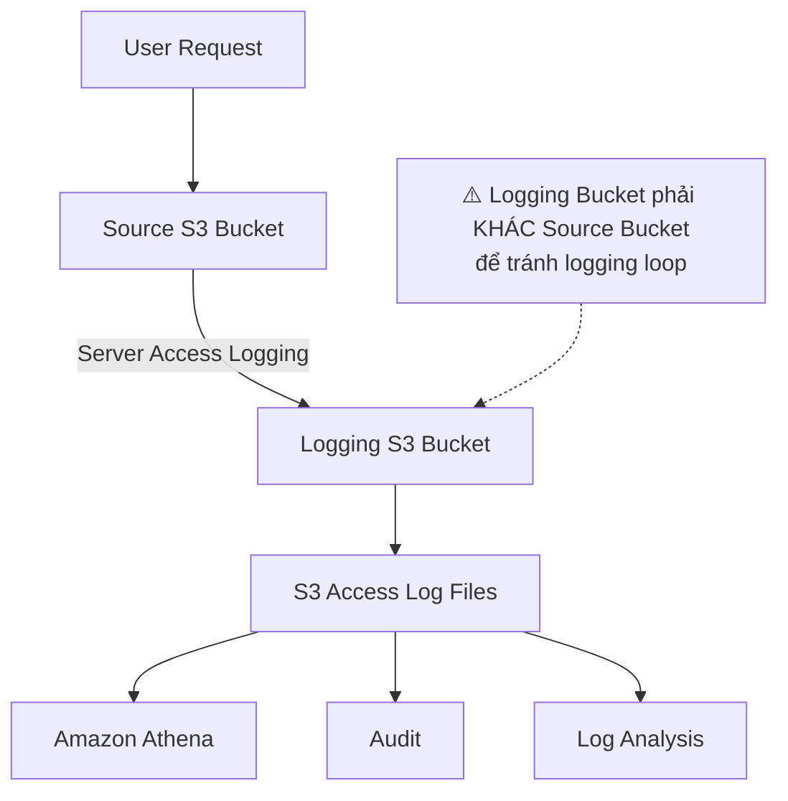

# 159. S3 Access Logs - Hands On

## 🛠️ Thực hành cấu hình S3 Access Logs

### 1. **Tạo Logging Bucket**

* Tạo một **S3 Bucket** riêng để lưu **S3 Access Logs**.
* ⚠️ **Không sử dụng chính bucket đang được theo dõi làm logging bucket** để tránh xảy ra **logging loop**.

---

### 2. **Bật S3 Access Logs cho Bucket nguồn**

* Truy cập bucket cần theo dõi.
* Mở phần **Properties**.
* Trong mục **Server access logging**, chọn **Enable**.
* Chỉ định **target logging bucket** vừa tạo.

Sau khi cấu hình xong:

* Mọi request đến bucket sẽ được AWS tự động ghi thành log và lưu vào logging bucket.

---

### 3. **Tạo hoạt động trên Bucket để sinh Log**

* Thực hiện một số thao tác như:

  * Upload object.
  * Download object.
  * List object.
  * Truy cập object.
* Các thao tác này sẽ tạo ra các bản ghi trong **S3 Access Logs**.

> Lưu ý: Log không xuất hiện ngay lập tức mà có thể mất một khoảng thời gian để AWS ghi và lưu.

---

### 4. **Kiểm tra Logging Bucket**

* Sau khi chờ một thời gian, truy cập **logging bucket**.
* Có thể thấy các file log được AWS tự động tạo.
* Mỗi file chứa thông tin về các request đã được gửi tới bucket nguồn.

Các thông tin trong log thường bao gồm:

* Bucket được truy cập.
* Thời điểm request.
* IP của client.
* Loại request (GET, PUT, DELETE,...).
* Kết quả request (thành công hoặc thất bại).
* Các metadata liên quan khác.

---

### 5. 🔍 **Phân tích Access Logs**

* Các file log có thể được:

  * Xem trực tiếp.
  * Phân tích bằng các công cụ như **Amazon Athena** để truy vấn và thống kê dữ liệu.
* Điều này rất hữu ích cho:

  * Audit.
  * Security analysis.
  * Theo dõi hoạt động truy cập.
  * Khắc phục sự cố.

---

### 6. ⚠️ **Lưu ý quan trọng**

* **Logging bucket phải khác bucket đang monitor**.
* Nếu cùng một bucket vừa chứa dữ liệu vừa chứa log:

  * Mỗi lần ghi log sẽ lại tạo thêm log mới.
  * Dẫn đến **logging loop** vô hạn.
  * Làm dung lượng bucket tăng nhanh và phát sinh chi phí rất lớn.

---

### 7. 📌 **Kết luận**

* **S3 Access Logs - Hands On** chủ yếu hướng dẫn cách:

  * Tạo một **logging bucket** riêng.
  * Bật **Server Access Logging** cho bucket cần theo dõi.
  * Thực hiện các thao tác để sinh log.
  * Kiểm tra log được ghi trong logging bucket.
* ⚠️ Điểm cần nhớ nhất cho kỳ thi và thực tế là: **không bao giờ cấu hình logging bucket trùng với bucket đang được theo dõi**.

---

## 📊 Quy trình tổng quát

