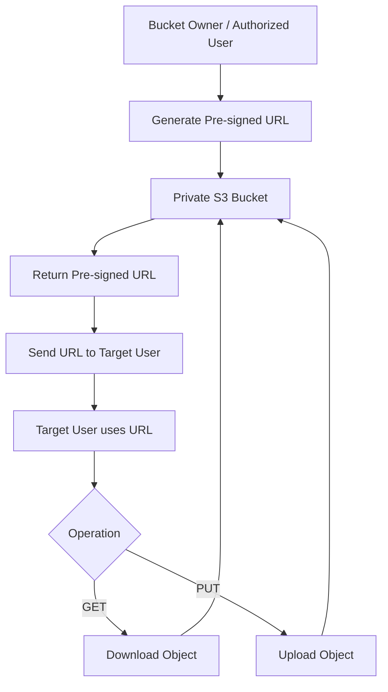

# 160. S3 Pre-signed URLs

## 🔗 S3 Pre-signed URLs – Cấp quyền truy cập tạm thời vào đối tượng trong S3

### 1. **S3 Pre-signed URL là gì?**

* **S3 Pre-signed URL** là một URL đặc biệt được tạo ra để cho phép truy cập tạm thời vào một object trong **Amazon S3**.
* URL này có thể được tạo bằng:

  * **S3 Console**
  * **AWS CLI**
  * **AWS SDK**
* Mỗi URL đều có **thời gian hết hạn (expiration)**.

---

### 2. ⏳ **Thời gian hết hạn (Expiration)**

* Nếu tạo bằng **S3 Console**:

  * URL có thể hết hạn sau tối đa **12 giờ**.
* Nếu tạo bằng **AWS CLI**:

  * URL có thể có thời hạn lên đến **168 giờ (7 ngày)**.

Sau khi hết thời gian này, URL sẽ không còn sử dụng được.

---

### 3. 🔑 **Cơ chế hoạt động**

* Khi một người dùng tạo **Pre-signed URL**, URL đó sẽ **kế thừa (inherit) quyền truy cập của người tạo**.
* Người nhận URL không cần có tài khoản AWS vẫn có thể thực hiện các thao tác được cho phép, chẳng hạn:

  * **GET** (tải xuống object).
  * **PUT** (upload object).

Điều này giúp chia sẻ quyền truy cập mà không cần cấp trực tiếp quyền lên bucket.

---

### 4. 📋 **Quy trình hoạt động**

---

### 5. ✅ **Use Cases phổ biến**

#### 📥 Cho phép tải file tạm thời

* Bucket vẫn được giữ ở trạng thái **private**.
* Chủ sở hữu tạo **Pre-signed URL** cho một object cụ thể.
* Gửi URL cho người cần truy cập để họ có thể tải file trong một khoảng thời gian giới hạn.

---

#### 🎬 Chỉ cho phép người dùng đã đăng nhập tải nội dung Premium

* Ví dụ:

  * Video trả phí.
  * Tài liệu độc quyền.
* Hệ thống xác thực người dùng, sau đó sinh **Pre-signed URL** để tải file từ S3.

---

#### 👥 Cấp quyền cho danh sách người dùng thay đổi liên tục

* Thay vì liên tục thay đổi **Bucket Policy** hoặc **IAM Policy**,
* Ứng dụng có thể **động (dynamically)** tạo **Pre-signed URL** cho từng người dùng khi cần.

---

#### 📤 Cho phép upload tạm thời

* Có thể cấp cho người dùng một **Pre-signed URL** để **PUT** object lên một vị trí xác định trong S3.
* Bucket vẫn giữ chế độ **private** và không cần cấp quyền AWS trực tiếp cho người upload.

---

### 6. ⚠️ **Ưu điểm quan trọng**

* Không cần chuyển bucket sang **public**.
* Không cần tạo tài khoản AWS cho người nhận.
* Quyền truy cập chỉ có hiệu lực trong thời gian giới hạn.
* Người nhận chỉ có thể thực hiện các thao tác được phép thông qua URL.

---

### 7. 📌 **Kết luận**

* **S3 Pre-signed URLs** là cơ chế cấp quyền truy cập **tạm thời** đến object trong **Amazon S3**.
* URL được tạo bởi người có quyền và **kế thừa quyền (inherit permissions)** của người tạo.
* Hỗ trợ cả **GET** và **PUT**, rất phù hợp cho:

  * Chia sẻ file an toàn.
  * Download nội dung premium.
  * Upload file vào bucket private.
* Đây là một tính năng được sử dụng rất phổ biến để duy trì tính bảo mật trong khi vẫn cho phép truy cập có kiểm soát.

---

## 📊 Tóm tắt nhanh

| **Tiêu chí**                       | **S3 Pre-signed URL**                                                                        |
| ---------------------------------- | -------------------------------------------------------------------------------------------- |
| 🎯 **Mục đích**                    | Cấp quyền truy cập tạm thời đến object trong S3                                              |
| 🔧 **Cách tạo**                    | S3 Console, AWS CLI, AWS SDK                                                                 |
| ⏳ **Thời hạn**                     | Console: tối đa **12 giờ**; AWS CLI: tối đa **168 giờ (7 ngày)**                             |
| 🔑 **Quyền truy cập**              | Kế thừa (**inherit**) quyền của người tạo URL                                                |
| 📥 **Thao tác hỗ trợ**             | **GET** và **PUT**                                                                           |
| 🔒 **Bucket có cần Public không?** | ❌ Không, bucket vẫn có thể để **private**                                                    |
| ✅ **Use Cases**                    | Chia sẻ file tạm thời, tải video premium, upload file an toàn, cấp quyền động cho người dùng |
