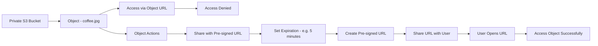

# 161. S3 Pre-signed URLs - Hands On

## 🛠️ Thực hành sử dụng S3 Pre-signed URLs

### 1. **Kiểm tra Object trong Private Bucket**

* Chọn một object trong **S3 Bucket** (ví dụ: `coffee.jpg`).
* Sao chép **Object URL** và mở trên trình duyệt.
* Vì bucket đang ở chế độ **private**, kết quả nhận được sẽ là:

  * ❌ **Access Denied**

➡️ Điều này xác nhận rằng object không thể được truy cập trực tiếp qua URL công khai.

---

### 2. **Truy cập bằng Pre-signed URL**

* Trong S3 Console, khi nhấn **Open** vào object, AWS sử dụng một **Pre-signed URL**.
* URL này chứa thông tin xác thực (**credentials**) của người tạo, cho phép truy cập object mặc dù bucket vẫn là **private**.

➡️ Người có URL này có thể truy cập object trong thời gian URL còn hiệu lực.

---

### 3. **Tạo Pre-signed URL từ S3 Console**

Thực hiện các bước:

1. Chọn object cần chia sẻ.
2. Chọn **Object actions**.
3. Chọn **Share with a pre-signed URL**.
4. Chỉ định thời gian hết hạn (**expiration**) cho URL (ví dụ: **5 phút**).
5. Nhấn **Create pre-signed URL**.

AWS sẽ sinh ra một URL có thể chia sẻ cho người khác.

---

### 4. **Chia sẻ và sử dụng Pre-signed URL**

* Gửi **Pre-signed URL** cho người cần truy cập.
* Người nhận chỉ cần mở URL trên trình duyệt.
* Dù bucket và object vẫn ở chế độ **private**, họ vẫn có thể truy cập trong khoảng thời gian URL còn hiệu lực.

Sau khi hết hạn (**expire**), URL sẽ không còn sử dụng được.

---

### 5. 🔒 **Ưu điểm của Pre-signed URL**

* Không cần chuyển bucket sang **public**.
* Không cần cấp quyền AWS cho người nhận.
* Có thể giới hạn thời gian truy cập để tăng tính bảo mật.
* Phù hợp để chia sẻ file nhanh chóng và an toàn.

---

### 6. 📌 **Quy trình hoạt động**

---

### 7. 📌 **Kết luận**

* Truy cập trực tiếp bằng **Object URL** sẽ bị **Access Denied** nếu bucket là **private**.
* **Pre-signed URL** cho phép chia sẻ quyền truy cập tạm thời mà **không cần public bucket**.
* Có thể tạo dễ dàng từ **S3 Console**, **AWS CLI** hoặc **AWS SDK**.
* Đây là giải pháp phổ biến để chia sẻ file an toàn và giới hạn thời gian truy cập.

---

## 📊 Tóm tắt nhanh

| **Thao tác**                            | **Kết quả**                                       |
| --------------------------------------- | ------------------------------------------------- |
| 🌐 Mở **Object URL** của private bucket | ❌ `Access Denied`                                 |
| 🔗 Tạo **Pre-signed URL**               | ✅ Cho phép truy cập tạm thời                      |
| ⏳ Thiết lập **Expiration**              | Có thể giới hạn thời gian (ví dụ: 5 phút)         |
| 👥 Chia sẻ URL cho người khác           | Người nhận truy cập được dù bucket là **private** |
| 🔒 Hết thời gian hiệu lực               | URL tự động **expire** và không còn truy cập được |
