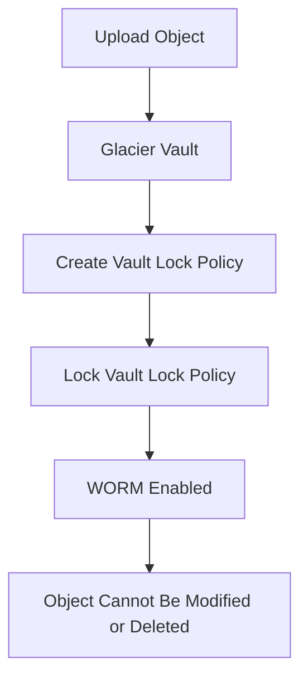
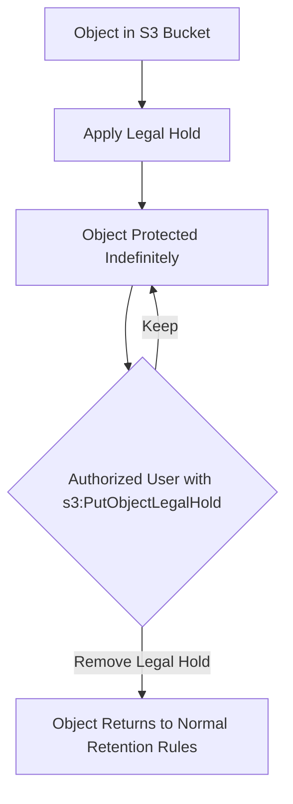

# 162. Glacier Vault Lock & S3 Object Lock

## 🔒 Glacier Vault Lock & S3 Object Lock – Bảo vệ dữ liệu theo mô hình WORM

### 1. **WORM (Write Once Read Many) là gì?**

* **WORM (Write Once Read Many)** là mô hình lưu trữ trong đó:

  * ✅ Dữ liệu chỉ được ghi (**Write Once**) một lần.
  * ✅ Sau khi ghi, dữ liệu chỉ có thể đọc (**Read Many**).
  * ❌ Không thể sửa đổi hoặc xóa.

* Mô hình này thường được sử dụng cho:

  * **Compliance**
  * **Data Retention**
  * **Lưu trữ hồ sơ pháp lý và kiểm toán**

---

## 🏔️ 2. Glacier Vault Lock

### **Glacier Vault Lock là gì?**

* **Glacier Vault Lock** cho phép khóa (**lock**) toàn bộ **Glacier Vault** theo mô hình **WORM**.
* Sau khi tạo và khóa (**lock**) **Vault Lock Policy**:

  * ❌ Không ai có thể thay đổi hoặc xóa policy.
  * ❌ Các object trong Vault cũng không thể bị xóa hoặc sửa đổi.
  * ❌ Kể cả **administrator** hoặc AWS cũng không thể ghi đè chính sách đã khóa.

### 📌 Quy trình hoạt động

### ✅ Use Cases

* Compliance.
* Data Retention.
* Lưu trữ tài liệu pháp lý cần bảo toàn tuyệt đối.

---

## 🪣 3. S3 Object Lock

### **S3 Object Lock là gì?**

* **S3 Object Lock** cũng hỗ trợ mô hình **WORM**, nhưng hoạt động ở **cấp object** thay vì toàn bộ bucket.

* Điều kiện tiên quyết:

  * ✅ **Phải bật Versioning** trước khi sử dụng.

* Có thể khóa từng **object version** để ngăn việc xóa hoặc ghi đè trong một khoảng thời gian xác định.

---

## 🔐 4. Retention Modes của S3 Object Lock

### **4.1 Compliance Mode**

* Chế độ bảo vệ nghiêm ngặt nhất.

Đặc điểm:

* ❌ Không ai có thể ghi đè hoặc xóa object version.
* ❌ Bao gồm cả **root user**.
* ❌ Không thể thay đổi retention mode.
* ❌ Không thể rút ngắn retention period.

➡️ Phù hợp khi yêu cầu tuân thủ pháp lý nghiêm ngặt.

---

### **4.2 Governance Mode**

* Linh hoạt hơn so với Compliance Mode.

Đặc điểm:

* ❌ Người dùng thông thường không thể sửa hoặc xóa object.
* ✅ Một số **admin users** có quyền IAM đặc biệt vẫn có thể:

  * Thay đổi retention.
  * Xóa object.
  * Thay đổi lock settings.

➡️ Phù hợp khi vẫn cần khả năng quản trị trong một số trường hợp.

---

## ⏳ 5. Retention Period

* Cả **Compliance Mode** và **Governance Mode** đều yêu cầu cấu hình **Retention Period**.
* Trong thời gian này:

  * Object được bảo vệ khỏi việc sửa hoặc xóa.
* ✅ Có thể **gia hạn (extend)** thời gian bảo vệ nếu cần.

---

## ⚖️ 6. Legal Hold

### **Legal Hold là gì?**

* **Legal Hold** bảo vệ object **vô thời hạn (indefinitely)**.
* Khác với **Retention Period**, Legal Hold:

  * Không phụ thuộc vào thời gian hết hạn.
  * Tiếp tục có hiệu lực cho đến khi được gỡ bỏ.

Ví dụ:

* Một tài liệu cần phục vụ điều tra hoặc kiện tụng.
* Có thể đặt **Legal Hold** để đảm bảo object không bị xóa trong suốt quá trình xử lý.

### 🔑 IAM Permission

Để thêm hoặc gỡ **Legal Hold**, cần quyền:

* `s3:PutObjectLegalHold`

---

### 📌 Quy trình hoạt động của Legal Hold

---

## 📌 7. Kết luận

* **Glacier Vault Lock**

  * Khóa ở **cấp Vault**.
  * Sau khi **Vault Lock Policy** được lock thì không thể thay đổi.
  * Phù hợp cho **Compliance** và **Data Retention** nghiêm ngặt.

* **S3 Object Lock**

  * Khóa ở **cấp từng Object Version**.
  * Yêu cầu **Versioning** phải được bật.
  * Hỗ trợ hai chế độ:

    * **Compliance Mode**: không ai được phép thay đổi.
    * **Governance Mode**: admin có quyền đặc biệt vẫn có thể can thiệp.

* **Legal Hold**

  * Bảo vệ object **vô thời hạn**.
  * Không phụ thuộc vào **Retention Period**.
  * Được quản lý thông qua quyền IAM `s3:PutObjectLegalHold`.

---

## 📊 So sánh nhanh

| **Tiêu chí**              | **Glacier Vault Lock**                 | **S3 Object Lock**                                            |
| ------------------------- | -------------------------------------- | ------------------------------------------------------------- |
| 🎯 **Mục tiêu**           | Áp dụng WORM cho toàn bộ Glacier Vault | Áp dụng WORM cho từng object version                          |
| 📍 **Phạm vi**            | Cấp Vault                              | Cấp Object                                                    |
| 🔄 **Yêu cầu Versioning** | ❌ Không                                | ✅ Bắt buộc                                                    |
| 🔒 **Compliance Mode**    | Chính sách Vault không thể thay đổi    | Object không thể sửa/xóa, kể cả bởi root user                 |
| 🛡️ **Governance Mode**   | Không áp dụng                          | Admin có quyền IAM đặc biệt có thể ghi đè                     |
| ⏳ **Retention Period**    | Theo Vault Lock Policy                 | Cấu hình trên từng object, có thể gia hạn                     |
| ⚖️ **Legal Hold**         | ❌ Không                                | ✅ Có, bảo vệ vô thời hạn                                      |
| 📝 **Use Cases**          | Compliance, Data Retention             | Compliance, lưu trữ tài liệu quan trọng, bảo vệ object cụ thể |
