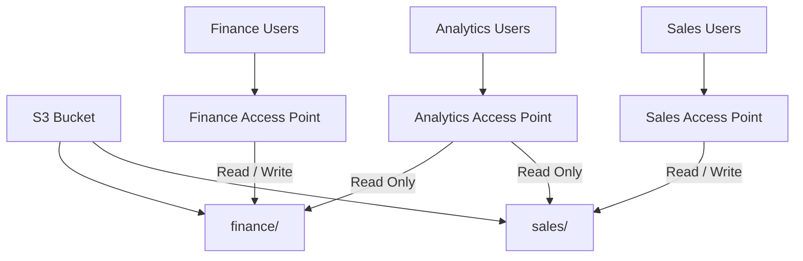
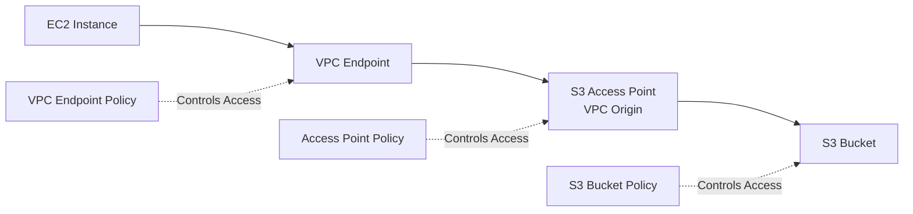

# 163. S3 Access Points

## 🎯 S3 Access Points – Đơn giản hóa việc quản lý quyền truy cập S3

### 1. **Vấn đề khi chỉ sử dụng S3 Bucket Policy**

Giả sử một **S3 Bucket** chứa nhiều loại dữ liệu:

* 📊 `finance/`
* 💰 `sales/`
* 📈 `analytics/`

Đồng thời có nhiều nhóm người dùng cần truy cập:

* Finance Team
* Sales Team
* Analytics Team

Nếu chỉ sử dụng **S3 Bucket Policy**, chính sách sẽ ngày càng phức tạp:

* Thêm nhiều user → Policy dài hơn.
* Thêm nhiều prefix → Policy khó quản lý.
* Khó mở rộng và bảo trì.

---

### 2. **S3 Access Points là gì?**

**S3 Access Point** là một điểm truy cập (**access endpoint**) riêng cho S3 Bucket.

Mỗi **Access Point**:

* Có **DNS name** riêng.
* Có **Access Point Policy** riêng (tương tự **Bucket Policy**).
* Có thể giới hạn quyền truy cập vào một phần dữ liệu trong bucket.

➡️ Nhờ đó, việc quản lý quyền truy cập trở nên đơn giản và dễ mở rộng hơn.

---

### 3. **Ví dụ sử dụng S3 Access Points**

Có thể tạo nhiều Access Point cho cùng một bucket:

* **Finance Access Point**

  * Cho phép **Read/Write** vào prefix `finance/`.

* **Sales Access Point**

  * Cho phép **Read/Write** vào prefix `sales/`.

* **Analytics Access Point**

  * Cho phép **Read Only** đối với cả `finance/` và `sales/`.

Mỗi Access Point có **Access Point Policy** riêng để kiểm soát quyền truy cập.

---

### 4. 📌 **Kiến trúc hoạt động**

➡️ Mỗi nhóm người dùng chỉ truy cập thông qua **Access Point** tương ứng thay vì truy cập trực tiếp vào bucket.

---

### 5. 🔒 **Access Point Policy**

* Mỗi **Access Point** có một **Access Point Policy** riêng.
* Cú pháp và cách hoạt động rất giống **S3 Bucket Policy**.
* Có thể định nghĩa:

  * Quyền `Read`.
  * Quyền `Write`.
  * Giới hạn theo `prefix`.
  * Giới hạn theo IAM principal.

➡️ Điều này giúp tách biệt việc quản lý quyền của từng nhóm người dùng.

---

### 6. 🌐 **Internet Origin và VPC Origin**

Khi tạo **S3 Access Point**, có thể chọn:

* **Internet Origin**

  * Có thể truy cập từ Internet (nếu được cấp quyền).

* **VPC Origin**

  * Chỉ cho phép truy cập từ bên trong **Amazon VPC**.
  * Phù hợp với các hệ thống nội bộ cần kết nối riêng tư.

---

### 7. 🔐 **Truy cập riêng tư thông qua VPC Endpoint**

Nếu sử dụng **VPC Origin**:

* EC2 trong VPC sẽ không truy cập trực tiếp qua Internet.
* Cần tạo **VPC Endpoint** để kết nối tới **S3 Access Point**.

Ngoài ra:

* **VPC Endpoint Policy** phải cho phép truy cập tới:

  * Access Point.
  * S3 Bucket tương ứng.

---

### 8. 📌 **Kiến trúc VPC Origin**

➡️ Khi sử dụng **VPC Origin**, hệ thống có nhiều lớp bảo mật:

* **VPC Endpoint Policy**
* **Access Point Policy**
* **S3 Bucket Policy**

---

### 9. ✅ **Ưu điểm của S3 Access Points**

* Đơn giản hóa việc quản lý quyền truy cập.
* Mỗi nhóm người dùng có **Access Point Policy** riêng.
* Giảm độ phức tạp của **Bucket Policy**.
* Dễ mở rộng khi số lượng người dùng và dữ liệu tăng.
* Hỗ trợ truy cập qua Internet hoặc riêng tư trong **VPC**.
* Mỗi Access Point có **DNS name** riêng để kết nối.

---

### 10. 📌 **Kết luận**

* **S3 Access Points** giúp **quản lý bảo mật ở quy mô lớn (security at scale)**.
* Thay vì viết một **Bucket Policy** khổng lồ, có thể tạo nhiều **Access Point** với chính sách riêng cho từng nhóm hoặc từng ứng dụng.
* Khi cần truy cập riêng tư từ VPC:

  * Sử dụng **VPC Origin**.
  * Kết hợp với **VPC Endpoint** và **VPC Endpoint Policy** để tăng cường bảo mật.

---

## 📊 So sánh nhanh

| **Tiêu chí**              | **S3 Bucket Policy**               | **S3 Access Points**                                  |
| ------------------------- | ---------------------------------- | ----------------------------------------------------- |
| 🎯 **Phạm vi quản lý**    | Toàn bộ bucket                     | Từng Access Point                                     |
| 🔒 **Chính sách bảo mật** | Một Bucket Policy chung            | Mỗi Access Point có **Access Point Policy** riêng     |
| 📈 **Khả năng mở rộng**   | Dễ trở nên phức tạp khi nhiều user | Dễ quản lý khi số lượng user và ứng dụng lớn          |
| 🌐 **DNS riêng**          | ❌ Không                            | ✅ Có                                                  |
| 🏢 **Hỗ trợ VPC Origin**  | Không trực tiếp                    | ✅ Có                                                  |
| 🔗 **Kết nối riêng tư**   | Qua S3 Endpoint thông thường       | Qua **VPC Endpoint** + **Access Point**               |
| ✅ **Use Case**            | Bucket nhỏ, ít nhóm người dùng     | Nhiều team, nhiều ứng dụng, cần quản lý quyền độc lập |
