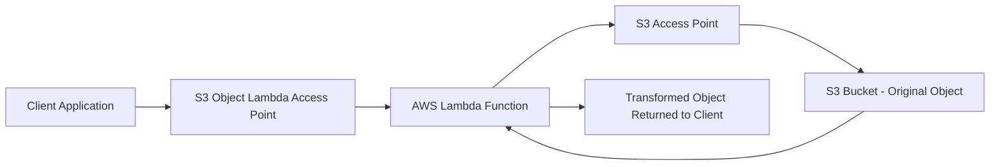
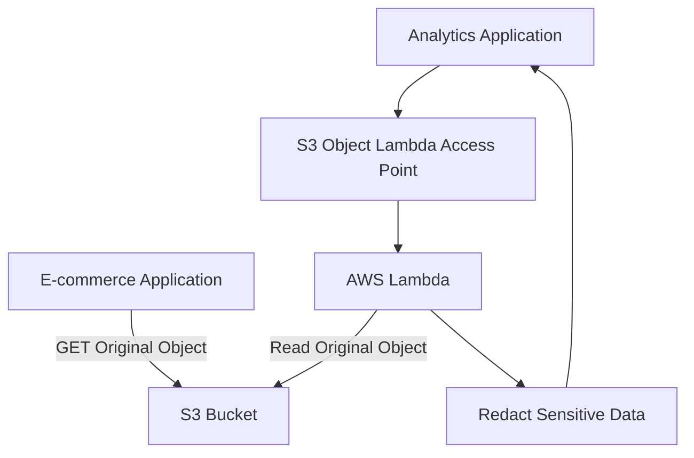
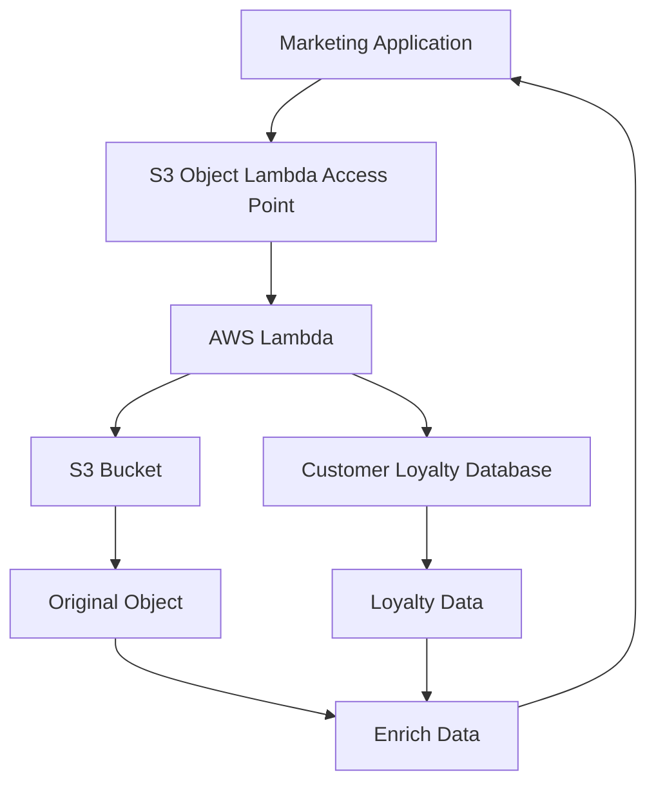

# 164. S3 Object Lambda

## 🚀 S3 Object Lambda – Biến đổi dữ liệu khi truy cập mà không cần sao chép Object

### 1. **S3 Object Lambda là gì?**

* **S3 Object Lambda** cho phép **thay đổi (transform)** nội dung của object **ngay trước khi trả về cho ứng dụng**.
* Việc biến đổi này được thực hiện thông qua **AWS Lambda**.
* Nhờ đó:

  * ✅ Không cần tạo thêm bucket mới.
  * ✅ Không cần lưu nhiều phiên bản của cùng một object.
  * ✅ Mỗi ứng dụng có thể nhận dữ liệu theo định dạng hoặc nội dung khác nhau.

---

### 2. **Cơ chế hoạt động**

* Dữ liệu gốc (**original object**) vẫn được lưu trong **S3 Bucket**.
* Khi client truy cập thông qua **S3 Object Lambda Access Point**:

  1. Request được chuyển đến **AWS Lambda**.
  2. Lambda đọc object từ S3.
  3. Lambda xử lý hoặc biến đổi dữ liệu.
  4. Kết quả đã xử lý được trả về cho client.

➡️ Object gốc trong S3 **không bị thay đổi**.

---

### 3. 📌 **Kiến trúc tổng quát**

---

### 4. **Ví dụ: Analytics chỉ xem dữ liệu đã Redact**

Giả sử:

* **E-commerce Application** cần dữ liệu đầy đủ.
* **Analytics Application** không được xem thông tin nhạy cảm.

Thay vì tạo thêm bucket mới chứa dữ liệu đã xử lý:

* E-commerce truy cập trực tiếp vào S3 Bucket.
* Analytics truy cập qua **S3 Object Lambda Access Point**.
* Lambda sẽ **redact** (ẩn hoặc xóa) các trường nhạy cảm trước khi trả về.

---

### 5. **Ví dụ: Marketing cần dữ liệu Enriched**

Marketing muốn bổ sung thông tin từ **Customer Loyalty Database**.

Thay vì lưu thêm bản sao của object:

* Lambda đọc object gốc.
* Lambda truy vấn **Customer Loyalty Database**.
* Lambda kết hợp dữ liệu (**enrich**).
* Trả về object đã bổ sung thông tin.

---

### 6. ✅ **Use Cases phổ biến**

#### 🔒 Redact PII (Personally Identifiable Information)

* Ẩn thông tin cá nhân trước khi trả dữ liệu cho:

  * Analytics.
  * Môi trường test.
  * Non-production environments.

Ví dụ:

* Tên.
* Email.
* Số điện thoại.
* Địa chỉ.

---

#### 🔄 Chuyển đổi định dạng dữ liệu

Có thể chuyển đổi:

* XML → JSON.
* CSV → JSON.
* Hoặc bất kỳ định dạng nào phù hợp với ứng dụng.

---

#### 🖼️ Xử lý hình ảnh theo thời gian thực

Lambda có thể:

* Resize image.
* Watermark image.
* Tạo thumbnail.
* Gắn watermark khác nhau theo từng người dùng.

Tất cả được thực hiện **on the fly**, không cần lưu nhiều bản sao.

---

### 7. 🎯 Ưu điểm của S3 Object Lambda

* Chỉ cần **một S3 Bucket** để lưu dữ liệu gốc.
* Không cần tạo nhiều bucket hoặc nhiều bản sao của object.
* Biến đổi dữ liệu động theo từng ứng dụng hoặc từng request.
* Dễ dàng tích hợp với **AWS Lambda** để thực hiện logic tùy chỉnh.
* Giảm chi phí lưu trữ và đơn giản hóa quản lý dữ liệu.

---

### 8. 📌 **Kết luận**

* **S3 Object Lambda** cho phép thay đổi nội dung object ngay khi được truy xuất mà **không làm thay đổi dữ liệu gốc**.
* Hoạt động dựa trên:

  * **S3 Object Lambda Access Point**
  * **AWS Lambda**
  * **S3 Access Point**
* Đây là giải pháp lý tưởng khi cần:

  * **Redact PII**.
  * **Enrich dữ liệu**.
  * **Chuyển đổi định dạng**.
  * **Resize hoặc Watermark hình ảnh** theo thời gian thực.

---

## 📊 So sánh S3 Access Point và S3 Object Lambda

| **Tiêu chí**                    | **S3 Access Point**                | **S3 Object Lambda**                                        |
| ------------------------------- | ---------------------------------- | ----------------------------------------------------------- |
| 🎯 **Mục đích**                 | Quản lý quyền truy cập             | Biến đổi dữ liệu trước khi trả về                           |
| 🔄 **Thay đổi nội dung object** | ❌ Không                            | ✅ Có                                                        |
| ⚙️ **Sử dụng AWS Lambda**       | ❌ Không                            | ✅ Có                                                        |
| 💾 **Thay đổi dữ liệu gốc**     | ❌ Không                            | ❌ Không                                                     |
| 📂 **Cần tạo bucket mới**       | ❌ Không                            | ❌ Không                                                     |
| 🔒 **Use Cases**                | Quản lý quyền theo nhóm người dùng | Redact PII, Enrich data, XML → JSON, Resize/Watermark image |
