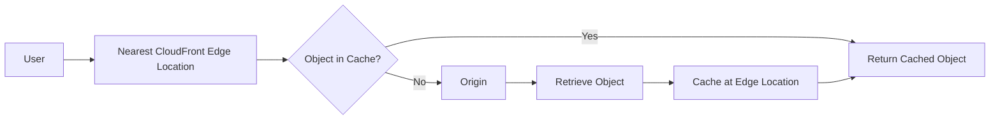
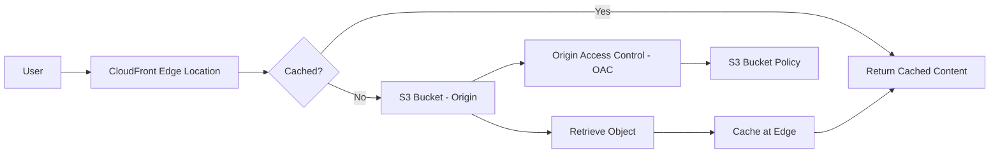
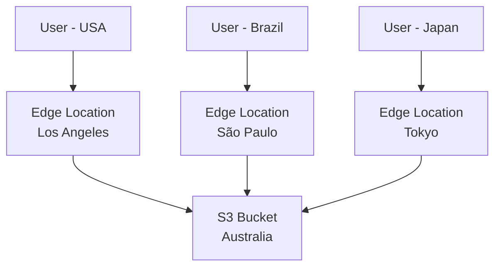

# 165. CloudFront Overview

## 🌍 CloudFront – Content Delivery Network (CDN) của AWS

### 1. **CloudFront là gì?**

* **Amazon CloudFront** là dịch vụ **Content Delivery Network (CDN)** của AWS.
* Trong kỳ thi AWS, khi thấy thuật ngữ **CDN**, hãy nghĩ ngay đến **CloudFront**.
* CloudFront giúp:

  * 🚀 Tăng tốc độ truy cập nội dung.
  * 🌎 Giảm độ trễ (**latency**) cho người dùng trên toàn thế giới.
  * 💾 Cache nội dung tại các **Edge Locations (Points of Presence - PoP)**.

---

### 2. **CloudFront hoạt động như thế nào?**

* Thay vì người dùng truy cập trực tiếp vào **Origin**, họ sẽ truy cập **Edge Location** gần nhất.
* Nếu dữ liệu đã được cache:

  * ✅ Trả về ngay từ Edge Location.
* Nếu chưa có:

  * CloudFront lấy dữ liệu từ **Origin**.
  * Cache tại Edge Location.
  * Trả về cho người dùng.
* Những request sau sẽ được phục vụ trực tiếp từ cache.

### 📌 Quy trình hoạt động

---

### 3. 🚀 **Lợi ích của CloudFront**

* Giảm **latency** nhờ phục vụ dữ liệu từ Edge Location gần người dùng.
* Cải thiện trải nghiệm người dùng trên toàn cầu.
* Giảm tải cho Origin Server.
* Hỗ trợ **DDoS Protection** thông qua hạ tầng phân tán của AWS.
* Có thể kết hợp với:

  * **AWS Shield**
  * **AWS WAF (Web Application Firewall)**

---

### 4. 🌐 **Mạng lưới Edge Locations**

CloudFront có hàng trăm **Points of Presence (PoP)** trên toàn thế giới, bao gồm:

* **Edge Locations**
* **Edge Caches**

Ví dụ:

* Bucket nằm ở **Australia**.
* Người dùng ở **Mỹ** truy cập:

  * Request được gửi đến Edge Location tại Mỹ.
  * Edge Location lấy dữ liệu từ Australia và cache lại.
* Người dùng tiếp theo tại Mỹ:

  * Nhận dữ liệu trực tiếp từ Edge Cache mà không cần truy cập Australia.

---

### 5. 🎯 **Origin của CloudFront**

CloudFront có thể kết nối tới nhiều loại **Origin**.

#### 📦 Amazon S3 Bucket

* Phân phối file tĩnh.
* Cache nội dung tại Edge.
* Có thể upload file thông qua CloudFront.
* Bảo mật bằng **Origin Access Control (OAC)**.

---

#### 🏢 VPC Origin

Có thể kết nối đến tài nguyên riêng tư trong VPC như:

* Private Application Load Balancer.
* Private Network Load Balancer.
* Private EC2 Instances.

➡️ Cho phép truy cập backend nội bộ mà không cần public Internet.

---

#### 🌍 Custom Origin (HTTP)

Có thể sử dụng bất kỳ HTTP backend nào như:

* Static S3 Website.
* Public Load Balancer.
* Public Web Server.
* Các dịch vụ HTTP khác.

---

### 6. 📌 **Kiến trúc CloudFront với S3**

➡️ Sau lần truy cập đầu tiên, các request tiếp theo sẽ được phục vụ trực tiếp từ **Edge Location**.

---

### 7. 🔒 **Origin Access Control (OAC)**

Khi sử dụng **Amazon S3** làm Origin:

* CloudFront có thể truy cập S3 thông qua **Origin Access Control (OAC)**.
* **Bucket Policy** được cấu hình để chỉ cho phép CloudFront truy cập.
* Người dùng không cần truy cập trực tiếp vào S3 Bucket.

➡️ Đây là cách bảo mật được AWS khuyến nghị.

---

### 8. 🌍 **Ví dụ phân phối nội dung toàn cầu**

* Mỗi Edge Location chỉ cần lấy dữ liệu từ Origin khi cache chưa có.
* Sau đó, dữ liệu được phục vụ cục bộ cho người dùng trong khu vực.

---

### 9. ⚖️ **CloudFront vs S3 Cross-Region Replication (CRR)**

| **Tiêu chí**            | **CloudFront**                         | **S3 Cross-Region Replication (CRR)**                 |
| ----------------------- | -------------------------------------- | ----------------------------------------------------- |
| 🎯 **Mục đích**         | CDN, cache nội dung                    | Sao chép bucket sang Region khác                      |
| 🌍 **Phạm vi**          | Hàng trăm Edge Locations trên toàn cầu | Chỉ các Region được cấu hình                          |
| 💾 **Cơ chế**           | Cache tại Edge                         | Replicate dữ liệu                                     |
| ⚡ **Hiệu năng**         | Giảm latency toàn cầu                  | Dữ liệu sẵn sàng ở Region khác                        |
| 🔄 **Cập nhật dữ liệu** | Theo cơ chế cache                      | Near real-time replication                            |
| 📖 **Use Case**         | Static content, website, media         | Disaster Recovery, dữ liệu cần tồn tại ở nhiều Region |
| 📝 **Read/Write**       | Chủ yếu tối ưu đọc (**Read**)          | Replicate object giữa các bucket                      |

---

### 10. 📌 **Kết luận**

* **CloudFront** là **CDN** của AWS giúp tăng tốc truy cập bằng cách cache nội dung tại các **Edge Locations** trên toàn thế giới.
* CloudFront hỗ trợ nhiều loại **Origin**, bao gồm:

  * Amazon S3.
  * VPC Origin.
  * Custom HTTP Origin.
* Khi sử dụng S3 làm Origin, nên dùng **Origin Access Control (OAC)** để bảo mật truy cập.
* Không nên nhầm lẫn:

  * **CloudFront** → dùng để **cache và phân phối nội dung toàn cầu**.
  * **S3 Cross-Region Replication** → dùng để **sao chép dữ liệu giữa các AWS Region**.

---

## 📝 Ghi nhớ cho kỳ thi AWS

* ✅ **CDN ⇒ CloudFront**
* ✅ **CloudFront + S3 ⇒ sử dụng Origin Access Control (OAC)**
* ✅ **CloudFront ⇒ Cache tại Edge Locations để giảm latency**
* ✅ **CloudFront ≠ S3 Cross-Region Replication**
* ✅ **CloudFront hỗ trợ S3, VPC Origin và Custom HTTP Origin**
