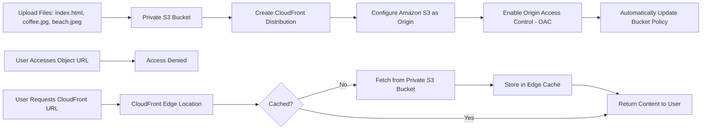
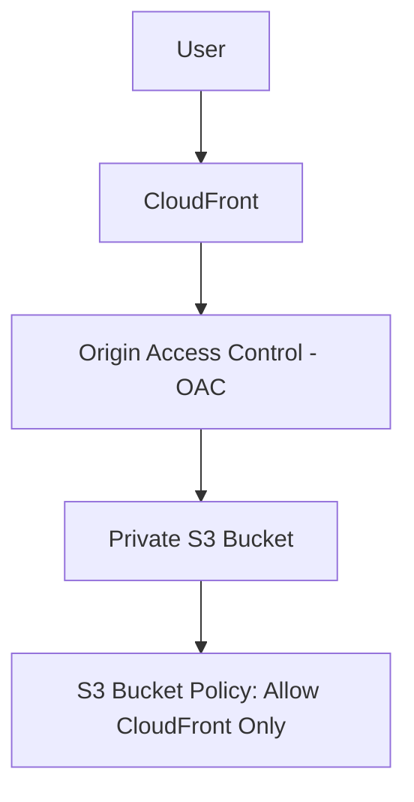

# 166. CloudFront with S3 – Hands On

## 🛠️ Thực hành cấu hình CloudFront với S3

### 1. **Tạo S3 Bucket và tải nội dung lên**

* Tạo một **S3 Bucket** mới (ví dụ: `demo-cloudfront`).
* Upload các file:

  * `index.html`
  * `coffee.jpg`
  * `beach.jpeg`
* Giữ nguyên thiết lập mặc định và **không public bucket**.

---

### 2. **Kiểm tra truy cập trực tiếp vào S3**

* Mở **Object URL** của `index.html` hoặc `coffee.jpg`.
* Do bucket là **private**, trình duyệt sẽ trả về:

```text
Access Denied
```

* Nếu chọn **Open** trong S3 Console, AWS sẽ tạo **Pre-signed URL**, cho phép truy cập tạm thời bằng quyền của người dùng hiện tại.

➡️ Điều này chứng minh object vẫn là **private**, chỉ có **Pre-signed URL** mới truy cập được.

---

### 3. **Tạo CloudFront Distribution**

Trong **CloudFront Console**:

1. Chọn **Create Distribution**.
2. Chọn **Free Plan** (đủ dùng cho demo).
3. Chọn **Origin Type = Amazon S3**.
4. Chọn bucket vừa tạo.
5. Bật:

   * ✅ **Allow private S3 bucket access**
   * ✅ **Use recommended Origin Access Control (OAC) settings**
   * ✅ **Use recommended cache settings**
6. Giữ các cấu hình mặc định khác và tạo Distribution.

---

### 4. **Origin Access Control (OAC) và Bucket Policy**

Sau khi tạo Distribution:

* AWS tự động cấu hình **Bucket Policy**.
* Bucket Policy cho phép **CloudFront Distribution** truy cập bucket riêng tư.

➡️ Người dùng cuối **không truy cập trực tiếp vào S3**, mà thông qua CloudFront.

---

### 5. **Truy cập nội dung qua CloudFront**

Sau khi Distribution được tạo:

* Truy cập Domain Name của CloudFront:

```
https://<distribution-domain>/coffee.jpg
https://<distribution-domain>/beach.jpeg
https://<distribution-domain>/index.html
```

Kết quả:

* ✅ `coffee.jpg` hiển thị bình thường.
* ✅ `beach.jpeg` hiển thị bình thường.
* ✅ `index.html` hiển thị đầy đủ nội dung và hình ảnh.

➡️ Mặc dù bucket vẫn là **private**, CloudFront vẫn có thể phục vụ nội dung nhờ **OAC**.

---

### 6. 🚀 **Lợi ích của Cache**

Khi người dùng truy cập lần đầu:

* CloudFront lấy dữ liệu từ **S3 Origin**.
* Nội dung được lưu vào **Edge Cache**.

Những lần truy cập sau:

* CloudFront trả dữ liệu trực tiếp từ **Edge Cache**.
* Không cần truy vấn lại S3.
* Thời gian phản hồi nhanh hơn đáng kể.

---

## 📌 Quy trình tổng quát



---

## 🔒 Vai trò của Origin Access Control (OAC)



➡️ **OAC** giúp CloudFront truy cập bucket riêng tư mà **không cần public bucket**, đồng thời **Bucket Policy** chỉ cho phép CloudFront đọc dữ liệu.

---

## 📌 Kết luận

* **CloudFront** có thể phân phối nội dung từ **Private S3 Bucket** mà không cần public object.
* **Origin Access Control (OAC)** là cơ chế được AWS khuyến nghị để CloudFront truy cập S3 an toàn.
* AWS tự động cập nhật **Bucket Policy** để cấp quyền cho CloudFront.
* Sau lần truy cập đầu tiên, nội dung được **cache tại Edge Location**, giúp tăng tốc độ truy cập và giảm tải cho S3 Origin.

---

## 📊 Tóm tắt nhanh

| **Bước**                               | **Mô tả**                                                                          |
| -------------------------------------- | ---------------------------------------------------------------------------------- |
| 📦 Tạo S3 Bucket                       | Upload `index.html`, `coffee.jpg`, `beach.jpeg` và giữ bucket ở chế độ **private** |
| ❌ Truy cập Object URL                  | Bị **Access Denied**                                                               |
| 🌐 Tạo CloudFront Distribution         | Chọn **Amazon S3** làm Origin                                                      |
| 🔒 Bật **Origin Access Control (OAC)** | Cho phép CloudFront truy cập bucket riêng tư                                       |
| 📝 Bucket Policy                       | AWS tự động thêm quyền cho CloudFront                                              |
| 🚀 Truy cập qua CloudFront URL         | Nội dung hiển thị bình thường dù bucket không public                               |
| 💾 Edge Cache                          | Các lần truy cập sau nhanh hơn nhờ dữ liệu được cache                              |
