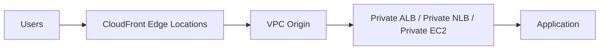
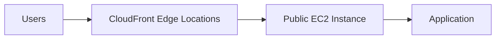
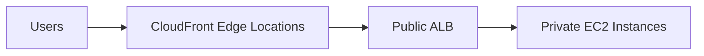

# 167. CloudFront - ALB/EC2 as an Origin

## 🌐 Sử dụng ALB hoặc EC2 làm Origin cho CloudFront

Ngoài **Amazon S3**, **CloudFront** còn có thể sử dụng:

* **Application Load Balancer (ALB)**
* **Network Load Balancer (NLB)**
* **EC2 Instance**

làm **Origin** để phân phối nội dung.

Hiện nay, AWS khuyến nghị sử dụng **VPC Origin** vì an toàn và đơn giản hơn.

---

## 1. ✅ VPC Origin (Cách mới – Khuyến nghị)

### **VPC Origin là gì?**

* **VPC Origin** cho phép CloudFront kết nối trực tiếp tới các tài nguyên nằm trong **private subnet** của **VPC**.
* Backend không cần public Internet nhưng vẫn có thể phục vụ request thông qua CloudFront.

Hỗ trợ các loại Origin:

* **Private Application Load Balancer (ALB)**
* **Private Network Load Balancer (NLB)**
* **Private EC2 Instance**

---

### 📌 Kiến trúc với VPC Origin

### ✅ Ưu điểm

* Backend luôn nằm trong **private subnet**.
* Không cần public ALB hoặc EC2.
* Giảm rủi ro bị truy cập trực tiếp từ Internet.
* CloudFront đóng vai trò là điểm truy cập duy nhất cho người dùng.

---

## 2. ⚠️ Cách cũ: Public Origin

Trước khi có **VPC Origin**, để CloudFront truy cập ALB hoặc EC2:

* EC2 hoặc ALB phải được **public**.
* Chỉ cho phép IP của CloudFront truy cập thông qua **Security Group**.

AWS cung cấp danh sách các **CloudFront Edge Location IPs**, và Security Group phải được cấu hình để chỉ cho phép các IP này.

---

### 📌 Kiến trúc cũ với Public EC2

---

### 📌 Kiến trúc cũ với Public ALB

Trong cả hai trường hợp:

* **Security Group** của EC2 hoặc ALB phải cho phép IP của CloudFront.
* Nếu cấu hình sai Security Group, backend có thể vô tình bị mở ra Internet.

---

## 3. ⚠️ Nhược điểm của cách cũ

* Phải duy trì danh sách IP của CloudFront.
* Cần cập nhật Security Group khi danh sách IP thay đổi.
* Có nguy cơ cấu hình sai khiến ALB hoặc EC2 bị truy cập công khai.
* Quản lý phức tạp hơn.

---

## 4. 📌 So sánh VPC Origin và Public Origin

| **Tiêu chí**                                  | **VPC Origin (Khuyến nghị)** | **Public Origin (Cách cũ)**            |
| --------------------------------------------- | ---------------------------- | -------------------------------------- |
| 🌐 Backend cần public                         | ❌ Không                      | ✅ Có                                   |
| 🔒 Private Subnet                             | ✅ Hỗ trợ                     | ⚠️ Chỉ EC2 phía sau ALB có thể private |
| 🛡️ Bảo mật                                   | Cao                          | Thấp hơn                               |
| ⚙️ Cấu hình Security Group theo IP CloudFront | ❌ Không cần                  | ✅ Bắt buộc                             |
| 🔧 Quản trị                                   | Đơn giản                     | Phức tạp                               |
| 🎯 AWS khuyến nghị                            | ✅ Có                         | ❌ Không                                |

---

## 5. 📌 Kết luận

* **CloudFront** có thể sử dụng **ALB**, **NLB** hoặc **EC2** làm **Origin**.
* **VPC Origin** là phương pháp hiện đại và được AWS khuyến nghị:

  * Giữ backend trong **private subnet**.
  * Không cần public tài nguyên.
  * Tăng cường bảo mật và giảm rủi ro cấu hình sai.
* Cách cũ yêu cầu backend phải **public** và giới hạn truy cập bằng **Security Group** chỉ cho phép IP của CloudFront.

---

## 📝 Ghi nhớ cho kỳ thi AWS

* ✅ **CloudFront + Private ALB/EC2 ⇒ Sử dụng VPC Origin**.
* ✅ **VPC Origin** cho phép backend **không cần public Internet**.
* ⚠️ **Public EC2/Public ALB + Security Group cho phép IP CloudFront** là cách triển khai cũ và kém tối ưu hơn.
* 🚀 Nếu đề bài yêu cầu **tăng bảo mật cho Origin phía sau CloudFront**, đáp án ưu tiên là **VPC Origin**.
