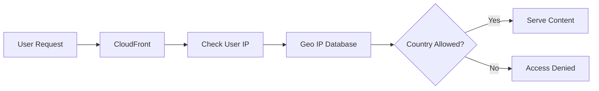

# 168. CloudFront - Geo Restriction

## 🌍 CloudFront Geo Restriction – Giới hạn truy cập theo quốc gia

### 1. **Geo Restriction là gì?**

* **CloudFront Geo Restriction** cho phép kiểm soát việc truy cập vào **CloudFront Distribution** dựa trên **quốc gia (country)** của người dùng.
* CloudFront xác định quốc gia bằng cách sử dụng **Geo IP Database** của bên thứ ba để ánh xạ địa chỉ IP của người dùng.

➡️ Nhờ đó, bạn có thể cho phép hoặc chặn người dùng từ một số quốc gia cụ thể.

---

## 2. **Hai chế độ Geo Restriction**

### ✅ Allow List

* Chỉ cho phép người dùng từ các quốc gia được chỉ định truy cập.
* Mọi quốc gia khác sẽ bị từ chối.

Ví dụ:

* Cho phép:

  * 🇺🇸 United States
  * 🇯🇵 Japan
  * 🇻🇳 Vietnam

➡️ Chỉ người dùng từ các quốc gia này mới truy cập được.

---

### 🚫 Block List

* Chặn người dùng từ các quốc gia được chỉ định.
* Các quốc gia còn lại vẫn có thể truy cập bình thường.

Ví dụ:

* Chặn:

  * Country A
  * Country B

➡️ Người dùng từ các quốc gia khác vẫn được phép truy cập.

---

## 3. 📌 Quy trình hoạt động

---

## 4. 🎯 Use Cases

### 📜 Tuân thủ bản quyền (Copyright)

Một số nội dung chỉ được phép phát hành tại các quốc gia nhất định.

Ví dụ:

* Video chỉ được cấp phép tại Nhật Bản.
* Người dùng từ các quốc gia khác sẽ bị chặn.

---

### 🌍 Giới hạn phạm vi dịch vụ

* Chỉ phục vụ khách hàng trong một khu vực cụ thể.
* Chặn truy cập từ các quốc gia không được hỗ trợ.

---

### 🔒 Chính sách bảo mật

* Ngăn truy cập từ các quốc gia có nguy cơ cao.
* Giảm thiểu rủi ro từ các khu vực không mong muốn.

---

## 5. ⚙️ Cấu hình trong CloudFront

Trong **CloudFront Distribution**:

1. Mở phần **Security**.
2. Chọn **Geo Restriction**.
3. Chọn một trong hai chế độ:

   * **Allow List**
   * **Block List**
4. Chọn danh sách quốc gia tương ứng.
5. Lưu cấu hình.

---

## 6. 💰 Lưu ý về gói sử dụng

Trong bài thực hành, tính năng **Geo Restriction** có thể không hiển thị trên **Free Plan** của CloudFront.

Tác giả đã chuyển sang **Pay as You Go** để cấu hình:

* **Allow List**
* **Block List**

➡️ Giao diện và khả năng sử dụng có thể thay đổi theo thời điểm và chính sách của AWS.

---

## 7. 📌 Kết luận

* **CloudFront Geo Restriction** giúp kiểm soát truy cập dựa trên **quốc gia của người dùng**.
* Hỗ trợ hai chế độ:

  * ✅ **Allow List** – chỉ cho phép các quốc gia được chỉ định.
  * 🚫 **Block List** – chặn các quốc gia được chỉ định.
* CloudFront xác định quốc gia thông qua **Geo IP Database** dựa trên địa chỉ IP của người dùng.
* Đây là tính năng hữu ích để đáp ứng yêu cầu về **copyright**, **quy định pháp lý** và **chính sách bảo mật**.

---

## 📊 So sánh nhanh

| **Chế độ**        | **Mô tả**                              | **Kết quả**                              |
| ----------------- | -------------------------------------- | ---------------------------------------- |
| ✅ **Allow List**  | Chỉ cho phép các quốc gia được liệt kê | Các quốc gia khác bị chặn                |
| 🚫 **Block List** | Chặn các quốc gia được liệt kê         | Các quốc gia khác vẫn được phép truy cập |

---

## 📝 Ghi nhớ cho kỳ thi AWS

* ✅ **CloudFront Geo Restriction = Giới hạn truy cập theo quốc gia**.
* ✅ Có **2 chế độ**: **Allow List** và **Block List**.
* ✅ Xác định quốc gia thông qua **Geo IP Database** dựa trên địa chỉ IP.
* ✅ Thường được sử dụng để thực thi **copyright laws**, **tuân thủ pháp lý** và **kiểm soát phạm vi truy cập nội dung**.
