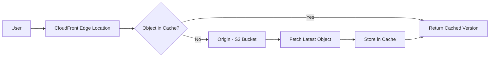
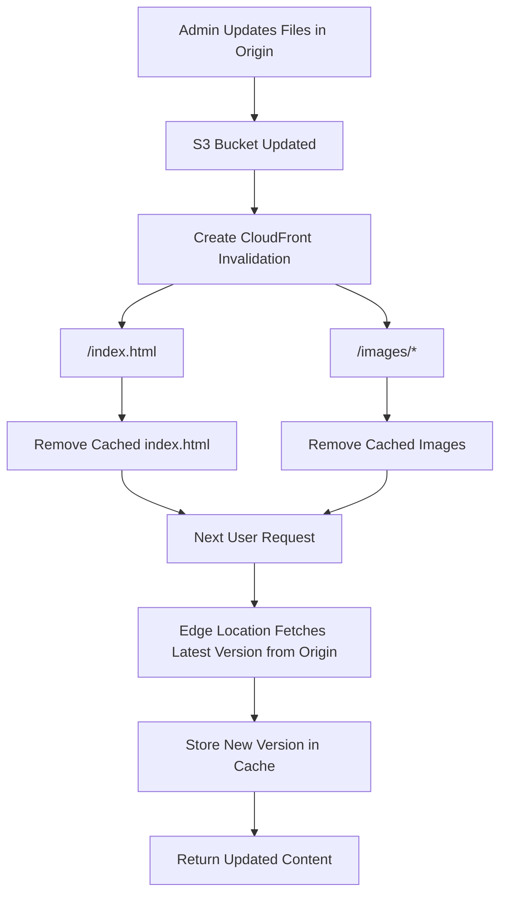

# 170. CloudFront - Cache Invalidation

## 🗑️ CloudFront Cache Invalidation – Xóa Cache để cập nhật nội dung ngay lập tức

### 1. **Vấn đề khi sử dụng Cache**

CloudFront lưu nội dung tại các **Edge Locations** để tăng tốc truy cập.

Mỗi object được cache theo một khoảng thời gian gọi là **TTL (Time To Live)**.

* Trong thời gian TTL còn hiệu lực:

  * ✅ CloudFront phục vụ nội dung từ cache.
  * ❌ Không kiểm tra xem Origin có phiên bản mới hay không.

➡️ Nếu bạn cập nhật file trong **Origin** (ví dụ: S3 Bucket), người dùng vẫn có thể nhận được **phiên bản cũ** cho đến khi TTL hết hạn.

---

## 2. **CloudFront Cache Invalidation là gì?**

**Cache Invalidation** là cơ chế cho phép **xóa thủ công** một phần hoặc toàn bộ cache trên các **Edge Locations**.

Sau khi invalidation:

* Object bị xóa khỏi cache.
* Lần truy cập tiếp theo sẽ lấy dữ liệu mới nhất từ **Origin**.
* Nội dung mới sẽ được cache lại.

➡️ Không cần chờ TTL hết hạn.

---

## 3. 📌 Quy trình hoạt động bình thường (không Invalidation)



---

## 4. 📌 Khi Origin được cập nhật nhưng chưa Invalidate

Giả sử:

* `index.html`
* `images/logo.png`

đã được cache với **TTL = 1 ngày**.

Sau đó admin cập nhật các file trong S3.

➡️ CloudFront **vẫn tiếp tục trả phiên bản cũ** cho đến khi TTL hết hạn.

---

## 5. 🚀 Sử dụng Cache Invalidation

Admin có thể gửi yêu cầu **Invalidation** để xóa cache ngay lập tức.

Có thể chỉ định:

* Một file cụ thể:

```text
/index.html
```

* Một nhóm file:

```text
/images/*
```

* Toàn bộ Distribution:

```text
/*
```

---

## 6. 📌 Quy trình Cache Invalidation



---

## 7. 🎯 Ví dụ thực tế

Ban đầu:

* `index.html`
* `images/banner.png`

được cache tại nhiều Edge Locations.

Admin cập nhật:

* Giao diện website (`index.html`).
* Hình ảnh mới (`images/banner.png`).

Để người dùng thấy ngay phiên bản mới:

```text
/index.html
/images/*
```

CloudFront sẽ xóa các object này khỏi cache và tải phiên bản mới từ Origin khi có request tiếp theo.

---

## 8. ✅ Khi nào nên dùng Cache Invalidation?

* Cập nhật website tĩnh.
* Thay đổi hình ảnh, CSS hoặc JavaScript.
* Sửa lỗi nội dung cần áp dụng ngay.
* Không muốn chờ TTL hết hạn.

---

## 9. 📌 Kết luận

* CloudFront sử dụng **TTL** để quyết định khi nào làm mới cache.
* Nếu Origin thay đổi trước khi TTL hết hạn, người dùng vẫn có thể nhận nội dung cũ.
* **Cache Invalidation** giúp xóa cache ngay lập tức để CloudFront lấy phiên bản mới từ Origin.
* Có thể invalidate:

  * Một file cụ thể (`/index.html`).
  * Một nhóm file (`/images/*`).
  * Toàn bộ nội dung (`/*`).

---

## 📊 So sánh TTL và Cache Invalidation

| **Tiêu chí**                 | **TTL hết hạn**          | **Cache Invalidation**                      |
| ---------------------------- | ------------------------ | ------------------------------------------- |
| 🔄 Làm mới cache             | Tự động khi TTL kết thúc | Thủ công theo yêu cầu                       |
| ⚡ Tốc độ cập nhật            | Có thể phải chờ          | Gần như ngay lập tức                        |
| 🎯 Phạm vi                   | Theo thời gian cấu hình  | Theo đường dẫn (`/file`, `/images/*`, `/*`) |
| 📦 Lấy dữ liệu mới từ Origin | Sau khi TTL hết          | Ngay ở request tiếp theo sau khi invalidate |
| 💡 Use Case                  | Nội dung ít thay đổi     | Nội dung cần cập nhật khẩn cấp              |

---

## 📝 Ghi nhớ cho kỳ thi AWS

* ✅ **CloudFront cache chỉ tự làm mới khi TTL hết hạn**.
* ✅ **Cache Invalidation** dùng để **xóa cache trước khi TTL hết hạn**.
* ✅ Có thể invalidate theo:

  * `/index.html`
  * `/images/*`
  * `/*` (toàn bộ Distribution).
* ✅ Sau khi invalidate, **request tiếp theo** sẽ lấy dữ liệu mới nhất từ **Origin** và cache lại tại **Edge Location**.
