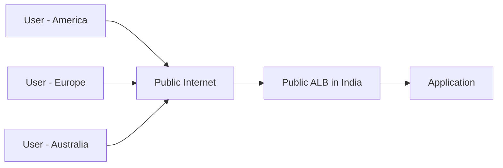
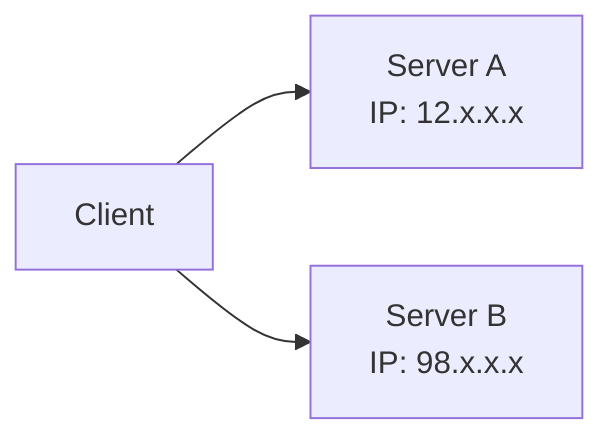
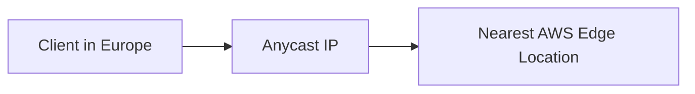
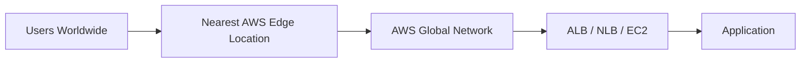
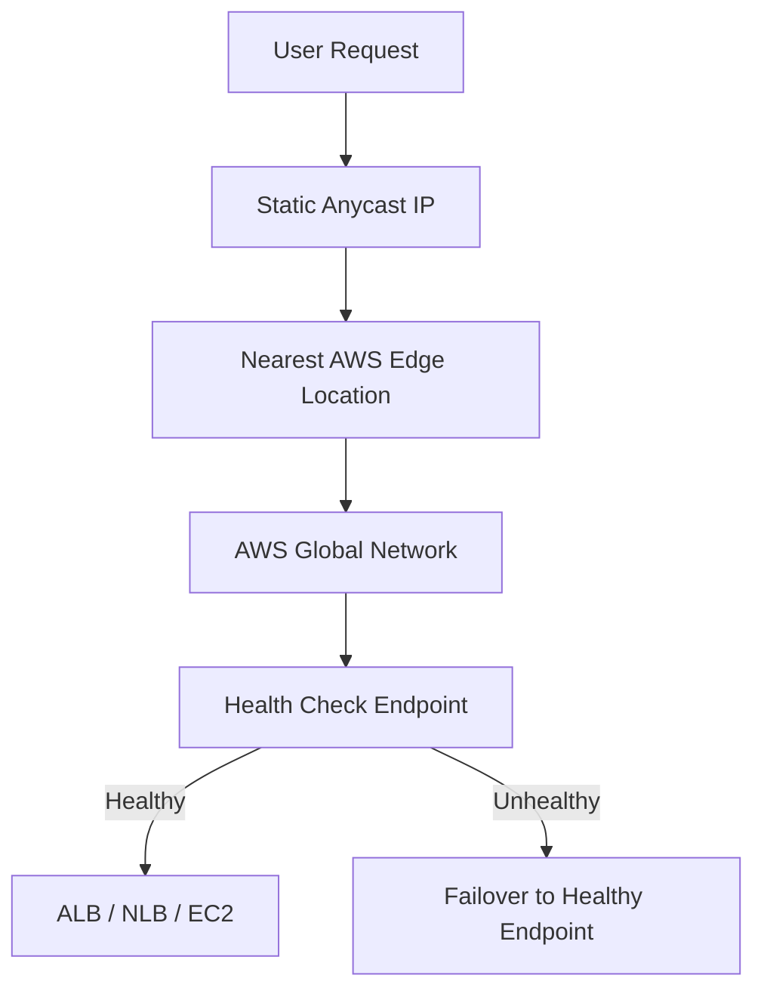
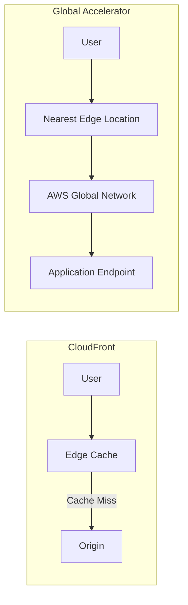

# 171. AWS Global Accelerator – Overview

## 🌍 AWS Global Accelerator là gì?

**AWS Global Accelerator** là dịch vụ giúp **định tuyến lưu lượng truy cập của người dùng qua mạng toàn cầu của AWS (AWS Global Network)** để giảm **latency**, tăng **độ ổn định** và hỗ trợ **failover nhanh**.

Khác với việc để người dùng đi qua Internet công cộng đến ứng dụng, Global Accelerator đưa lưu lượng vào **AWS Network** càng sớm càng tốt thông qua **Edge Locations**.

---

## 1. 🚨 Vấn đề cần giải quyết

Giả sử ứng dụng chỉ được triển khai tại **một Region** (ví dụ: India), nhưng người dùng đến từ khắp nơi trên thế giới.

Nếu truy cập trực tiếp:

* Người dùng phải đi qua nhiều router trên Internet công cộng.
* Độ trễ (**latency**) cao hơn.
* Kết nối kém ổn định hơn.
* Nguy cơ mất gói tin hoặc gián đoạn lớn hơn.

---

## 2. 🌐 Unicast IP vs Anycast IP

### ✅ Unicast IP

* Mỗi server có **một IP riêng**.
* Client kết nối đến đúng IP của server mong muốn.

---

### ✅ Anycast IP

* **Nhiều server cùng chia sẻ một IP Address**.
* Client sẽ tự động được định tuyến đến **server gần nhất**.

Đây chính là cơ chế được **AWS Global Accelerator** sử dụng.

---

## 3. 🚀 Cách AWS Global Accelerator hoạt động

Global Accelerator cấp cho ứng dụng **2 Static Anycast IP** trên toàn cầu.

Người dùng sẽ:

1. Kết nối tới Anycast IP.
2. Được định tuyến đến **AWS Edge Location gần nhất**.
3. Từ Edge Location, lưu lượng đi trên **AWS Global Network** đến ứng dụng.

➡️ Thay vì đi qua Internet công cộng suốt hành trình, lưu lượng nhanh chóng đi vào mạng riêng của AWS.

---

## 4. 📌 Các loại Endpoint được hỗ trợ

AWS Global Accelerator có thể làm việc với:

* ✅ **Elastic IP**
* ✅ **EC2 Instance**
* ✅ **Application Load Balancer (ALB)**
* ✅ **Network Load Balancer (NLB)**

Các endpoint có thể là:

* Public
* Private

---

## 5. ⚡ Lợi ích của AWS Global Accelerator

### 🚀 Giảm độ trễ (Low Latency)

* Định tuyến thông minh đến Edge Location gần nhất.
* Sử dụng **AWS Global Network** thay vì Internet công cộng.

### 🔄 Failover nhanh

* Tự động kiểm tra **Health Check** của endpoint.
* Nếu endpoint lỗi, tự động chuyển sang endpoint khỏe mạnh.
* Thời gian failover thường **dưới 1 phút**.

### 🌐 Static IP toàn cầu

* Cấp **2 Static Anycast IP** cố định.
* Client chỉ cần whitelist hai địa chỉ IP này.

### 🛡️ DDoS Protection

* Tích hợp với **AWS Shield** để bảo vệ trước các cuộc tấn công DDoS.

---

## 6. 📌 Quy trình hoạt động

---

## 7. 🎯 Use Cases

* Ứng dụng toàn cầu cần **độ trễ thấp**.
* **Gaming**.
* **IoT**.
* **VoIP (Voice over IP)**.
* API cần **Static IP**.
* Hệ thống cần **Disaster Recovery** và **Regional Failover** nhanh.

---

## 8. ☁️ So sánh CloudFront và AWS Global Accelerator

| **Tiêu chí**                        | **CloudFront**                   | **AWS Global Accelerator**                 |
| ----------------------------------- | -------------------------------- | ------------------------------------------ |
| 🎯 Mục đích                         | CDN, tăng tốc phân phối nội dung | Tăng tốc định tuyến lưu lượng đến ứng dụng |
| 💾 Cache                            | ✅ Có                             | ❌ Không                                    |
| 🌍 Edge Locations                   | ✅ Có                             | ✅ Có                                       |
| 🚀 Cơ chế                           | Phục vụ nội dung từ Edge Cache   | Proxy lưu lượng qua AWS Global Network     |
| 📄 Static Content (ảnh, video, CSS) | ✅ Rất phù hợp                    | ❌ Không tối ưu                             |
| 🔄 Dynamic Content / API            | ✅ Hỗ trợ tăng tốc                | ✅ Hỗ trợ                                   |
| 🌐 TCP / UDP                        | ❌ Chủ yếu HTTP/HTTPS             | ✅ Hỗ trợ TCP và UDP                        |
| 📌 Static IP                        | ❌ Không cung cấp                 | ✅ Có 2 Static Anycast IP                   |
| 🔁 Regional Failover                | Không phải mục đích chính        | ✅ Tự động failover nhanh                   |
| 🛡️ DDoS Protection                 | AWS Shield                       | AWS Shield                                 |

---

## 9. 📌 CloudFront vs Global Accelerator

* **CloudFront**: tập trung vào **cache nội dung** tại Edge Location.
* **Global Accelerator**: **không cache**, mà tối ưu đường truyền từ người dùng đến ứng dụng.

---

## 10. 📌 Kết luận

* **AWS Global Accelerator** sử dụng **Anycast IP** để đưa người dùng đến **Edge Location gần nhất**.
* Sau đó lưu lượng đi qua **AWS Global Network**, giúp giảm latency và tăng độ ổn định.
* Dịch vụ hỗ trợ **EC2**, **ALB**, **NLB** và **Elastic IP**, đồng thời cung cấp **2 Static IP toàn cầu**, **Health Check**, **Automatic Failover** và **AWS Shield**.
* Khác với **CloudFront**, Global Accelerator **không cache nội dung** mà tập trung vào **tăng tốc kết nối và cải thiện tính sẵn sàng của ứng dụng**.

---

## 📝 Ghi nhớ cho kỳ thi AWS

* ✅ **CloudFront = CDN + Cache nội dung tại Edge Locations**.
* ✅ **AWS Global Accelerator = Định tuyến lưu lượng qua AWS Global Network, không cache**.
* ✅ Sử dụng **2 Static Anycast IP** trên toàn cầu.
* ✅ Hỗ trợ **TCP/UDP**, **Health Checks** và **Automatic Failover**.
* ✅ Nếu đề bài yêu cầu **Static IP toàn cầu**, **giảm latency cho ứng dụng**, hoặc **failover giữa nhiều Region**, hãy nghĩ đến **AWS Global Accelerator**.
