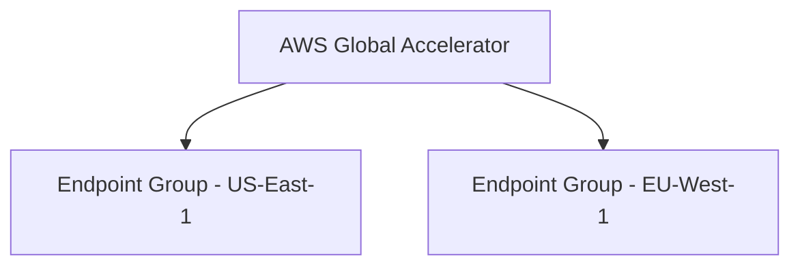
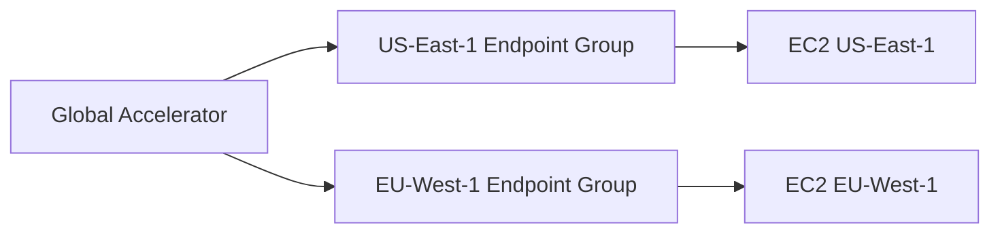
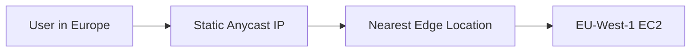
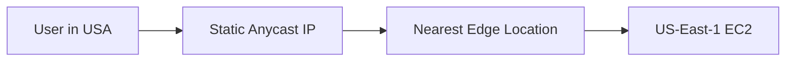
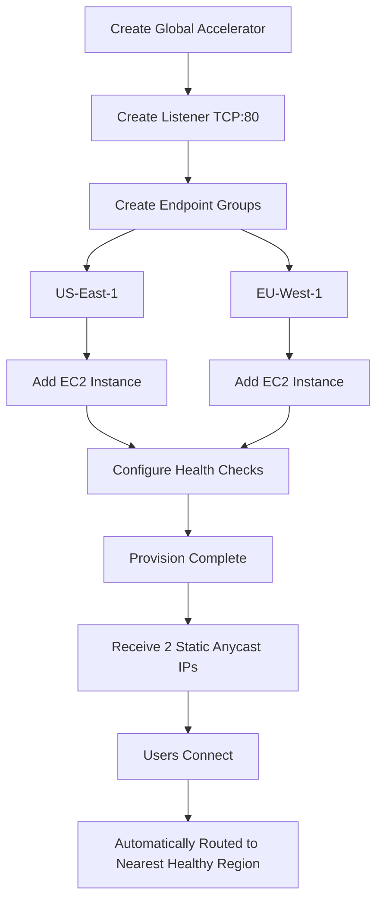

# 172. AWS Global Accelerator – Hands On

## 🛠️ Thực hành cấu hình AWS Global Accelerator

Bài thực hành minh họa cách sử dụng **AWS Global Accelerator** để phân phối lưu lượng đến các **EC2 Instances** ở nhiều **AWS Region**, giúp người dùng luôn được kết nối đến endpoint gần nhất.

---

## 1. 🚀 Tạo Global Accelerator

Các bước cấu hình:

* Đặt tên Accelerator (ví dụ: `Demo`).
* Chọn:

  * **Accelerator Type:** `Standard`
  * **Routing:** `IPv4`
* Tạo **Listener**:

  * **Protocol:** `TCP`
  * **Port:** `80` (HTTP)
* **Client Affinity**:

  * `None`: không cố định người dùng vào một backend.
  * `Source IP`: cùng một client sẽ ưu tiên đến cùng backend.

---

## 2. 🌍 Tạo Endpoint Groups theo Region

Trong ví dụ, tạo hai **Endpoint Group**:

* `US-East-1`
* `EU-West-1`

Mỗi Endpoint Group đại diện cho một AWS Region có thể nhận lưu lượng từ Global Accelerator.



---

## 3. 🖥️ Triển khai EC2 Instances

Ở mỗi Region:

* Launch một **EC2 Instance**.
* Mở **HTTP (Port 80)** trong **Security Group**.
* Sử dụng **User Data** để cài web server đơn giản hiển thị thông tin Region.

Ví dụ:

* EC2 tại **US-East-1** trả về:

```text
Hello World from US-East-1
```

* EC2 tại **EU-West-1** trả về:

```text
Hello World from EU-West-1
```

Điều này giúp dễ dàng xác định request đang được xử lý bởi Region nào.

---

## 4. 🔗 Thêm EC2 vào Endpoint Groups

Global Accelerator hỗ trợ nhiều loại Endpoint:

* ✅ EC2 Instance
* ✅ Application Load Balancer (ALB)
* ✅ Network Load Balancer (NLB)
* ✅ Elastic IP

Trong bài demo:

* Endpoint Group `US-East-1` → EC2 tại `US-East-1`
* Endpoint Group `EU-West-1` → EC2 tại `EU-West-1`



---

## 5. ❤️ Cấu hình Health Checks

Để Global Accelerator xác định endpoint có hoạt động hay không:

* **Protocol:** HTTP
* **Port:** 80
* **Path:** `/`
* **Health Check Interval:** 10 giây
* **Threshold:** 2 lần kiểm tra thành công

Sau khi provisioning hoàn tất, trạng thái endpoint sẽ chuyển sang **Healthy**.

---

## 6. 🌐 Sử dụng Static Anycast IP

Khi Global Accelerator hoạt động:

* AWS cấp **2 Static Anycast IP**.
* Người dùng truy cập thông qua các IP này thay vì truy cập trực tiếp EC2.

Global Accelerator sẽ định tuyến request đến **Region gần nhất** dựa trên vị trí của người dùng.



Nếu người dùng ở Mỹ:



---

## 7. 🧪 Kiểm chứng bằng VPN

Trong bài demo:

* Khi truy cập từ vị trí gần **Châu Âu**, trình duyệt nhận phản hồi:

```text
Hello World from EU-West-1
```

* Sau khi chuyển VPN sang **Hoa Kỳ**, cùng địa chỉ Global Accelerator trả về:

```text
Hello World from US-East-1
```

➡️ Điều này chứng minh Global Accelerator tự động định tuyến người dùng đến endpoint gần nhất.

---

## 8. 🧹 Dọn dẹp tài nguyên

Sau khi thực hành:

1. **Disable** Global Accelerator.
2. **Delete** Global Accelerator.
3. **Terminate** tất cả EC2 Instances ở các Region.

Việc này giúp tránh phát sinh chi phí không cần thiết.

---

## 📌 Quy trình tổng quát



---

## 📊 Thành phần chính

| **Thành phần**        | **Vai trò**                                       |
| --------------------- | ------------------------------------------------- |
| 🌐 Global Accelerator | Dịch vụ định tuyến lưu lượng toàn cầu             |
| 📡 Listener           | Lắng nghe kết nối (TCP/UDP, Port 80, 443, …)      |
| 🌍 Endpoint Group     | Nhóm endpoint trong một AWS Region                |
| 🖥️ Endpoint          | EC2, ALB, NLB hoặc Elastic IP                     |
| ❤️ Health Check       | Kiểm tra tình trạng endpoint để hỗ trợ failover   |
| 📌 Static Anycast IP  | Hai địa chỉ IP toàn cầu cố định để client kết nối |

---

## 📝 Ghi nhớ cho kỳ thi AWS

* ✅ **Global Accelerator** cấp **2 Static Anycast IP** dùng chung trên toàn cầu.
* ✅ Hỗ trợ các endpoint như **EC2**, **ALB**, **NLB** và **Elastic IP**.
* ✅ Sử dụng **Health Checks** để chỉ định tuyến đến endpoint khỏe mạnh và hỗ trợ **Automatic Failover**.
* ✅ Người dùng được chuyển đến **Region gần nhất** thông qua **AWS Global Network**, giúp giảm độ trễ và tăng tính ổn định.
* ✅ Sau khi thử nghiệm, nên **xóa Global Accelerator và terminate EC2 Instances** để tránh phát sinh chi phí.
