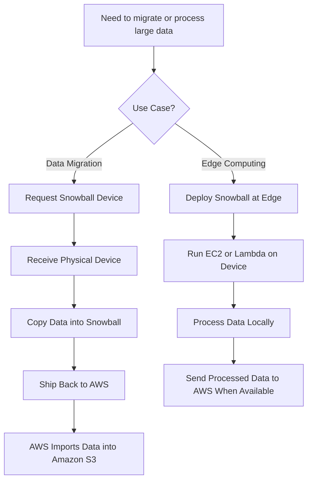

# 173. AWS Snow Family Overview

## ❄️ AWS Snow Family – Thiết bị vật lý để di chuyển dữ liệu và Edge Computing

**AWS Snow Family** là tập hợp các thiết bị phần cứng bảo mật cao của AWS, được sử dụng để:

* 📦 **Di chuyển lượng lớn dữ liệu** vào/ra AWS.
* 🖥️ **Xử lý dữ liệu tại Edge (Edge Computing)** ở những nơi có kết nối Internet hạn chế hoặc không có Internet.

---

## 1. 📦 AWS Snowball là gì?

Thay vì truyền dữ liệu qua Internet, AWS gửi một **thiết bị vật lý (Snowball Edge)** đến nơi của bạn.

Quy trình:

1. AWS gửi thiết bị Snowball.
2. Bạn copy dữ liệu vào thiết bị.
3. Gửi thiết bị trở lại AWS.
4. AWS import dữ liệu vào dịch vụ như **Amazon S3**.

➡️ Phù hợp khi cần di chuyển **hàng chục TB đến hàng PB (Petabyte)** dữ liệu.

---

## 2. 🏗️ Hai loại Snowball Edge

| **Loại**              | **Dung lượng** | **Mục đích chính**                         |
| --------------------- | -------------- | ------------------------------------------ |
| **Storage Optimized** | ~210 TB        | Di chuyển và lưu trữ lượng dữ liệu rất lớn |
| **Compute Optimized** | ~28 TB         | Edge Computing, xử lý dữ liệu tại chỗ      |

> 📌 **Storage Optimized** ưu tiên dung lượng lưu trữ, còn **Compute Optimized** ưu tiên khả năng tính toán.

---

## 3. 🚚 Khi nào nên dùng Snowball để Migration?

Ví dụ:

* Muốn truyền **100 TB** dữ liệu qua đường truyền **1 Gbps**.
* Thời gian ước tính lên đến khoảng **12 ngày**.

Nếu gặp các vấn đề như:

* ❌ Băng thông thấp.
* ❌ Kết nối Internet không ổn định.
* ❌ Chi phí truyền dữ liệu cao.
* ❌ Phải chia sẻ băng thông với ứng dụng khác.
* ❌ Việc truyền dữ liệu mất **hơn khoảng 1 tuần**.

➡️ AWS khuyến nghị sử dụng **Snowball** thay vì truyền trực tiếp qua mạng.

---

## 4. 🔄 So sánh Upload trực tiếp và Snowball

### Upload qua Internet

* Đơn giản.
* Nhưng tiêu tốn nhiều băng thông và thời gian.

---

### Sử dụng Snowball

**Ưu điểm:**

* Không phụ thuộc tốc độ Internet.
* Di chuyển dữ liệu khối lượng cực lớn hiệu quả.
* Bảo mật cao.

---

## 5. 🖥️ Edge Computing với Snowball

Ngoài việc vận chuyển dữ liệu, Snowball còn có thể xử lý dữ liệu ngay tại nơi phát sinh.

Các môi trường điển hình:

* 🚛 Xe tải trên đường.
* 🚢 Tàu ngoài biển.
* ⛏️ Mỏ khai thác.
* 🌄 Khu vực hẻo lánh không có Internet.

---

## 6. ⚙️ Khả năng Compute của Snowball

Snowball Edge không chỉ lưu dữ liệu mà còn có thể chạy:

* ✅ **EC2 Instances**
* ✅ **AWS Lambda Functions**

Nhờ đó có thể:

* Tiền xử lý dữ liệu (Pre-processing).
* Chạy Machine Learning tại Edge.
* Chuyển đổi (Transcode) video/media.
* Lọc dữ liệu trước khi gửi lên AWS.

---

## 7. 📌 Các Use Cases phổ biến

### 📦 Data Migration

* Di chuyển hàng trăm TB hoặc PB dữ liệu lên AWS.
* Chuyển dữ liệu từ Data Center on-premises lên Amazon S3.

### 🖥️ Edge Computing

* Xử lý dữ liệu tại nơi tạo ra dữ liệu.
* Chạy ứng dụng ở khu vực không có Internet ổn định.
* Giảm lượng dữ liệu cần truyền về Cloud.

---

## 📊 Quy trình tổng quát

---

## 📝 Ghi nhớ cho kỳ thi AWS

* ✅ **AWS Snowball** là thiết bị vật lý dùng để **Data Migration** và **Edge Computing**.
* ✅ Khi việc truyền dữ liệu qua mạng mất **hơn khoảng 1 tuần** hoặc băng thông hạn chế, nên cân nhắc dùng **Snowball**.
* ✅ **Storage Optimized** (~210 TB) phù hợp để vận chuyển dữ liệu lớn.
* ✅ **Compute Optimized** (~28 TB) phù hợp cho xử lý dữ liệu tại Edge.
* ✅ Snowball Edge có thể chạy **EC2 Instances** và **Lambda Functions** ngay trên thiết bị.
* ✅ Các use case điển hình: **migrating petabytes of data**, **Machine Learning tại Edge**, **media transcoding**, và **xử lý dữ liệu ở nơi không có Internet ổn định**.
