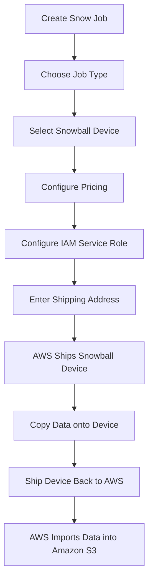

# 174. AWS Snow Family – Hands On

## 🛠️ Thực hành tạo AWS Snow Family Job

Bài thực hành này minh họa quy trình **đặt (order) một thiết bị AWS Snowball Edge** để **Import**, **Export** hoặc **Edge Computing**. Mục tiêu là làm quen với các tùy chọn cấu hình chứ không thực sự đặt thiết bị.

---

## 1. 📝 Tạo Snow Job

Khi tạo một Snow Job, trước tiên cần nhập:

* **Job Name** (ví dụ: `My Import Job`)
* **Job Type** – xác định mục đích sử dụng của thiết bị.

Có 3 loại Job chính:

| **Job Type**                       | **Mô tả**                                                                              |
| ---------------------------------- | -------------------------------------------------------------------------------------- |
| **Import into Amazon S3**          | AWS gửi Snowball đến bạn → bạn copy dữ liệu → gửi lại AWS → dữ liệu được import vào S3 |
| **Export from Amazon S3**          | AWS copy dữ liệu từ S3 vào Snowball → gửi thiết bị đến bạn                             |
| **Local Compute and Storage Only** | Dùng Snowball để xử lý dữ liệu và lưu trữ tại Edge, không phục vụ migration            |

---

## 2. 📦 Chọn loại Snow Device

Hiện tại có hai lựa chọn phổ biến:

| **Thiết bị**                        | **Dung lượng** | **Mục đích**                             |
| ----------------------------------- | -------------- | ---------------------------------------- |
| **Snowball Edge Storage Optimized** | ~210 TB        | Data Migration và lưu trữ khối lượng lớn |
| **Snowball Edge Compute Optimized** | ~28 TB         | Edge Computing, chạy EC2/Lambda tại Edge |

> 📌 Một số dòng Snow Family cũ có thể đã ngừng hỗ trợ (discontinued), nhưng đối với kỳ thi AWS chỉ cần nắm rõ các loại thiết bị chính.

---

## 3. 💰 Cấu hình Pricing và Data Transfer

Sau khi chọn thiết bị:

* Chọn **Pricing Option** (ví dụ: On-demand).
* Chỉ định **Amazon S3 Bucket** đích (đối với Import) hoặc nguồn (đối với Export).
* Cấu hình thêm các tùy chọn nếu cần.

---

## 4. 🔐 Cấu hình Security

Snowball sử dụng cơ chế mã hóa và IAM để bảo vệ dữ liệu.

Cần chỉ định:

* **Service Role (IAM Role)**

Role này cho phép Snowball truy cập các tài nguyên AWS như **Amazon S3** để đọc hoặc ghi dữ liệu.

---

## 5. 🚚 Cấu hình Shipping

Khai báo:

* 📍 Địa chỉ nhận thiết bị.
* 🚛 Tốc độ vận chuyển:

  * One-day shipping.
  * Two-day shipping.
* 🔔 Email hoặc thông báo theo dõi trạng thái Job.

Sau khi xác nhận, AWS sẽ gửi thiết bị vật lý đến địa chỉ đã đăng ký.

---

## 6. 🔄 Quy trình sử dụng Snowball

Sau khi nhận thiết bị:

1. Copy dữ liệu vào Snowball.
2. Đóng gói lại thiết bị.
3. Gửi trả AWS bằng **shipping label** đi kèm.
4. AWS tự động import dữ liệu vào Amazon S3.

---

## 📊 Import vs Export

| **Import Job**                       | **Export Job**                               |
| ------------------------------------ | -------------------------------------------- |
| AWS gửi Snowball đến khách hàng      | AWS copy dữ liệu từ S3 vào Snowball          |
| Khách hàng copy dữ liệu vào thiết bị | AWS gửi thiết bị chứa dữ liệu cho khách hàng |
| Gửi thiết bị lại AWS                 | Khách hàng nhận thiết bị và lấy dữ liệu      |
| AWS import dữ liệu vào Amazon S3     | Dữ liệu được lấy từ Amazon S3                |

---

## 📝 Ghi nhớ cho kỳ thi AWS

* ✅ **Import Job**: Copy dữ liệu từ **On-premises → Snowball → Amazon S3**.
* ✅ **Export Job**: Copy dữ liệu từ **Amazon S3 → Snowball → On-premises**.
* ✅ **Local Compute and Storage Only**: dùng cho **Edge Computing**, không phải migration.
* ✅ Cần cấu hình **IAM Service Role** để Snowball có quyền truy cập Amazon S3.
* ✅ Sau khi sử dụng xong, chỉ cần gửi lại thiết bị cho AWS bằng **shipping label** đi kèm; AWS sẽ xử lý việc import/export dữ liệu.
