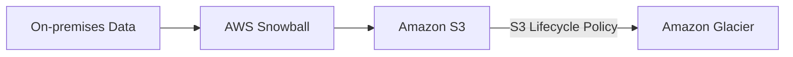
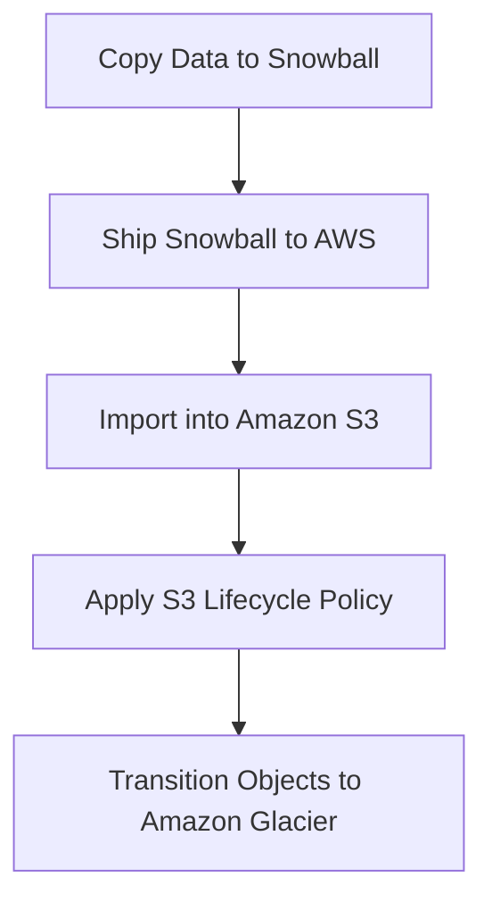

# 175. Architecture: Snowball into Glacier

## ❄️ Snowball không thể import trực tiếp vào Glacier

Đây là một tình huống thường xuất hiện trong kỳ thi AWS.

Giả sử bạn muốn sử dụng **AWS Snowball** để chuyển dữ liệu vào **Amazon Glacier** nhằm lưu trữ dài hạn.

⚠️ **Snowball KHÔNG hỗ trợ import dữ liệu trực tiếp vào Glacier.**

---

## 1. ✅ Giải pháp đúng

Thay vào đó, cần thực hiện theo 2 bước:

1. **Snowball import dữ liệu vào Amazon S3**.
2. Sử dụng **S3 Lifecycle Policy** để tự động chuyển (transition) dữ liệu từ **Amazon S3** sang **Amazon Glacier**.

---

## 2. 🔄 Quy trình hoạt động

1. AWS gửi thiết bị **Snowball** đến khách hàng.
2. Khách hàng copy dữ liệu vào Snowball.
3. Gửi thiết bị lại AWS.
4. AWS import dữ liệu vào **Amazon S3**.
5. **S3 Lifecycle Policy** tự động chuyển object sang **Amazon Glacier** theo cấu hình.

---

## 📊 Tóm tắt

| **Yêu cầu**                                      | **Có hỗ trợ?** |
| ------------------------------------------------ | -------------- |
| Snowball → Amazon S3                             | ✅ Có           |
| Snowball → Amazon Glacier trực tiếp              | ❌ Không        |
| Amazon S3 → Amazon Glacier bằng Lifecycle Policy | ✅ Có           |

---

## 📝 Ghi nhớ cho kỳ thi AWS

* ❌ **AWS Snowball không thể import dữ liệu trực tiếp vào Amazon Glacier.**
* ✅ Muốn lưu dữ liệu trong Glacier, hãy:

  * **Snowball → Amazon S3**
  * **Amazon S3 → Amazon Glacier** thông qua **S3 Lifecycle Policy**.
* ⭐ Nếu đề thi hỏi cách đưa lượng lớn dữ liệu vào Glacier bằng Snowball, đáp án đúng là **import vào S3 trước rồi dùng Lifecycle Policy để transition sang Glacier**.
