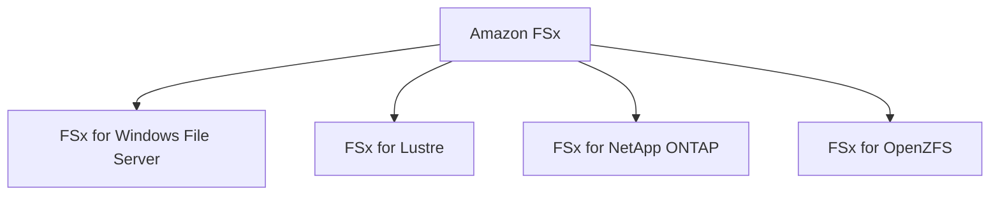
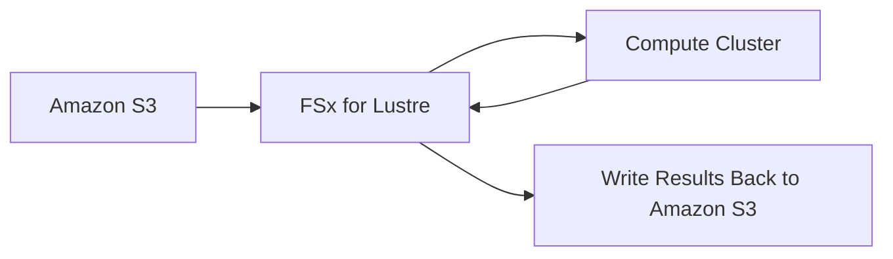
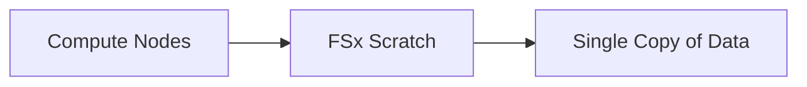
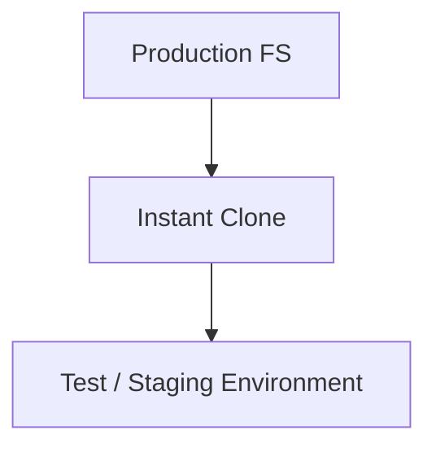
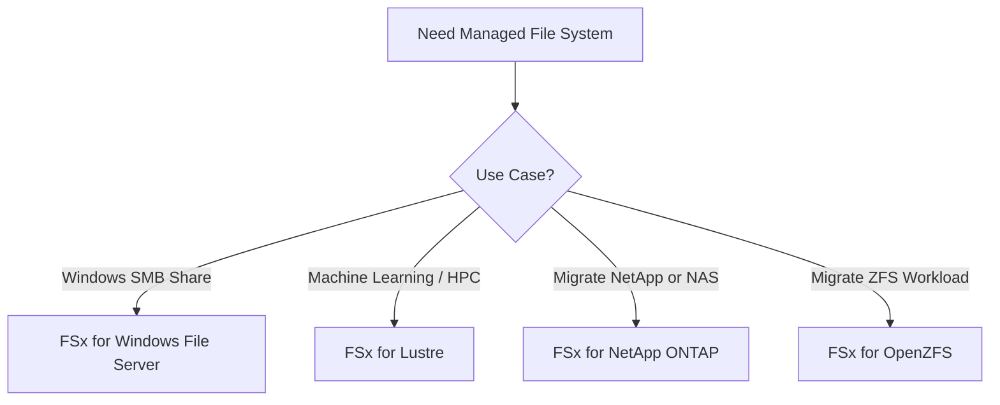

# 176. Amazon FSx

## 📁 Amazon FSx – Dịch vụ File System được quản lý hoàn toàn trên AWS

**Amazon FSx** là dịch vụ cho phép triển khai các **file system phổ biến của bên thứ ba** dưới dạng **Fully Managed Service** trên AWS.

Có thể hiểu đơn giản:

* **Amazon RDS** → Managed Database (MySQL, PostgreSQL, ...)
* **Amazon FSx** → Managed File System (Windows File Server, Lustre, NetApp ONTAP, OpenZFS, ...)

---

## 1. 🏗️ Các loại Amazon FSx

Hiện tại cần ghi nhớ 4 loại chính:

| **FSx Service**                 | **Use Case chính**                                 |
| ------------------------------- | -------------------------------------------------- |
| **FSx for Windows File Server** | Windows Shared File System (SMB)                   |
| **FSx for Lustre**              | High Performance Computing (HPC), Machine Learning |
| **FSx for NetApp ONTAP**        | Di chuyển NAS/ONTAP workloads lên AWS              |
| **FSx for OpenZFS**             | Di chuyển ZFS workloads lên AWS                    |

---

# 🪟 2. FSx for Windows File Server

## Đặc điểm

* Fully Managed **Windows File Server**.
* Hỗ trợ:

  * ✅ **SMB Protocol**
  * ✅ **NTFS**
* Tích hợp **Microsoft Active Directory (AD)**.
* Hỗ trợ:

  * Access Control Lists (ACLs).
  * User Quotas.

> 📌 Mặc dù là Windows File Server nhưng **Linux EC2 cũng có thể mount được**.

---

## Khả năng tích hợp

Nếu doanh nghiệp đã có Windows File Server On-premises:

* Có thể sử dụng **Microsoft DFS (Distributed File System)** để kết nối với FSx.

---

## Storage Options

| Storage | Phù hợp                                             |
| ------- | --------------------------------------------------- |
| **SSD** | Database, Analytics, Media Processing (Low Latency) |
| **HDD** | Home Directory, CMS, Workload thông thường          |

---

## Tính năng nổi bật

* Multi-AZ High Availability.
* Truy cập từ On-premises qua kết nối riêng.
* Backup hàng ngày lên Amazon S3.
* Scale đến:

  * Hàng trăm PB dữ liệu.
  * Hàng triệu IOPS.

---

# 🚀 3. FSx for Lustre

## Lustre là gì?

Tên **Lustre** bắt nguồn từ:

> **Linux + Cluster**

Đây là Distributed File System dành cho:

* Machine Learning.
* High Performance Computing (**HPC**).

➡️ Khi đề bài có từ khóa **HPC**, gần như nghĩ ngay đến **FSx for Lustre**.

---

## Use Cases

* Machine Learning.
* Video Processing.
* Financial Modeling.
* Electronic Design Automation (EDA).

---

## Hiệu năng

* Hàng trăm GB/s throughput.
* Millions of IOPS.
* Sub-millisecond latency.

---

## Storage Options

| Storage | Phù hợp                                     |
| ------- | ------------------------------------------- |
| SSD     | IOPS cao, file nhỏ, random access           |
| HDD     | Throughput cao, file lớn, sequential access |

---

## 🔗 Tích hợp với Amazon S3

FSx for Lustre có thể làm việc trực tiếp với S3:

* Đọc dữ liệu từ **Amazon S3** như một File System.
* Sau khi xử lý xong, ghi kết quả trở lại **Amazon S3**.

➡️ Đây là điểm rất hay xuất hiện trong đề thi.

---

# 4. 📂 Scratch vs Persistent File System

## Scratch File System

Đặc điểm:

* Temporary Storage.
* ❌ Không Replication.
* Nếu server lỗi → mất dữ liệu.
* Hiệu năng cực cao (Burst lớn).

Phù hợp:

* Short-term processing.
* Temporary workloads.
* Cost Optimization.

---

## Persistent File System

Đặc điểm:

* Long-term Storage.
* ✅ Có Replication trong cùng AZ.
* Server lỗi → tự động khôi phục trong vài phút.

Phù hợp:

* Long-running jobs.
* Sensitive Data.
* Dữ liệu cần độ bền cao.

---

# 🗄️ 5. FSx for NetApp ONTAP

Đây là phiên bản Managed của **NetApp ONTAP** trên AWS.

## Hỗ trợ Protocol

* ✅ NFS
* ✅ SMB
* ✅ iSCSI

---

## Use Case

Di chuyển workload đang chạy trên:

* NetApp ONTAP.
* NAS Storage.

lên AWS.

---

## Tính năng nổi bật

* Auto Scaling Storage.
* Snapshots.
* Replication.
* Data Compression.
* **Data Deduplication**.
* **Point-in-time Instantaneous Cloning**.

➡️ Clone gần như tức thì để test hoặc staging.

---

# 🐧 6. FSx for OpenZFS

Managed **OpenZFS** trên AWS.

## Hỗ trợ

* ✅ NFS Protocol.

---

## Use Case

Di chuyển hệ thống đang dùng **ZFS** lên AWS.

---

## Tính năng

* Lên đến 1 triệu IOPS.
* Latency < 0.5 ms.
* Snapshots.
* Compression.
* Point-in-time Cloning.

⚠️ **Không hỗ trợ Data Deduplication** (khác NetApp ONTAP).

---

# 📊 So sánh nhanh

| Tiêu chí           | Windows File Server  | Lustre               | NetApp ONTAP    | OpenZFS       |
| ------------------ | -------------------- | -------------------- | --------------- | ------------- |
| Protocol           | SMB, NTFS            | Lustre               | NFS, SMB, iSCSI | NFS           |
| Dùng cho           | Windows Shared Files | HPC, ML              | NAS Migration   | ZFS Migration |
| Active Directory   | ✅                    | ❌                    | ❌               | ❌             |
| Tích hợp S3        | Backup               | ✅ Native Integration | ❌               | ❌             |
| Data Deduplication | ❌                    | ❌                    | ✅               | ❌             |
| Instant Clone      | ❌                    | ❌                    | ✅               | ✅             |
| Điểm nổi bật       | Windows File Share   | HPC cực nhanh        | Enterprise NAS  | Hiệu năng ZFS |

---

# 📌 Quy trình lựa chọn FSx

---

# 📝 Ghi nhớ cho kỳ thi AWS

* ✅ **FSx for Windows File Server** → SMB, NTFS, Active Directory, hỗ trợ cả Linux mount.
* ✅ **FSx for Lustre** → **Machine Learning**, **HPC**, tích hợp trực tiếp với **Amazon S3**.
* ✅ **Scratch File System** → Temporary, không replication, hiệu năng cao.
* ✅ **Persistent File System** → Replication trong cùng AZ, phù hợp lưu trữ lâu dài.
* ✅ **FSx for NetApp ONTAP** → Hỗ trợ **NFS/SMB/iSCSI**, có **Data Deduplication** và **Instant Cloning**.
* ✅ **FSx for OpenZFS** → Dành cho workload ZFS, hỗ trợ **NFS**, **Snapshots** và **Instant Cloning**, nhưng **không có Data Deduplication**.
* ⭐ Từ khóa quan trọng trong đề thi:

  * **HPC / Machine Learning** → **FSx for Lustre**
  * **Windows File Share / SMB / Active Directory** → **FSx for Windows File Server**
  * **NetApp / NAS Migration** → **FSx for NetApp ONTAP**
  * **ZFS Migration** → **FSx for OpenZFS**
