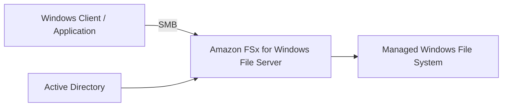

# Amazon FSx Overview

## 📁 Amazon FSx – Dịch vụ Managed File Systems trên AWS

### 1. **Amazon FSx là gì?**

* **Amazon FSx** là dịch vụ cung cấp các **Managed File Systems** trên AWS.
* Thay vì tự cài đặt và quản lý File Server, AWS sẽ quản lý hạ tầng giúp bạn.
* Đối với kỳ thi AWS, cần nắm rõ **4 loại FSx chính**:

  * 📂 **FSx for Lustre**
  * 🪟 **FSx for Windows File Server**
  * 🗄️ **FSx for NetApp ONTAP**
  * 🐧 **FSx for OpenZFS**

---

## 2. 🚀 FSx for Lustre

### Mục đích

* Cung cấp **Lustre File System** trên AWS.
* Phù hợp với các workload cần **High Performance Computing (HPC)** hoặc yêu cầu hiệu năng cao.

### Đặc điểm

* Có hai loại File System:

  * ✅ **Persistent**
  * ✅ **Scratch**
* Có thể cấu hình:

  * Deployment Type
  * Storage Type
  * Throughput
  * VPC
  * Encryption

> 📌 Đối với kỳ thi, chỉ cần nhớ rằng **FSx for Lustre** hỗ trợ **Persistent** và **Scratch File Systems**.

---

## 3. 🪟 FSx for Windows File Server

### Mục đích

* Cung cấp **Windows File Server** được quản lý trên AWS.

### Đặc điểm

* Truy cập thông qua giao thức **SMB (Server Message Block)**.
* Hỗ trợ triển khai:

  * ✅ **Single-AZ** (thường phù hợp cho môi trường Dev/Test)
  * ✅ **Multi-AZ** (tăng tính sẵn sàng)
* Có thể lựa chọn:

  * SSD hoặc HDD
  * Storage Capacity
  * Throughput Capacity
* Tích hợp xác thực với **Active Directory**:

  * AWS Managed Active Directory
  * Self-managed Microsoft Active Directory
* Hỗ trợ Encryption, Backup và Maintenance.

### Luồng truy cập

---

## 4. 🗄️ FSx for NetApp ONTAP

### Mục đích

* Cung cấp **NetApp ONTAP File System** trên AWS.

### Đặc điểm

* Tương thích với nhiều hệ điều hành:

  * 🐧 Linux
  * 🪟 Windows
  * 🍎 macOS
* Hỗ trợ:

  * **Single-AZ**
  * **Multi-AZ**
* Có các tính năng tối ưu lưu trữ (**Storage Efficiency**):

  * ✅ **Deduplication**
  * ✅ **Compression**
  * ✅ **Compaction**
* Mang lại hiệu năng cao và tận dụng các tính năng quen thuộc của NetApp.

---

## 5. 🐧 FSx for OpenZFS

### Mục đích

* Cung cấp **OpenZFS File System** trên AWS.

### Đặc điểm

* Tương thích với:

  * 🐧 Linux
  * 🪟 Windows
  * 🍎 macOS
* Được quản lý hoàn toàn bởi AWS.
* Phù hợp với các ứng dụng yêu cầu sử dụng hệ thống file **ZFS**.

---

## 6. 📊 So sánh các loại Amazon FSx

| Tiêu chí                     | **FSx for Lustre**               | **FSx for Windows File Server** | **FSx for NetApp ONTAP**                           | **FSx for OpenZFS**        |
| ---------------------------- | -------------------------------- | ------------------------------- | -------------------------------------------------- | -------------------------- |
| 🎯 Mục đích                  | Lustre File System hiệu năng cao | Windows File Server             | NetApp ONTAP                                       | OpenZFS                    |
| 📡 Giao thức chính           | Lustre                           | **SMB**                         | Nhiều giao thức của ONTAP                          | ZFS                        |
| 💻 Hệ điều hành              | Chủ yếu Linux/HPC                | Windows                         | Linux / Windows / macOS                            | Linux / Windows / macOS    |
| 🏢 Hỗ trợ Multi-AZ           | Có                               | Có                              | Có                                                 | Có (tùy cấu hình)          |
| 🔑 Tích hợp Active Directory | Không                            | ✅ Có                            | Có thể tích hợp                                    | Không phải tính năng chính |
| ⚡ Tính năng nổi bật          | **Persistent**, **Scratch**      | SMB + Active Directory          | **Deduplication**, **Compression**, **Compaction** | Managed ZFS trên AWS       |

---

## 7. 📌 Mẹo ghi nhớ cho kỳ thi

* 🚀 **FSx for Lustre** → Dùng **Lustre File System**, nhớ hai chế độ **Persistent** và **Scratch**.
* 🪟 **FSx for Windows File Server** → **Windows File Share** qua giao thức **SMB**, tích hợp **Active Directory**.
* 🗄️ **FSx for NetApp ONTAP** → Hệ thống file **NetApp**, hỗ trợ **Linux / Windows / macOS** và các tính năng **Deduplication**, **Compression**, **Compaction**.
* 🐧 **FSx for OpenZFS** → Cung cấp **OpenZFS File System** được quản lý trên AWS.

---

## ✅ Kết luận

* **Amazon FSx** là dịch vụ cung cấp các **Managed File Systems** trên AWS.
* Có 4 lựa chọn quan trọng cần ghi nhớ:

  * **FSx for Lustre** → Lustre File System cho workload hiệu năng cao.
  * **FSx for Windows File Server** → Windows File Server sử dụng **SMB** và tích hợp **Active Directory**.
  * **FSx for NetApp ONTAP** → NetApp File System với các tính năng tối ưu lưu trữ như **Deduplication**, **Compression**, **Compaction**.
  * **FSx for OpenZFS** → Managed **OpenZFS** trên AWS.
* Trong kỳ thi AWS, trọng tâm là **phân biệt đúng từng loại FSx và use case phù hợp**.
