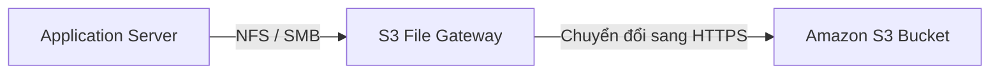
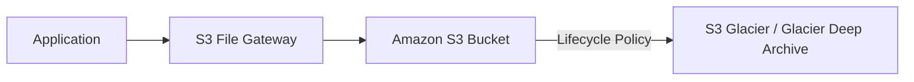
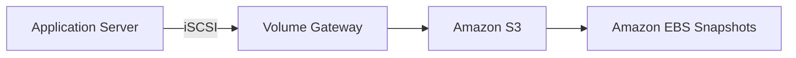
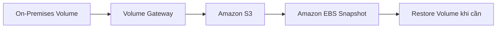
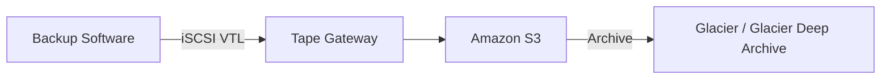
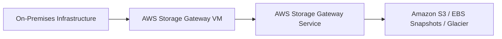

# 178. AWS Storage Gateway Overview

## 🌉 AWS Storage Gateway – Cầu nối giữa On-Premises và AWS Cloud

### 1. **AWS Storage Gateway là gì?**

* **AWS Storage Gateway** là dịch vụ giúp kết nối (**bridge**) giữa hệ thống **On-Premises** và **AWS Cloud**.
* Thường được sử dụng trong mô hình **Hybrid Cloud**, khi một phần hạ tầng nằm tại doanh nghiệp và phần còn lại chạy trên AWS.

---

## 2. 🎯 Các Use Case chính

* 🔄 **Disaster Recovery**: Backup dữ liệu On-Premises lên AWS.
* 💾 **Backup & Restore**.
* ☁️ **Cloud Migration**.
* 📈 Mở rộng dung lượng lưu trữ sang Cloud.
* ⚡ Giữ dữ liệu thường truy cập ở On-Premises và lưu dữ liệu ít truy cập trên AWS.
* 🚀 Sử dụng AWS làm nơi lưu trữ chính nhưng vẫn cache dữ liệu cục bộ để giảm độ trễ.

---

## 3. 📂 Amazon S3 File Gateway

### Mục đích

Cho phép ứng dụng **On-Premises** truy cập **Amazon S3** như một **Network File Share** thông qua **NFS** hoặc **SMB**.

### Luồng hoạt động

### Đặc điểm

* Ứng dụng không cần biết dữ liệu thực tế nằm trên S3.
* File Gateway tự động chuyển request **NFS/SMB → HTTPS**.
* Chỉ cache các file **Most Recently Used** để tăng tốc truy cập.
* Hỗ trợ:

  * S3 Standard
  * S3 Standard-IA
  * S3 One Zone-IA
  * S3 Intelligent-Tiering
* ❌ Không truy cập trực tiếp **Glacier**.
* ✅ Có thể dùng **Lifecycle Policy** để chuyển object sang **S3 Glacier** hoặc **Glacier Deep Archive**.
* Sử dụng **IAM Role** để truy cập S3.
* Khi dùng **SMB**, có thể tích hợp **Active Directory** để xác thực người dùng.

### Lifecycle sang Glacier

---

## 4. 💽 Volume Gateway

### Mục đích

Cung cấp **Block Storage** qua giao thức **iSCSI** và backup dữ liệu lên AWS dưới dạng **Amazon EBS Snapshots**.

### Luồng hoạt động

### Hai chế độ

#### ✅ Cached Volumes

* Dữ liệu chính nằm trên AWS.
* Chỉ cache dữ liệu truy cập gần đây tại On-Premises để giảm độ trễ.

#### ✅ Stored Volumes

* Toàn bộ dữ liệu chính nằm trên On-Premises.
* Backup định kỳ lên Amazon S3.

### Khôi phục dữ liệu

---

## 5. 📼 Tape Gateway

### Mục đích

Dành cho các doanh nghiệp đang sử dụng hệ thống **Tape Backup** truyền thống.

### Luồng hoạt động

### Đặc điểm

* Tạo **Virtual Tape Library (VTL)** thay thế Tape vật lý.
* Tương thích với nhiều phần mềm backup phổ biến.
* Có thể archive tape sang **Glacier** hoặc **Glacier Deep Archive** để giảm chi phí lưu trữ.

---

## 6. 🏢 Vị trí triển khai Storage Gateway

**Storage Gateway** phải được triển khai dưới dạng **VM** trong môi trường **On-Premises**.

---

## 7. 📊 So sánh các loại Storage Gateway

| Tiêu chí     | **S3 File Gateway**        | **Volume Gateway**               | **Tape Gateway**         |
| ------------ | -------------------------- | -------------------------------- | ------------------------ |
| 🎯 Mục đích  | Truy cập S3 như File Share | Backup Block Storage             | Tape Backup trên Cloud   |
| 📡 Giao thức | NFS, SMB                   | iSCSI                            | iSCSI VTL                |
| 💾 Backend   | Amazon S3                  | Amazon S3 + Amazon EBS Snapshots | Amazon S3 + Glacier      |
| ⚡ Cache      | Có (Most Recently Used)    | Có (Cached Volumes)              | Không đáng kể            |
| 🏢 Phù hợp   | File Server                | Application Server               | Tape Backup truyền thống |

---

## 8. 📌 Mẹo ghi nhớ

* 📂 **File Gateway** → **NFS/SMB → Amazon S3**.
* 💽 **Volume Gateway** → **iSCSI → Amazon S3 → Amazon EBS Snapshots**.
* 📼 **Tape Gateway** → **iSCSI VTL → Amazon S3 → Glacier**.
* 🌉 **AWS Storage Gateway** là cầu nối giữa **On-Premises** và **AWS Cloud** trong kiến trúc **Hybrid Cloud**.

---

## ✅ Kết luận

* **AWS Storage Gateway** giúp tích hợp hạ tầng On-Premises với AWS mà không cần thay đổi nhiều ứng dụng hiện có.
* Ba loại chính:

  * **S3 File Gateway** → File Share ↔ Amazon S3.
  * **Volume Gateway** → Block Storage ↔ Amazon S3/EBS Snapshots.
  * **Tape Gateway** → Tape Backup ↔ Amazon S3/Glacier.
* Thường xuất hiện trong các bài toán **Hybrid Cloud**, **Backup & Restore**, **Disaster Recovery** và **Cloud Migration**.
