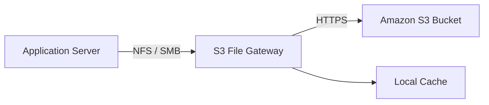
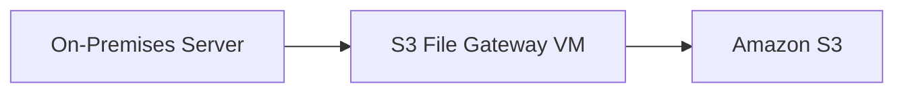
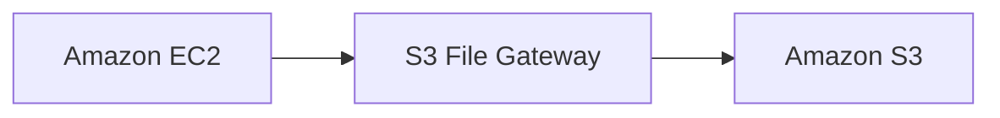
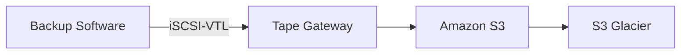
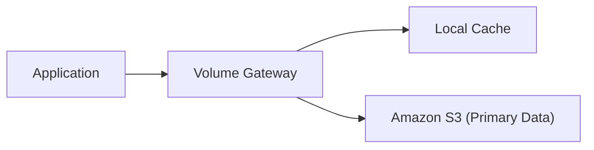
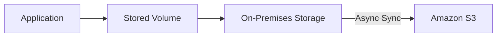

# 179. AWS Storage Gateway – Các tùy chọn khi tạo Gateway

## 🏗️ 1. Tạo một Storage Gateway

Khi tạo **AWS Storage Gateway**, bạn cần:

* Đặt **Gateway Name** (ví dụ: `Demo Gateway`).
* Chọn loại **Gateway** phù hợp với nhu cầu sử dụng.
* Chọn nền tảng (**Platform**) để triển khai Gateway.

---

## 2. 📂 Amazon S3 File Gateway

### Mục đích

* Cho phép truy cập dữ liệu trong **Amazon S3** thông qua giao thức:

  * **NFS**
  * **SMB**
* Hỗ trợ **Local Cache** để tăng tốc độ truy cập.

### Luồng hoạt động

### Nền tảng triển khai (Platform)

Có thể cài đặt **S3 File Gateway** trên:

* ✅ **VMware**
* ✅ **Microsoft Hyper-V**
* ✅ **Linux KVM**
* ✅ **Amazon EC2**

### Ý nghĩa của từng lựa chọn

#### Triển khai On-Premises

Nếu dùng:

* VMware
* Microsoft Hyper-V
* Linux KVM

thì **Storage Gateway** sẽ chạy ngay trong **Data Center** của doanh nghiệp.

➡️ Dữ liệu cache nằm gần ứng dụng hơn, giúp truy cập với **low latency**.

#### Triển khai trên AWS

Nếu chạy trên **Amazon EC2**:

➡️ Toàn bộ **Gateway** và **Cache** đều nằm trong tài khoản AWS của bạn.

Việc lựa chọn phụ thuộc vào yêu cầu về hiệu năng và kiến trúc hệ thống.

---

## 3. 📼 Tape Gateway

### Mục đích

* Mô phỏng hệ thống **Tape Backup** truyền thống bằng **Virtual Tape Library (VTL)**.
* Giao tiếp thông qua **iSCSI-VTL**.
* Dữ liệu tape được lưu trên AWS.

### Luồng hoạt động

### Đặc điểm

* Giữ nguyên quy trình backup bằng Tape hiện có.
* Có thể lưu trữ lâu dài trên **Amazon S3 Glacier** để tiết kiệm chi phí.

---

## 4. 💽 Volume Gateway

### Mục đích

* Cung cấp **Block Storage** thông qua giao thức **iSCSI**.
* Dữ liệu được lưu trên **Amazon S3**.

---

### ✅ Cached Volume

* **Primary Data** được lưu trên **Amazon S3**.
* Chỉ các dữ liệu truy cập thường xuyên được giữ trong **Local Cache**.

**Ưu điểm**

* Tiết kiệm dung lượng lưu trữ tại On-Premises.
* Vẫn đảm bảo **low-latency access** cho dữ liệu thường dùng.

---

### ✅ Stored Volume

* **Entire Dataset** được lưu tại **On-Premises**.
* Sau đó dữ liệu được **sync asynchronously** lên **Amazon S3**.

**Ưu điểm**

* Dữ liệu chính luôn nằm trong doanh nghiệp.
* AWS đóng vai trò backup và đồng bộ từ xa.

---

## 5. 📊 So sánh Cached Volume và Stored Volume

| Tiêu chí                        | **Cached Volume**             | **Stored Volume**                            |
| ------------------------------- | ----------------------------- | -------------------------------------------- |
| 📍 Primary Data                 | Amazon S3                     | On-Premises                                  |
| ⚡ Local Cache                   | Có                            | Không cần (toàn bộ dữ liệu đã ở local)       |
| 🚀 Truy cập dữ liệu thường dùng | Từ Local Cache                | Trực tiếp từ On-Premises                     |
| 🔄 Đồng bộ                      | Cache đọc từ S3               | Sync bất đồng bộ (**asynchronously**) lên S3 |
| 🎯 Phù hợp                      | Muốn lưu trữ chủ yếu trên AWS | Muốn giữ dữ liệu chính tại Data Center       |

---

## 6. 📌 Mẹo ghi nhớ

* 📂 **S3 File Gateway** → Truy cập **Amazon S3** bằng **NFS/SMB**, có **Local Cache**.
* 📼 **Tape Gateway** → **iSCSI-VTL** → Lưu Tape trên **Amazon S3** và **S3 Glacier**.
* 💽 **Volume Gateway**:

  * **Cached Volume** → **Primary Data trên Amazon S3**, cache tại local.
  * **Stored Volume** → **Primary Data trên On-Premises**, đồng bộ (**sync asynchronously**) lên Amazon S3.
* 🏢 Có thể triển khai Storage Gateway trên:

  * **VMware**
  * **Microsoft Hyper-V**
  * **Linux KVM**
  * **Amazon EC2**

---

## ✅ Kết luận

* Khi tạo **AWS Storage Gateway**, cần chọn đúng loại Gateway theo nhu cầu:

  * **S3 File Gateway** → Chia sẻ file thông qua **NFS/SMB**.
  * **Tape Gateway** → Thay thế hệ thống **Tape Backup** truyền thống bằng **Virtual Tape Library**.
  * **Volume Gateway** → Cung cấp **Block Storage (iSCSI)** với hai mô hình:

    * **Cached Volume**: dữ liệu chính trên **Amazon S3**.
    * **Stored Volume**: dữ liệu chính trên **On-Premises**, đồng bộ lên **Amazon S3**.
