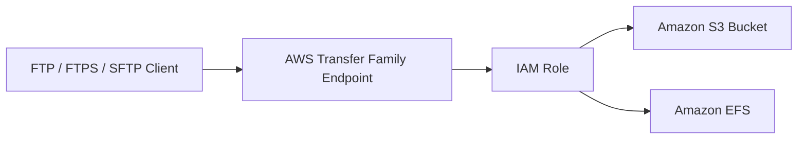
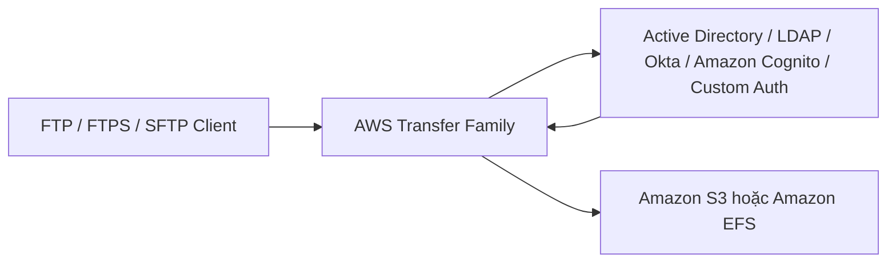
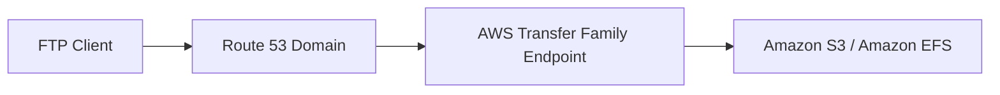

# AWS Transfer Family

## 📁 AWS Transfer Family – Truy cập Amazon S3 hoặc Amazon EFS qua FTP/SFTP/FTPS

### 1. **AWS Transfer Family là gì?**

* **AWS Transfer Family** là dịch vụ cho phép truyền dữ liệu vào/ra **Amazon S3** hoặc **Amazon EFS** thông qua các giao thức truyền file truyền thống.
* Phù hợp khi ứng dụng hoặc đối tác **không sử dụng S3 API** hoặc **EFS Network File System**, mà chỉ hỗ trợ **FTP**, **FTPS** hoặc **SFTP**.

---

## 2. 🌐 Các giao thức được hỗ trợ

AWS Transfer Family hỗ trợ 3 giao thức chính:

| Giao thức                             | Mô tả                                 | Mã hóa dữ liệu khi truyền |
| ------------------------------------- | ------------------------------------- | ------------------------- |
| **FTP (File Transfer Protocol)**      | Giao thức truyền file truyền thống    | ❌ Không mã hóa            |
| **FTPS (FTP over SSL)**               | FTP sử dụng SSL/TLS                   | ✅ Có mã hóa               |
| **SFTP (SSH File Transfer Protocol)** | Giao thức truyền file bảo mật qua SSH | ✅ Có mã hóa               |

> 📌 Cần nhớ:
>
> * **FTP** → Không mã hóa (**unencrypted**).
> * **FTPS** và **SFTP** → Có mã hóa khi truyền (**encrypted in transit**).

---

## 3. 🔄 Luồng hoạt động

Người dùng kết nối đến **AWS Transfer Family Endpoint** bằng giao thức FTP/FTPS/SFTP.

Dịch vụ sẽ tự động sử dụng **IAM Role** để đọc hoặc ghi dữ liệu vào **Amazon S3** hoặc **Amazon EFS**.

> Ứng dụng phía client chỉ thấy một FTP Server thông thường, trong khi phía sau dữ liệu thực tế được lưu trên **Amazon S3** hoặc **Amazon EFS**.

---

## 4. 🏗️ Đặc điểm nổi bật

* ✅ **Fully Managed** – AWS quản lý toàn bộ hạ tầng.
* 📈 **Scalable** – Tự động mở rộng theo nhu cầu.
* 🛡️ **Reliable** – Độ tin cậy cao.
* 🌍 **Highly Available** – Khả năng sẵn sàng cao.

Người dùng không cần tự triển khai hay vận hành FTP Server.

---

## 5. 💰 Mô hình tính phí

Chi phí của AWS Transfer Family bao gồm:

* 💵 Phí theo **Provisioned Endpoint** (tính theo giờ).
* 📦 Phí theo số lượng **GB dữ liệu truyền vào và truyền ra** thông qua dịch vụ.

---

## 6. 🔐 Authentication

AWS Transfer Family hỗ trợ nhiều phương thức xác thực người dùng.

### Lưu trữ trực tiếp trong dịch vụ

* Quản lý username/password ngay trong AWS Transfer Family.

### Tích hợp hệ thống xác thực bên ngoài

Có thể tích hợp với:

* **Microsoft Active Directory**
* **LDAP**
* **Okta**
* **Amazon Cognito**
* **Custom Authentication Source**

Luồng xác thực:

---

## 7. 🌍 Sử dụng Route 53 với AWS Transfer Family

Người dùng có thể:

* Kết nối trực tiếp đến **AWS Transfer Family Endpoint**.
* Hoặc sử dụng **Amazon Route 53** để gán một **hostname/domain tùy chỉnh** cho Endpoint.

---

## 8. 🎯 Các Use Case phổ biến

AWS Transfer Family thường được sử dụng để:

* 📂 Chia sẻ file với đối tác qua **FTP/SFTP/FTPS**.
* 🌐 Phân phối **Public Datasets**.
* 🏢 Tích hợp với các hệ thống **CRM**, **ERP** hoặc ứng dụng cũ chỉ hỗ trợ FTP.
* 🔄 Di chuyển dữ liệu lên **Amazon S3** hoặc **Amazon EFS** mà không cần thay đổi giao thức của ứng dụng.

---

## 9. 📊 Tóm tắt nhanh

| Tiêu chí            | AWS Transfer Family                                                                |
| ------------------- | ---------------------------------------------------------------------------------- |
| 🎯 Mục đích         | Truy cập Amazon S3 hoặc Amazon EFS bằng FTP/SFTP/FTPS                              |
| 📡 Giao thức        | FTP, FTPS, SFTP                                                                    |
| 🔒 Mã hóa           | FTP ❌, FTPS ✅, SFTP ✅                                                              |
| 💾 Backend          | Amazon S3 hoặc Amazon EFS                                                          |
| 👤 Authentication   | Internal User Store hoặc Active Directory, LDAP, Okta, Amazon Cognito, Custom Auth |
| 🌍 Domain tùy chỉnh | Hỗ trợ thông qua Route 53                                                          |
| ⚙️ Hạ tầng          | Fully Managed, Scalable, Reliable, Highly Available                                |
| 💰 Chi phí          | Theo Endpoint theo giờ + lượng dữ liệu truyền                                      |

---

## 📌 Mẹo ghi nhớ cho kỳ thi

* **AWS Transfer Family = FTP Server được AWS quản lý**, dùng để truy cập **Amazon S3** hoặc **Amazon EFS**.

* Nếu đề bài yêu cầu:

  * **"Upload file vào S3 bằng FTP"**
  * **"Legacy application chỉ hỗ trợ SFTP/FTPS"**
  * **"Cung cấp FTP interface cho S3 hoặc EFS"**

  ➜ Đáp án thường là **AWS Transfer Family**.

* Nhớ phân biệt:

  * **FTP** → Không mã hóa.
  * **FTPS** → FTP + SSL/TLS.
  * **SFTP** → Truyền file bảo mật qua SSH.

---

## ✅ Kết luận

* **AWS Transfer Family** giúp doanh nghiệp sử dụng các giao thức truyền file quen thuộc (**FTP**, **FTPS**, **SFTP**) để làm việc với **Amazon S3** hoặc **Amazon EFS**.
* Dịch vụ được AWS quản lý hoàn toàn, hỗ trợ mở rộng tự động, tích hợp nhiều hệ thống xác thực và phù hợp với các ứng dụng hoặc đối tác vẫn đang sử dụng giao thức FTP truyền thống.
