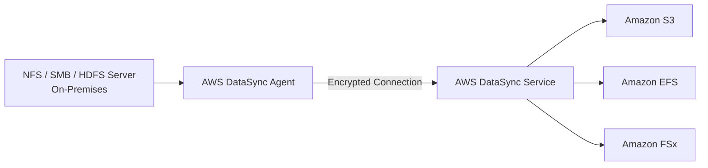
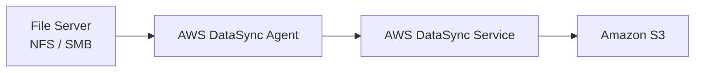
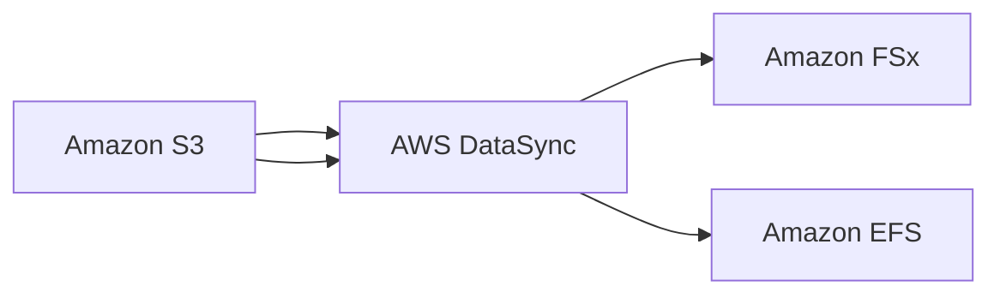

# AWS DataSync

## 🔄 AWS DataSync – Dịch vụ đồng bộ và di chuyển dữ liệu

### 1. **AWS DataSync là gì?**

* **AWS DataSync** là dịch vụ dùng để **synchronize (đồng bộ)** hoặc **move (di chuyển)** lượng lớn dữ liệu giữa:

  * 🏢 **On-Premises** và **AWS**
  * ☁️ **Cloud khác** và **AWS**
  * ☁️ **Các dịch vụ lưu trữ bên trong AWS**

* Đây là dịch vụ được sử dụng nhiều trong các bài toán:

  * **Data Migration**
  * **Backup**
  * **Synchronization**
  * **Hybrid Cloud**

---

## 2. 🎯 Các nguồn và đích được hỗ trợ

### Nguồn dữ liệu có thể là:

* **NFS**
* **SMB**
* **HDFS**
* Các hệ thống lưu trữ tương thích khác

### Đích dữ liệu trên AWS có thể là:

* ✅ **Amazon S3** (bao gồm mọi Storage Class, kể cả **Glacier**)
* ✅ **Amazon EFS**
* ✅ **Amazon FSx**

---

## 3. ⚙️ Cần DataSync Agent khi nào?

### Trường hợp 1: Đồng bộ từ On-Premises hoặc Cloud khác sang AWS

* Cần cài đặt **AWS DataSync Agent** tại môi trường nguồn.
* Agent sẽ đọc dữ liệu và truyền an toàn (encrypted) đến dịch vụ DataSync trên AWS.

> 📌 **Khi kết nối với NFS hoặc SMB Server thì bắt buộc phải có DataSync Agent.**

---

### Trường hợp 2: Đồng bộ giữa các dịch vụ AWS

* Nếu chỉ đồng bộ giữa các dịch vụ AWS thì:

  * ❌ **Không cần DataSync Agent**
  * AWS DataSync thực hiện việc copy trực tiếp.

---

## 4. 🔁 Đồng bộ hai chiều

DataSync hỗ trợ đồng bộ theo cả hai hướng.

Ví dụ:

* On-Premises ➜ Amazon S3
* Amazon S3 ➜ On-Premises
* Amazon EFS ➜ Amazon FSx
* Amazon FSx ➜ Amazon S3

---

## 5. ⏰ Replication Task theo Schedule

Một điểm quan trọng của **AWS DataSync**:

* ❌ **Không đồng bộ liên tục (Not Continuous Replication).**
* ✅ Chạy theo **Schedule**:

  * Hourly
  * Daily
  * Weekly

Do đó sẽ luôn có một khoảng **lag** giữa nguồn và đích.

---

## 6. 🔐 Preserve Metadata và File Permissions

Đây là một trong những đặc điểm quan trọng nhất của DataSync.

Khi đồng bộ dữ liệu, DataSync **giữ nguyên**:

* 📄 File metadata
* 🔒 File permissions
* 👤 Ownership
* 🛡️ Security attributes

Hỗ trợ:

* **POSIX permissions** (NFS)
* **SMB permissions**

> 📌 Đây là điểm thường xuất hiện trong đề thi: **AWS DataSync có khả năng preserve metadata và file permissions khi di chuyển dữ liệu.**

---

## 7. 🚀 Hiệu năng

* Một **DataSync Task** có thể đạt tốc độ lên đến **10 Gbps**.
* Có thể cấu hình **Bandwidth Limit** để tránh chiếm toàn bộ băng thông mạng.

---

## 8. 📊 So sánh hai kiểu sử dụng

| Tiêu chí                  | **On-Premises ↔ AWS** | **AWS ↔ AWS** |
| ------------------------- | --------------------- | ------------- |
| Cần **DataSync Agent**    | ✅ Có                  | ❌ Không       |
| Hỗ trợ NFS / SMB / HDFS   | ✅ Có                  | Không áp dụng |
| Preserve Metadata         | ✅ Có                  | ✅ Có          |
| Preserve File Permissions | ✅ Có                  | ✅ Có          |
| Đồng bộ theo Schedule     | ✅ Có                  | ✅ Có          |

---

## 9. 📝 Luồng hoạt động phổ biến

### Đồng bộ từ On-Premises lên AWS

### Đồng bộ từ On-Premises sang Amazon EFS

### Đồng bộ giữa các dịch vụ AWS

---

## 10. 📌 Mẹo ghi nhớ cho kỳ thi

* 🔄 **AWS DataSync = Synchronize dữ liệu số lượng lớn.**
* 🏢 **Có NFS/SMB/HDFS ⇒ Phải cài DataSync Agent.**
* ☁️ **AWS ↔ AWS ⇒ Không cần Agent.**
* 🔐 **Preserve Metadata và File Permissions** (POSIX, SMB).
* ⏰ Chạy theo **Schedule (Hourly / Daily / Weekly)**, **không phải Continuous Replication**.
* 🚀 Hỗ trợ tốc độ lên đến **10 Gbps** và có thể giới hạn băng thông.

---

## ✅ Kết luận

* **AWS DataSync** là dịch vụ chuyên dùng để **đồng bộ và di chuyển dữ liệu quy mô lớn** giữa **On-Premises**, **Cloud khác** và **AWS**.
* Dịch vụ hỗ trợ **Amazon S3**, **Amazon EFS**, **Amazon FSx** và nhiều giao thức như **NFS**, **SMB**, **HDFS**.
* Điểm nổi bật:

  * ✅ **Preserve Metadata**
  * ✅ **Preserve File Permissions**
  * ✅ **Schedule-based Replication**
  * ✅ **Hỗ trợ DataSync Agent cho môi trường On-Premises**
  * ✅ **Không cần Agent khi đồng bộ giữa các dịch vụ AWS**
