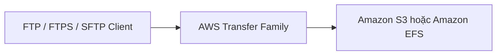
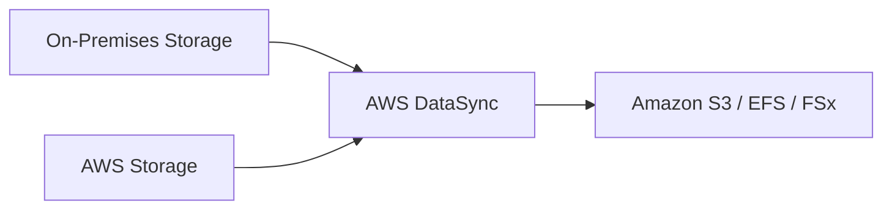

# AWS Storage Services Summary

## 📦 Tổng quan các dịch vụ Storage trên AWS

AWS cung cấp rất nhiều dịch vụ lưu trữ (**Storage Services**), mỗi dịch vụ được thiết kế cho một **use case** riêng. Việc lựa chọn đúng dịch vụ là kỹ năng quan trọng của một **AWS Solutions Architect**.

---

# 1. 🪣 Amazon S3 – Object Storage

## Đặc điểm

* **Amazon S3** là dịch vụ **Object Storage**.
* Truy cập thông qua **S3 API**, không phải File System hay Block Storage.
* Phù hợp để lưu:

  * Hình ảnh, video.
  * File backup.
  * Static website.
  * Data lake.
  * Log files.

## Archive

Nếu cần lưu trữ lâu dài với chi phí thấp, có thể chuyển object sang:

* **S3 Glacier**
* **S3 Glacier Deep Archive**

---

# 2. 💽 Amazon EBS – Block Storage cho EC2

## Đặc điểm

* **Amazon EBS (Elastic Block Store)** là **Network Block Storage**.
* Gắn (**attach**) vào **EC2 Instance**.
* Thông thường chỉ gắn cho **một EC2 tại một thời điểm**.
* Riêng **io1/io2 Multi-Attach** cho phép nhiều EC2 cùng sử dụng trong một số trường hợp.

## Một số loại Volume

* **gp3** – General Purpose SSD.
* **io2** – Provisioned IOPS SSD cho workload hiệu năng cao.
* Ngoài ra còn nhiều loại volume khác tùy nhu cầu.

---

# 3. ⚡ EC2 Instance Store – Physical Storage

## Đặc điểm

* Là **Physical Storage** gắn trực tiếp vào máy chủ chạy EC2.
* Không phải **Network Storage** như EBS.
* Cung cấp **IOPS rất cao** và độ trễ thấp.

## Use Case

* Cache.
* Temporary data.
* Workload yêu cầu hiệu năng I/O cực cao.

⚠️ Dữ liệu sẽ mất khi EC2 bị **stop**, **terminate** hoặc host gặp sự cố.

---

# 4. 📂 Amazon EFS – Network File System cho Linux

## Đặc điểm

* **Amazon EFS (Elastic File System)** là **Network File System**.
* Hỗ trợ chuẩn **POSIX**.
* Có thể mount đồng thời trên nhiều EC2.
* Hoạt động trên nhiều **Availability Zones (Multi-AZ)**.

## Phù hợp

* Linux servers.
* Shared file system.
* Web farm.
* Container workloads.

---

# 5. 🪟 Amazon FSx for Windows

## Đặc điểm

* File System dành riêng cho **Windows Server**.
* Hỗ trợ giao thức và tính năng quen thuộc của Windows.

## Phù hợp

* Windows File Server.
* Active Directory environment.
* SMB workloads.

---

# 6. 🚀 Amazon FSx for Lustre

## Đặc điểm

* File System hiệu năng rất cao dành cho **High Performance Computing (HPC)**.
* Tương thích với **Lustre Client**.

## Phù hợp

* Machine Learning.
* Big Data.
* HPC workloads.
* Scientific Computing.

---

# 7. 🌐 Amazon FSx for NetApp ONTAP

## Đặc điểm

* Cung cấp **Network File System** với khả năng tương thích hệ điều hành cao.
* Dựa trên công nghệ **NetApp ONTAP**.

## Phù hợp

* Doanh nghiệp cần nhiều giao thức truy cập.
* Hybrid Storage.
* Migration từ hệ thống NetApp hiện có.

---

# 8. 🗄️ Amazon FSx for OpenZFS

## Đặc điểm

* Dịch vụ quản lý (**Managed Service**) cho **OpenZFS File System**.
* Cung cấp các tính năng mạnh của ZFS mà không cần tự vận hành.

---

# 9. 🌉 AWS Storage Gateway

## Mục đích

Kết nối (**bridge**) giữa **On-Premises** và **AWS Cloud**.

### Các loại chính

| Gateway              | Chức năng                                                   |
| -------------------- | ----------------------------------------------------------- |
| **S3 File Gateway**  | Đồng bộ và truy cập file trên **Amazon S3** qua **NFS/SMB** |
| **FSx File Gateway** | Đồng bộ file với **Amazon FSx**                             |
| **Volume Gateway**   | Mount **Volume (iSCSI)** và backup lên AWS                  |
| **Tape Gateway**     | Backup theo mô hình **Virtual Tape Library (VTL)**          |

### Kiến trúc tổng quát

---

# 10. 📤 AWS Transfer Family

## Mục đích

Cung cấp các giao thức truyền file truyền thống trên AWS:

* **FTP**
* **FTPS**
* **SFTP**

Dữ liệu được lưu phía sau trên:

* **Amazon S3**
* **Amazon EFS**

### Luồng hoạt động

---

# 11. 🔄 AWS DataSync

## Mục đích

Đồng bộ dữ liệu tự động theo lịch (**Scheduled Synchronization**).

Hỗ trợ:

* On-Premises → AWS
* AWS → AWS

### Luồng hoạt động

---

# 12. 🚚 AWS Snow Family

## Mục đích

Dùng khi không đủ băng thông mạng để truyền lượng dữ liệu rất lớn.

Các thiết bị:

* **Snowcone**
* **Snowball**
* **Snowmobile**

Được gửi đến On-Premises để sao chép dữ liệu vật lý rồi chuyển lên AWS.

### Luồng hoạt động

### Lưu ý

* **Snowcone** tích hợp sẵn **AWS DataSync Agent**.

---

# 13. 🗃️ Databases

Ngoài các dịch vụ Storage ở trên, AWS còn cung cấp nhiều **Database Services**.

* Database phù hợp cho dữ liệu cần:

  * **Indexing**
  * **Querying**
  * **Relationship**
  * **Transaction**

Việc lựa chọn Database sẽ phụ thuộc vào từng workload và được xem là một chủ đề riêng.

---

# 📊 Bảng tổng hợp nhanh

| Dịch vụ                         | Loại lưu trữ           | Keyword quan trọng               | Use Case                         |
| ------------------------------- | ---------------------- | -------------------------------- | -------------------------------- |
| **Amazon S3**                   | Object Storage         | Object, Bucket                   | Lưu file, log, static content    |
| **S3 Glacier**                  | Archive                | Cold Storage                     | Lưu trữ dài hạn                  |
| **Amazon EBS**                  | Block Storage          | Attach EC2                       | Disk cho EC2                     |
| **EC2 Instance Store**          | Physical Storage       | High IOPS                        | Cache, temporary data            |
| **Amazon EFS**                  | File Storage           | POSIX, Multi-AZ                  | Shared file cho Linux            |
| **Amazon FSx for Windows**      | File Storage           | SMB, Windows                     | Windows File Server              |
| **Amazon FSx for Lustre**       | HPC File System        | Lustre                           | HPC, ML, Big Data                |
| **Amazon FSx for NetApp ONTAP** | Network File System    | ONTAP                            | Enterprise File Storage          |
| **Amazon FSx for OpenZFS**      | Managed ZFS            | OpenZFS                          | ZFS workloads                    |
| **AWS Storage Gateway**         | Hybrid Storage         | Bridge On-Premises ↔ AWS         | Hybrid Cloud                     |
| **AWS Transfer Family**         | File Transfer          | FTP / FTPS / SFTP                | Truyền file lên AWS              |
| **AWS DataSync**                | Data Synchronization   | Scheduled Sync                   | Đồng bộ dữ liệu                  |
| **AWS Snow Family**             | Physical Data Transfer | Snowcone / Snowball / Snowmobile | Di chuyển dữ liệu khối lượng lớn |

---

# 🎯 Mẹo ghi nhớ cho kỳ thi

| Nếu đề bài nói...                    | Hãy nghĩ đến...                 |
| ------------------------------------ | ------------------------------- |
| Object Storage                       | **Amazon S3**                   |
| Archive dữ liệu                      | **S3 Glacier**                  |
| Disk cho EC2                         | **Amazon EBS**                  |
| Physical disk, High IOPS             | **EC2 Instance Store**          |
| Shared Linux File System             | **Amazon EFS**                  |
| Windows File Server                  | **Amazon FSx for Windows**      |
| HPC / Lustre                         | **Amazon FSx for Lustre**       |
| NetApp compatibility                 | **Amazon FSx for NetApp ONTAP** |
| Managed ZFS                          | **Amazon FSx for OpenZFS**      |
| Hybrid Cloud                         | **AWS Storage Gateway**         |
| FTP / FTPS / SFTP                    | **AWS Transfer Family**         |
| Scheduled data synchronization       | **AWS DataSync**                |
| Chuyển dữ liệu vật lý khối lượng lớn | **AWS Snow Family**             |

---

# ✅ Kết luận

* Mỗi dịch vụ Storage trên AWS được tối ưu cho một mục đích riêng.
* Khi thiết kế kiến trúc hoặc làm bài thi, hãy xác định trước dữ liệu cần:

  * **Object Storage** → **Amazon S3**.
  * **Block Storage** → **Amazon EBS**.
  * **File Storage** → **Amazon EFS / Amazon FSx**.
  * **Hybrid Cloud** → **AWS Storage Gateway**.
  * **FTP/SFTP** → **AWS Transfer Family**.
  * **Data Synchronization** → **AWS DataSync**.
  * **Offline Data Transfer** → **AWS Snow Family**.
