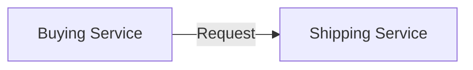
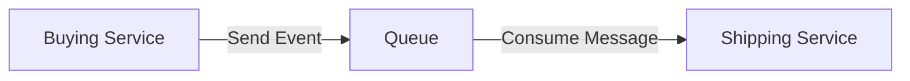
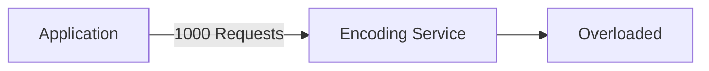
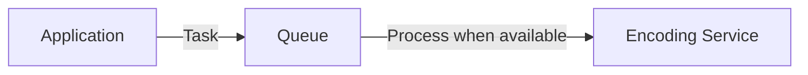
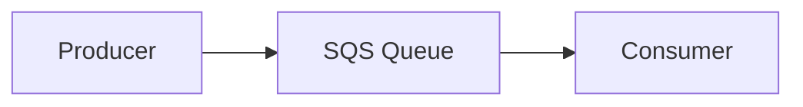
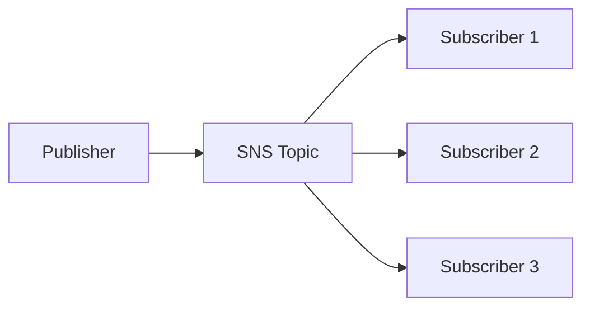
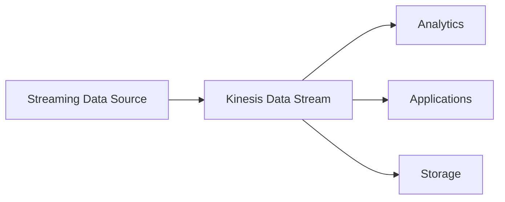

# AWS Integration & Messaging Overview

## 🔗 Tổng quan về AWS Integration và Messaging

Khi triển khai nhiều ứng dụng hoặc **microservices**, các service cần **giao tiếp (communicate)** và **chia sẻ dữ liệu (share information/data)** với nhau.

AWS cung cấp nhiều dịch vụ **Messaging Middleware** để giúp các ứng dụng tích hợp và hoạt động hiệu quả hơn, đặc biệt trong môi trường phân tán.

---

# 1. 📡 Hai mô hình giao tiếp giữa các ứng dụng

## ✅ Synchronous Communication

* Các service **kết nối trực tiếp** với nhau.
* Một service gửi request và chờ service còn lại xử lý.

### Ví dụ

* **Buying Service** nhận đơn hàng.
* Sau đó gọi trực tiếp **Shipping Service** để giao hàng.

### Luồng hoạt động

### Ưu điểm

* Đơn giản, dễ triển khai.
* Phản hồi ngay lập tức.

### Nhược điểm

* Hai service bị **coupled (phụ thuộc trực tiếp)**.
* Nếu một service gặp sự cố hoặc quá tải thì service còn lại cũng bị ảnh hưởng.
* Khó mở rộng (**scaling**) khi lưu lượng tăng đột biến.

---

## ✅ Asynchronous Communication (Event-Driven)

* Các service **không giao tiếp trực tiếp**.
* Thay vào đó, chúng sử dụng một **middleware** như **Queue** hoặc **Topic** để trao đổi dữ liệu.

### Ví dụ

* **Buying Service** chỉ gửi thông tin đơn hàng vào **Queue**.
* **Shipping Service** sẽ đọc dữ liệu từ Queue và xử lý khi sẵn sàng.

### Luồng hoạt động

### Ưu điểm

* Các service được **decouple** (tách rời).
* Có thể hoạt động độc lập.
* Dễ mở rộng và chịu tải tốt hơn.
* Một service bị chậm hoặc tạm dừng không ảnh hưởng ngay đến service khác.

---

# 2. ⚠️ Vấn đề của Synchronous Communication

Khi lưu lượng truy cập (**traffic**) tăng đột biến (**sudden spike**), mô hình đồng bộ dễ gặp vấn đề.

Ví dụ:

* Bình thường hệ thống chỉ cần encode **10 video**.
* Đột nhiên cần encode **1.000 video**.

Nếu **Application** gọi trực tiếp **Encoding Service**, dịch vụ encode có thể bị quá tải (**overwhelmed**) và gây **outage**.

### Minh họa

---

# 3. ✅ Decoupling bằng Messaging Middleware

Thay vì gửi request trực tiếp, ứng dụng đưa công việc vào một lớp trung gian (**decoupling layer**).

Service xử lý sẽ lấy công việc ra khi có khả năng xử lý.

### Luồng hoạt động

Kết quả:

* 📈 Hệ thống chịu được lượng request lớn.
* ⚡ Service xử lý theo tốc độ phù hợp.
* 🔄 Các service có thể **scale independently**.

---

# 4. 🚀 Các dịch vụ AWS dùng để Decouple ứng dụng

## 📬 Amazon SQS (Simple Queue Service)

* Mô hình **Queue**.
* Message được đưa vào Queue và được Consumer xử lý sau.
* Phù hợp cho **Asynchronous Processing**.

---

## 📢 Amazon SNS (Simple Notification Service)

* Mô hình **Publish / Subscribe (Pub/Sub)**.
* Một Publisher gửi một Message.
* Nhiều Subscriber nhận đồng thời.

---

## 🌊 Amazon Kinesis

* Dùng cho **Real-Time Streaming** và **Big Data**.
* Cho phép xử lý luồng dữ liệu liên tục với thông lượng cao.

---

# 5. 📊 So sánh Synchronous và Asynchronous

| Tiêu chí             | **Synchronous**            | **Asynchronous (Event-Driven)** |
| -------------------- | -------------------------- | ------------------------------- |
| 🔗 Kết nối           | Service gọi trực tiếp nhau | Thông qua Queue/Topic           |
| 🔄 Coupling          | Chặt (Tightly Coupled)     | Lỏng (Decoupled)                |
| ⚡ Phản hồi           | Ngay lập tức               | Có thể xử lý sau                |
| 📈 Khả năng Scale    | Khó scale khi tải tăng     | Scale độc lập giữa các service  |
| 🚨 Chịu tải đột biến | Kém                        | Tốt                             |
| 🎯 Ví dụ AWS         | REST API                   | SQS, SNS, Kinesis               |

---

# 6. 📌 Mẹo ghi nhớ

* 🔄 **Synchronous** → Service ↔ Service (gọi trực tiếp).
* 📬 **SQS** → **Queue Model**, xử lý bất đồng bộ (**Asynchronous**).
* 📢 **SNS** → **Publish / Subscribe**, phát một message đến nhiều subscriber.
* 🌊 **Kinesis** → **Real-Time Streaming** và xử lý **Big Data**.
* 🚀 Sử dụng **SQS**, **SNS** hoặc **Kinesis** giúp **decouple** hệ thống và cho phép các service **scale independently**.

---

# ✅ Kết luận

* Trong kiến trúc hiện đại, **Asynchronous Communication** thường được ưu tiên hơn để tăng khả năng mở rộng và giảm sự phụ thuộc giữa các service.
* AWS cung cấp ba dịch vụ Messaging quan trọng:

  * **Amazon SQS** → Queue.
  * **Amazon SNS** → Publish/Subscribe.
  * **Amazon Kinesis** → Real-Time Data Streaming.
* Các dịch vụ này đóng vai trò **middleware** giúp hệ thống linh hoạt, chịu tải tốt và dễ mở rộng.
