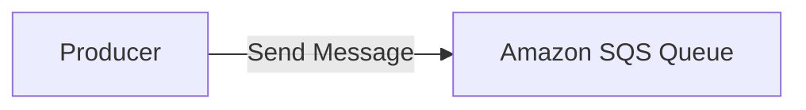
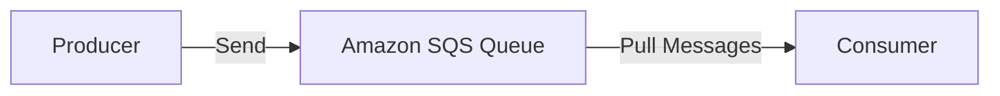
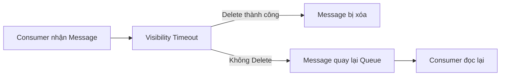
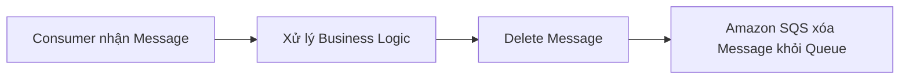
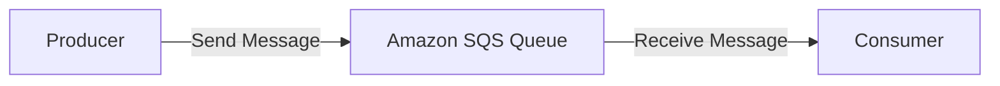
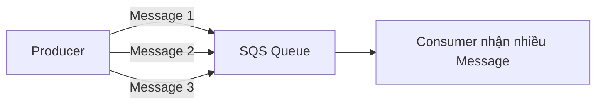
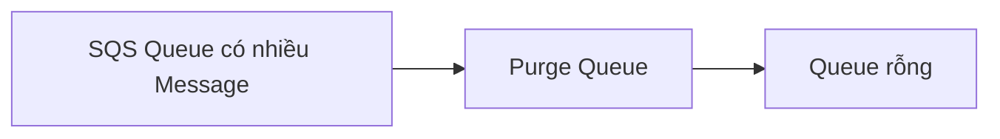
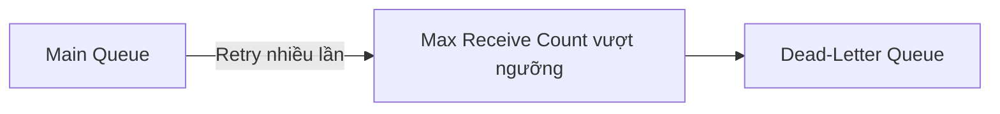
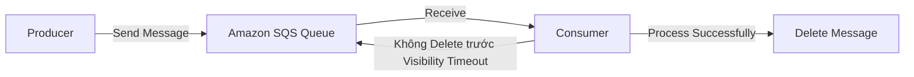

# Amazon SQS Practice – Tạo Queue, Gửi và Nhận Message

## 1. 📬 Tạo một Amazon SQS Queue

Amazon SQS hỗ trợ **2 loại Queue**:

* **Standard Queue** ✅ (được sử dụng trong ví dụ)
* **FIFO Queue** (sẽ tìm hiểu sau)

Ví dụ tạo một queue:

* **Queue Name**: `Demo Queue`

---

## 2. ⚙️ Các cấu hình khi tạo Queue

Một số cấu hình quan trọng:

| Cấu hình                     | Ý nghĩa                                               |
| ---------------------------- | ----------------------------------------------------- |
| **Visibility Timeout**       | Thời gian message bị ẩn sau khi consumer nhận được    |
| **Delivery Delay**           | Thời gian trì hoãn trước khi message có thể được nhận |
| **Message Retention Period** | Thời gian lưu message (ví dụ: **4 ngày**)             |
| **Maximum Message Size**     | Kích thước tối đa của message (**256 KB**)            |
| **Receive Wait Time**        | Thời gian Long Polling                                |

> Trong ví dụ, hầu hết sử dụng giá trị mặc định.

---

## 3. 🔐 Server-Side Encryption

Amazon SQS hỗ trợ **Server-Side Encryption (SSE)** để mã hóa message.

### ✅ SSE-SQS

* Mặc định sử dụng **Amazon SQS Managed Key**.
* Còn gọi là **SSE-SQS**.
* Hoạt động tương tự **SSE-S3** của Amazon S3.

### ✅ SSE-KMS

Có thể sử dụng **AWS KMS** để quản lý khóa mã hóa.

Ví dụ:

* Chọn **Customer Master Key (CMK)** như:

  * `alias/aws/sqs`
* Có thể cấu hình **Data Key Reuse Period** (ví dụ: 5 phút) để giảm số lần gọi API đến KMS.

---

## 4. 🔑 Access Policy

SQS hỗ trợ **Resource Policy** tương tự **S3 Bucket Policy**.

Có thể cấu hình:

* Ai được **Send Message**.
* Ai được **Receive Message**.
* Chỉ **Queue Owner** hoặc các **AWS Account / User / Role** cụ thể.

Chính sách được lưu dưới dạng **JSON Policy Document**.

---

## 5. ✉️ Gửi Message vào Queue

Sau khi tạo Queue, producer có thể gửi message.

Ví dụ gửi:

```
hello world!
```

### Luồng hoạt động



Sau khi gửi thành công:

* `Messages Available = 1`
* Message sẵn sàng để consumer đọc.

---

## 6. 📥 Nhận Message từ Queue

Consumer thực hiện **Pull Messages** để lấy message từ Queue.



Khi nhận được message, có thể xem:

* **Message ID**
* **Message Body**
* **MD5 Hash**
* **Sender**
* **Receive Count**
* **Message Size**
* **Message Attributes** (nếu có)

Ví dụ:

```
Message Body:
hello world!
```

---

## 7. 🔄 Visibility Timeout và Receive Count

Sau khi Consumer đọc message:

* Message **không bị xóa ngay**.
* Nó sẽ bị ẩn trong khoảng thời gian **Visibility Timeout** (mặc định thường là 30 giây).

Nếu Consumer **không Delete Message** trước khi hết thời gian này:

* Message sẽ quay trở lại Queue.
* Có thể được Consumer khác hoặc chính Consumer đó đọc lại.

### Luồng hoạt động



Do đó:

* **Receive Count** sẽ tăng dần (1 → 2 → 3 → ...).
* Điều này cho thấy message đã được nhận nhiều lần nhưng chưa được xử lý hoàn tất.

---

## 8. 🗑️ Delete Message sau khi xử lý thành công

Sau khi xử lý xong message, Consumer cần gọi **Delete Message**.



Việc **Delete Message** chính là tín hiệu cho Amazon SQS biết rằng:

> ✅ Message đã được xử lý thành công và không cần gửi lại nữa.

Nếu không xóa, message sẽ tiếp tục xuất hiện sau khi **Visibility Timeout** kết thúc.

---

## 9. 👥 Producer và Consumer được tách rời (Decoupling)

Amazon SQS giúp tách biệt Producer và Consumer.



Lợi ích:

* Không cần Producer và Consumer chạy cùng lúc.
* Consumer có thể xử lý bất đồng bộ (**Asynchronous Processing**).
* Hệ thống dễ mở rộng và chịu tải tốt hơn.

---

## 10. 📦 Xử lý nhiều Message

Producer có thể gửi nhiều message liên tiếp:

```
hello world
hello world 2
hello world 3
```

Consumer có thể Pull nhiều message trong một lần và xử lý theo lô.



---

## 11. 🧹 Purge Queue

Amazon SQS hỗ trợ **Purge Queue**.

Chức năng:

* Xóa **toàn bộ message** đang có trong Queue.
* Thường dùng trong môi trường **Development** hoặc **Testing**.

⚠️ Không nên sử dụng trên môi trường **Production** nếu chưa cân nhắc kỹ.



---

## 12. 📊 Monitoring

Amazon SQS cung cấp các thông tin theo dõi như:

* Số lượng message trong Queue.
* **Approximate Age of Oldest Message**.
* Các chỉ số giúp xây dựng **Auto Scaling** cho Consumer (ví dụ EC2 Auto Scaling Group).

---

## 13. 💀 Dead-Letter Queue (DLQ)

Queue có thể được cấu hình với **Dead-Letter Queue (DLQ)** thông qua **Redrive Policy**.

Nếu một message bị xử lý thất bại nhiều lần:



Trong bài thực hành này chưa cấu hình DLQ, nhưng đây là tính năng quan trọng để xử lý các message lỗi.

---

## 14. 📌 Mẹo ghi nhớ cho kỳ thi

* 📬 **Standard Queue** là loại Queue phổ biến nhất.
* 🔐 **SSE-SQS** là cơ chế mã hóa mặc định của Amazon SQS.
* 🔑 **Access Policy** hoạt động tương tự **S3 Bucket Policy**.
* 👥 **Producer** gửi message, **Consumer** nhận và xử lý message.
* ⏳ Sau khi nhận, message chỉ bị ẩn trong **Visibility Timeout**, chưa bị xóa.
* 🗑️ Chỉ khi **Delete Message**, Amazon SQS mới coi message đã được xử lý thành công.
* 📈 Nếu không Delete, **Receive Count** sẽ tăng và message có thể được gửi lại.
* 🧹 **Purge Queue** dùng để xóa toàn bộ message trong Queue.

---

## ✅ Kết luận

* Amazon SQS là dịch vụ **Message Queue** giúp **decouple Producer và Consumer**.
* Quy trình xử lý cơ bản:



* Để tránh xử lý lặp lại, Consumer phải **Delete Message** sau khi xử lý thành công.
* SQS hỗ trợ **SSE-SQS**, **SSE-KMS**, **Access Policy**, **Monitoring**, **Purge Queue** và **Dead-Letter Queue (DLQ)** để xây dựng hệ thống message bền vững và dễ mở rộng.
