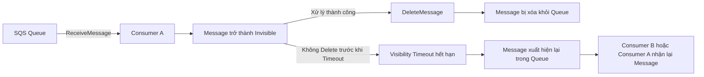
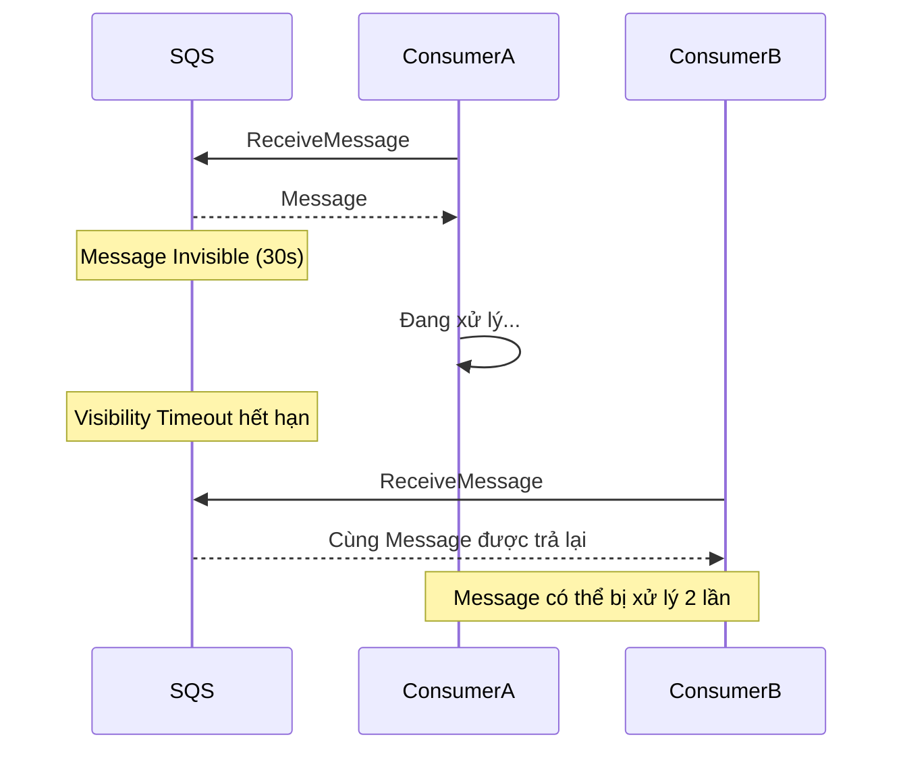
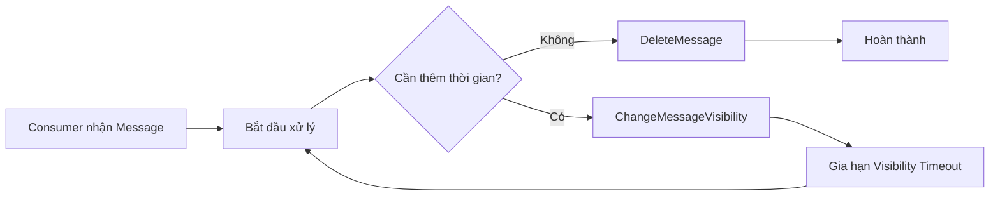

# SQS Message Visibility Timeout

## 👀 Message Visibility Timeout là gì?

**Message Visibility Timeout** là khoảng thời gian mà một message sau khi được **Consumer** đọc (**ReceiveMessage**) sẽ trở thành **invisible** đối với các Consumer khác.

* Mặc định (**default**) là **30 giây**.
* Trong khoảng thời gian này:

  * Consumer hiện tại có thời gian để xử lý message.
  * Các Consumer khác sẽ **không nhìn thấy** message đó.
* Sau khi xử lý xong, Consumer cần gọi **DeleteMessage** để xóa message khỏi queue.

---

## 🔄 Luồng hoạt động của Message Visibility Timeout

---

## ⏱️ Điều gì xảy ra trong Visibility Timeout?

Ví dụ:

1. **Consumer A** gọi `ReceiveMessage`.
2. Message được trả về và bắt đầu **Visibility Timeout (30s)**.
3. Trong 30 giây này:

   * Consumer khác gọi `ReceiveMessage`.
   * ❌ Message sẽ **không được trả về**.
4. Nếu Consumer A gọi `DeleteMessage` trước khi hết thời gian:

   * ✅ Message bị xóa vĩnh viễn.
5. Nếu Consumer A **không Delete**:

   * Message sẽ **hiển thị lại (visible)** trong queue.
   * Một Consumer khác có thể nhận lại cùng message đó.

---

## ⚠️ Nếu không xử lý kịp sẽ xảy ra Duplicate Processing

Nếu Consumer xử lý quá lâu và vượt quá **Visibility Timeout**, message sẽ quay trở lại queue và có thể bị xử lý nhiều lần.

➡️ Đây là nguyên nhân phổ biến dẫn đến **Duplicate Processing**.

---

## 🔧 ChangeMessageVisibility API

Nếu Consumer biết rằng cần nhiều thời gian hơn để xử lý message, thay vì để timeout hết hạn, Consumer nên gọi:

**`ChangeMessageVisibility`**

API này giúp:

* Gia hạn **Visibility Timeout** cho **message hiện tại**.
* Tiếp tục giữ message ở trạng thái **invisible**.
* Tránh việc Consumer khác nhận và xử lý cùng message.

### Luồng hoạt động

---

## ⚖️ Cách chọn Visibility Timeout phù hợp

### ❌ Đặt quá lớn

Ví dụ: **vài giờ**

* Nếu Consumer bị crash:

  * Message vẫn bị invisible trong nhiều giờ.
  * Các Consumer khác không thể xử lý.
* Hệ thống phải chờ rất lâu trước khi retry.

---

### ❌ Đặt quá nhỏ

Ví dụ: **vài giây**

* Consumer chưa xử lý xong.
* Message xuất hiện lại trong queue.
* Nhiều Consumer có thể nhận cùng một message.
* Dễ xảy ra **Duplicate Processing**.

---

### ✅ Khuyến nghị

* Đặt **Visibility Timeout** đủ lớn để phần lớn message xử lý xong bình thường.
* Nếu có trường hợp xử lý lâu hơn dự kiến:

  * Gọi **`ChangeMessageVisibility`** để gia hạn thay vì tăng timeout mặc định quá cao.

---

## ⚙️ Cấu hình Visibility Timeout

* Có thể cấu hình mặc định từ:

  * **0 giây**
  * đến **12 giờ**
* Giá trị mặc định của SQS là:

  * **30 giây**

---

## 📊 Tóm tắt

| Nội dung                  | Mô tả                                                                   |
| ------------------------- | ----------------------------------------------------------------------- |
| ⏱️ **Visibility Timeout** | Khoảng thời gian message bị **invisible** sau khi được `ReceiveMessage` |
| 🔒 Mặc định               | **30 giây**                                                             |
| 👥 Consumer khác          | Không thể nhận message trong thời gian timeout                          |
| ✅ Xử lý thành công        | Gọi `DeleteMessage` để xóa message                                      |
| ❌ Không Delete            | Message xuất hiện lại và có thể được nhận lần nữa                       |
| 🔧 API gia hạn            | `ChangeMessageVisibility`                                               |
| ⚠️ Timeout quá nhỏ        | Dễ gây **Duplicate Processing**                                         |
| ⚠️ Timeout quá lớn        | Nếu Consumer crash, phải chờ lâu mới retry                              |

---

## 📝 Mẹo ghi nhớ cho kỳ thi

* **ReceiveMessage** → Message trở thành **Invisible**.
* **DeleteMessage** → Message bị xóa khỏi queue.
* **Không Delete trước khi hết Visibility Timeout** → Message quay lại queue và có thể bị xử lý lại.
* **`ChangeMessageVisibility`** → Gia hạn thời gian xử lý cho một message đang được Consumer xử lý.
* Cần chọn **Visibility Timeout** hợp lý để cân bằng giữa khả năng retry nhanh và tránh **Duplicate Processing**.
