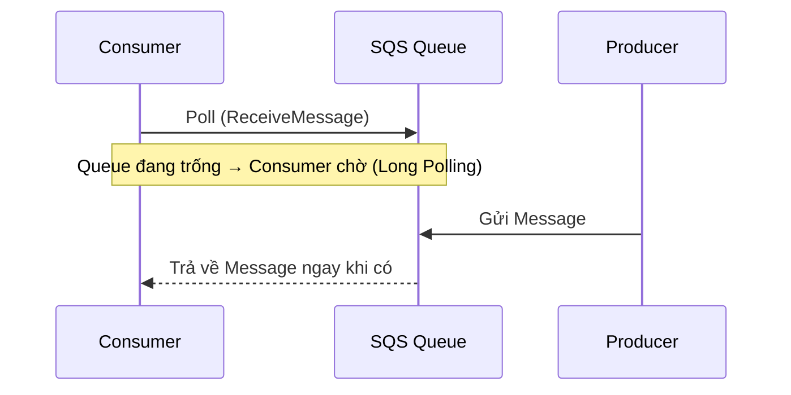

# SQS Long Polling

## ⏳ SQS Long Polling – Giảm số lần Poll và giảm độ trễ

### 1. **Long Polling là gì?**

**Long Polling** là cơ chế trong **Amazon SQS** cho phép **Consumer** chờ một khoảng thời gian để đợi message xuất hiện trong Queue, thay vì trả về ngay khi Queue đang trống.

* Nếu Queue chưa có message:

  * Consumer sẽ **đợi (wait)** thay vì nhận phản hồi rỗng ngay lập tức.
* Khi có message mới đến:

  * SQS sẽ trả message cho Consumer ngay trong request đang chờ.

---

## 2. 🔄 Luồng hoạt động của Long Polling



---

## 3. 🚀 Lợi ích của Long Polling

### ✅ Giảm số lượng API Calls

* Thay vì liên tục gửi nhiều request để kiểm tra Queue:

  * Consumer chỉ cần gửi một request và chờ trong một khoảng thời gian.
* Kết quả:

  * 📉 Giảm số lượng **API Calls** đến Amazon SQS.
  * 💰 Giảm chi phí vận hành.

---

### ✅ Giảm Latency

* Khi message được gửi vào Queue:

  * Consumer đang ở trạng thái chờ sẽ nhận được message gần như ngay lập tức.
* Không cần đợi đến lần poll tiếp theo như **Short Polling**.

=> **Độ trễ (Latency) thấp hơn**.

---

## 4. ⏱️ Thời gian chờ (Wait Time)

* **Long Polling** có thể cấu hình thời gian chờ từ:

```
1 giây → 20 giây
```

* AWS khuyến nghị có thể sử dụng:

```
WaitTimeSeconds = 20
```

vì:

* Giảm nhiều API Calls hơn.
* Hoạt động hiệu quả hơn.
* Tiết kiệm chi phí hơn.

---

## 5. ⚙️ Cấu hình Long Polling

Có thể bật **Long Polling** theo hai cách:

* 📌 **Queue Level**

  * Cấu hình trực tiếp cho toàn bộ **SQS Queue**.

* 📌 **API Level**

  * Thiết lập thông qua tham số **`WaitTimeSeconds`** khi gọi API `ReceiveMessage`.

---

## 6. 📊 So sánh Short Polling và Long Polling

| Tiêu chí         | **Short Polling**                  | **Long Polling**                         |
| ---------------- | ---------------------------------- | ---------------------------------------- |
| ⏳ Khi Queue rỗng | Trả kết quả ngay                   | Chờ message xuất hiện                    |
| 🔄 API Calls     | Nhiều                              | Ít hơn                                   |
| 💰 Chi phí       | Cao hơn do poll liên tục           | Thấp hơn                                 |
| ⚡ Latency        | Có thể phải đợi lần poll tiếp theo | Nhận message gần như ngay lập tức        |
| ⌛ Thời gian chờ  | Gần như không có                   | Có thể cấu hình từ **1–20 giây**         |
| ✅ Khuyến nghị    | Ít được ưu tiên                    | **Nên sử dụng trong hầu hết trường hợp** |

---

## 📌 Mẹo ghi nhớ cho kỳ thi

* **Long Polling** = Consumer **đợi** message thay vì trả về ngay khi Queue rỗng.
* Giúp:

  * 📉 **Giảm API Calls**.
  * ⚡ **Giảm Latency**.
  * 💰 **Tiết kiệm chi phí**.
* Thời gian chờ có thể cấu hình từ **1 đến 20 giây** bằng **`WaitTimeSeconds`**.
* Trong hầu hết các trường hợp, **nên ưu tiên Long Polling hơn Short Polling**.

---

## ✅ Kết luận

* **Amazon SQS Long Polling** cho phép Consumer chờ message trong một khoảng thời gian thay vì liên tục poll Queue.
* Cơ chế này giúp giảm số lượng request đến SQS, giảm chi phí và cải thiện hiệu năng hệ thống.
* Khi thiết kế ứng dụng sử dụng **Amazon SQS**, **Long Polling** thường là lựa chọn được khuyến nghị để tối ưu tài nguyên và trải nghiệm xử lý message.
