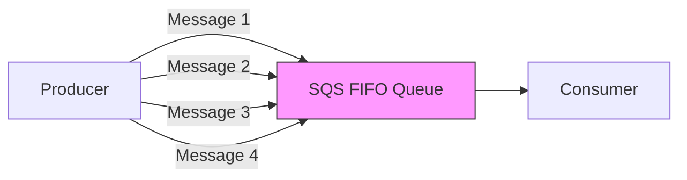
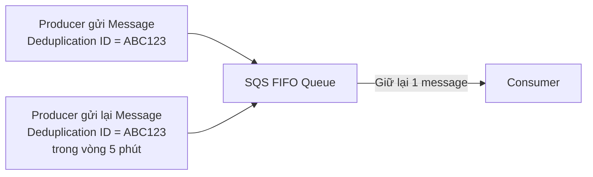
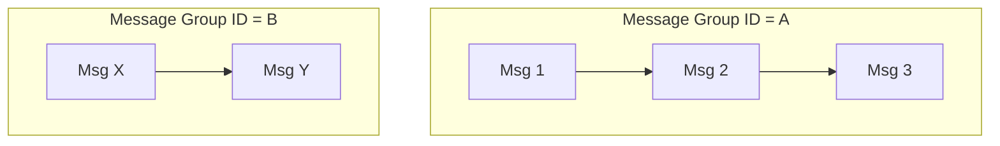
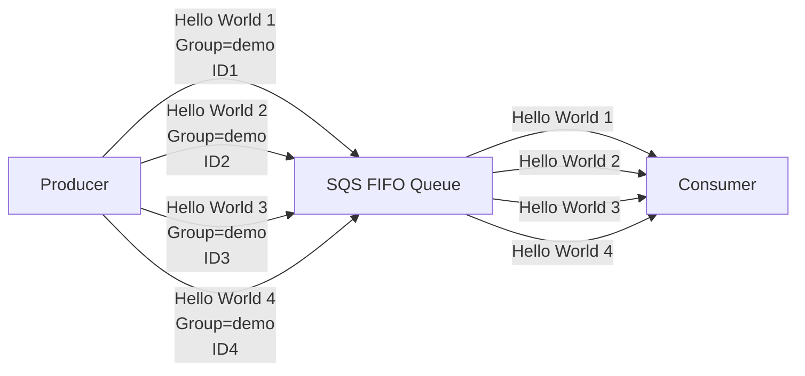

# Amazon SQS FIFO Queue

## 📬 SQS FIFO Queue – First In, First Out

### 1. **FIFO Queue là gì?**

* **FIFO (First In, First Out)** là loại queue của **Amazon SQS** đảm bảo **thứ tự xử lý message**.
* Nếu **Producer** gửi message theo thứ tự:

```text
1 → 2 → 3 → 4
```

thì **Consumer** sẽ nhận được theo đúng thứ tự:

```text
1 → 2 → 3 → 4
```

### Luồng hoạt động



> ✅ **Ordering Guarantee** là ưu điểm lớn nhất của **FIFO Queue**.
> ❌ **Standard SQS Queue** **không đảm bảo** message được nhận theo đúng thứ tự.

---

## 2. 🚀 Throughput của FIFO Queue

Do phải đảm bảo thứ tự xử lý nên **FIFO Queue** có giới hạn về hiệu năng:

| Chế độ                  | Throughput                       |
| ----------------------- | -------------------------------- |
| Không dùng **Batching** | Khoảng **300 messages/second**   |
| Dùng **Batching**       | Khoảng **3,000 messages/second** |

> 📌 Nếu cần throughput rất cao và không yêu cầu ordering, nên dùng **Standard Queue**.

---

## 3. ✅ Exactly-Once Send và Deduplication

FIFO Queue hỗ trợ tính năng **Exactly-Once Send**, giúp loại bỏ message trùng lặp (**duplicate**).

### Cách hoạt động

* Mỗi message gửi lên cần có một **Deduplication ID**.
* Nếu cùng một **Deduplication ID** xuất hiện nhiều lần trong vòng **5 phút**, SQS sẽ tự động loại bỏ các bản sao.



### Lợi ích

* Tránh xử lý dữ liệu trùng lặp.
* Giảm lỗi khi Producer gửi lại message do retry hoặc lỗi mạng.

---

## 4. 👥 Message Group ID

Để duy trì **Ordering Guarantee**, mỗi message phải thuộc một **Message Group ID**.

* Khi gửi message vào **FIFO Queue**, cần chỉ định:

  * **Message Group ID**
  * **Deduplication ID**

### Ordering chỉ được đảm bảo trong cùng một Message Group



> ✅ Trong **Group A**, thứ tự luôn là `Msg1 → Msg2 → Msg3`.
> ✅ Trong **Group B**, thứ tự luôn là `MsgX → MsgY`.
> ⚠️ Không có đảm bảo về thứ tự giữa **hai Message Group khác nhau**.

---

## 5. 🛠️ Cấu hình FIFO Queue

Khi tạo một **SQS FIFO Queue**:

* Tên queue **bắt buộc phải kết thúc bằng `.fifo`**.

Ví dụ:

```text
DemoQueue.fifo
```

Nếu không có hậu tố `.fifo` thì AWS sẽ không cho phép tạo FIFO Queue.

---

## 6. ⚙️ Content-Based Deduplication

FIFO Queue có tùy chọn:

**Content-Based Deduplication**

* AWS tự tính toán hash dựa trên nội dung message.
* Nếu hai message có cùng nội dung trong khoảng **5 phút**, chúng sẽ được coi là duplicate và chỉ lưu một bản.

Điều này giúp không cần tự tạo **Deduplication ID** trong một số trường hợp.

---

## 7. 🧪 Ví dụ thực tế

Producer gửi lần lượt:

| Message       | Message Group ID | Deduplication ID |
| ------------- | ---------------- | ---------------- |
| Hello World 1 | demo             | ID1              |
| Hello World 2 | demo             | ID2              |
| Hello World 3 | demo             | ID3              |
| Hello World 4 | demo             | ID4              |

### Luồng xử lý



Consumer sẽ luôn nhận theo đúng thứ tự:

```text
Hello World 1
↓
Hello World 2
↓
Hello World 3
↓
Hello World 4
```

---

## 8. 📊 So sánh Standard Queue và FIFO Queue

| Tiêu chí          | Standard Queue  | FIFO Queue                                                   |
| ----------------- | --------------- | ------------------------------------------------------------ |
| 📌 Thứ tự message | ❌ Không đảm bảo | ✅ Đảm bảo **First In, First Out**                            |
| 🔁 Duplicate      | Có thể xảy ra   | ✅ Hỗ trợ **Exactly-Once Send**                               |
| 🆔 Deduplication  | Không có        | Có **Deduplication ID** hoặc **Content-Based Deduplication** |
| 👥 Message Group  | Không có        | Cần **Message Group ID** để duy trì ordering                 |
| 🚀 Throughput     | Rất cao         | Khoảng **300 msg/s** hoặc **3,000 msg/s** khi batching       |
| 🏷️ Tên Queue     | Tùy ý           | Bắt buộc kết thúc bằng **`.fifo`**                           |

---

## 📌 Mẹo ghi nhớ cho kỳ thi

* ✅ **FIFO = First In, First Out** → Đảm bảo **Ordering** của message.
* ✅ Tên queue phải kết thúc bằng **`.fifo`**.
* ✅ Hỗ trợ **Exactly-Once Send** thông qua **Deduplication ID** hoặc **Content-Based Deduplication**.
* ✅ **Ordering Guarantee** được áp dụng theo từng **Message Group ID**.
* ⚠️ Throughput thấp hơn **Standard Queue** do phải đảm bảo thứ tự xử lý.

---

## ✅ Kết luận

* **Amazon SQS FIFO Queue** phù hợp khi ứng dụng yêu cầu:

  * Thứ tự xử lý chính xác (**Ordering Guarantee**).
  * Không có message trùng lặp (**Exactly-Once Send**).
* Để sử dụng hiệu quả, cần nhớ ba thành phần quan trọng:

  * 🏷️ **`.fifo`** trong tên queue.
  * 👥 **Message Group ID** để đảm bảo thứ tự.
  * 🆔 **Deduplication ID** (hoặc **Content-Based Deduplication**) để loại bỏ duplicate.
