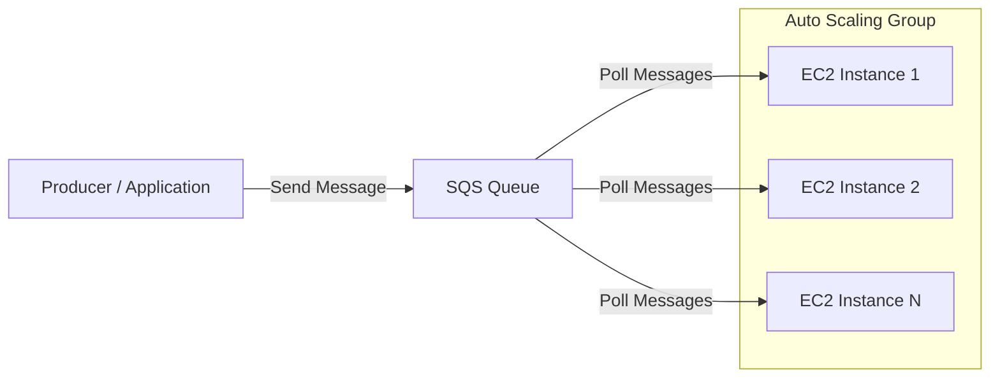
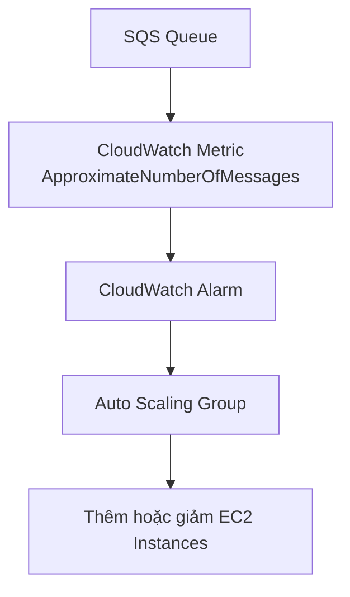
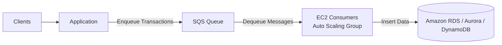
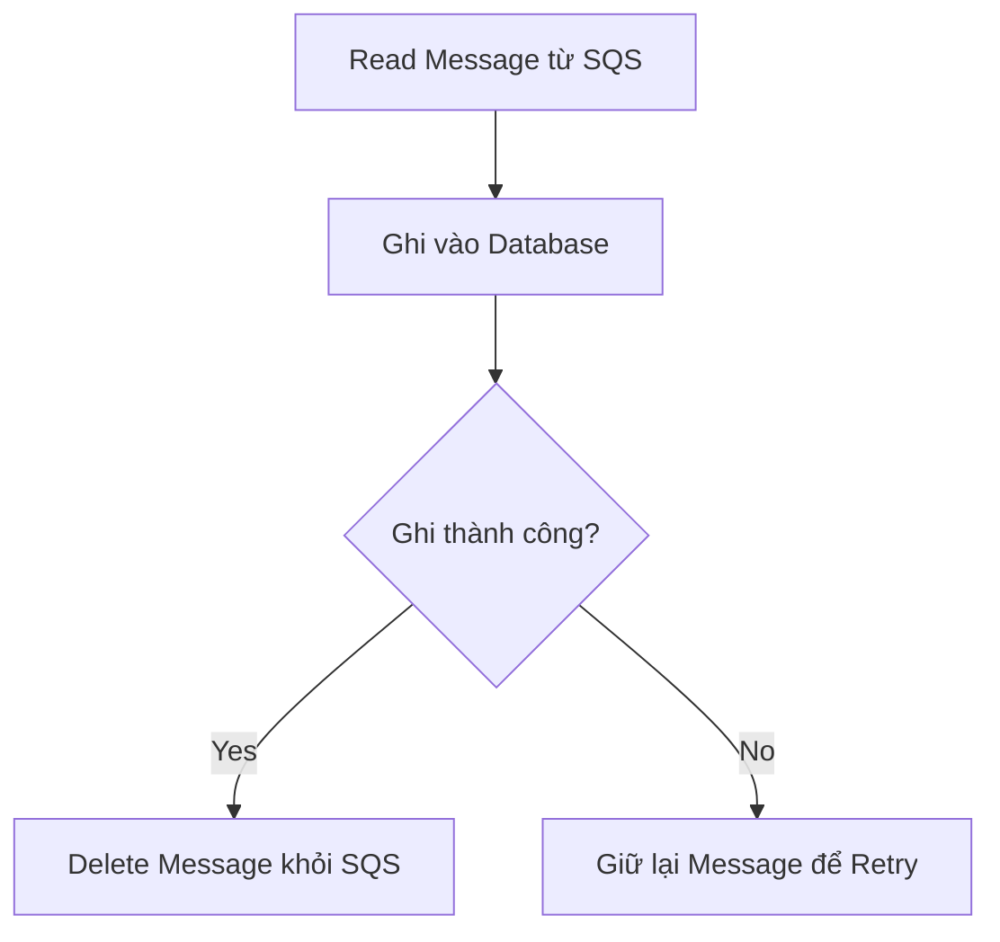
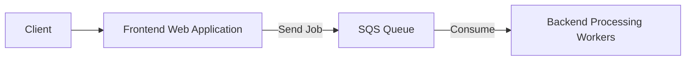

# SQS kết hợp Auto Scaling Group (ASG)

## 🚀 Sử dụng SQS để tự động Scale EC2

### 1. **Ý tưởng chính**

* **Amazon SQS** thường được kết hợp với **Auto Scaling Group (ASG)** để xử lý khối lượng công việc thay đổi liên tục.
* Các **EC2 Instances** trong ASG sẽ **poll** (lấy) message từ **SQS Queue** để xử lý.

### Luồng hoạt động



---

## 2. 📈 Auto Scaling dựa trên Queue Size

* **Amazon CloudWatch** cung cấp metric:

  * **ApproximateNumberOfMessages** (Queue Length)
* Metric này thể hiện số lượng message đang chờ xử lý trong **SQS Queue**.

Ví dụ:

* Nếu Queue Length > **1000 messages**

  * → Có quá nhiều message đang chờ.
  * → Hệ thống xử lý không kịp.
  * → **CloudWatch Alarm** kích hoạt **Scaling Action**.
  * → **ASG Scale Out** để thêm EC2 Instances.

Khi Queue giảm:

* → ASG có thể **Scale In** để tiết kiệm chi phí.

### Luồng Auto Scaling



---

# 3. 🛒 Pattern quan trọng: SQS làm Buffer cho Database Writes

## Vấn đề

Trong các đợt tải lớn (ví dụ: Flash Sale hoặc Marketing Campaign):

* Người dùng gửi rất nhiều request cùng lúc.
* Ứng dụng ghi trực tiếp vào:

  * **Amazon RDS**
  * **Amazon Aurora**
  * **Amazon DynamoDB**
* Nếu Database bị quá tải:

  * ❌ Timeout.
  * ❌ Transaction thất bại.
  * ❌ Mất dữ liệu của khách hàng.

---

## Giải pháp: Đặt SQS ở giữa

Thay vì ghi trực tiếp vào Database:

* Ứng dụng ghi request vào **SQS Queue** trước.
* Một nhóm EC2 trong **Auto Scaling Group** sẽ đọc message từ Queue và ghi xuống Database.

### Kiến trúc



---

## Lợi ích

* ✅ **SQS gần như mở rộng vô hạn (Infinitely Scalable)**.
* ✅ Không bị bottleneck khi lượng request tăng đột biến.
* ✅ Request được lưu bền vững trong Queue.
* ✅ Không mất transaction ngay cả khi Database xử lý chậm.
* ✅ Có thể tăng số lượng Consumer bằng **Auto Scaling Group** để xử lý nhanh hơn.

---

## Xóa Message đúng thời điểm

Message chỉ được xóa khỏi Queue sau khi:

* Consumer xử lý thành công.
* Dữ liệu đã được ghi vào Database.



Điều này giúp đảm bảo dữ liệu cuối cùng sẽ được ghi vào Database (**eventual processing**).

---

# 4. 🔗 Decoupling giữa các tầng của ứng dụng

SQS còn được dùng để **Decouple** các thành phần của hệ thống.

Thay vì:

```text
Frontend --> Backend --> Response
```

Có thể tách thành:



Backend sẽ xử lý các Job theo tốc độ phù hợp của mình mà không làm chậm Frontend.

---

# 5. 📌 Khi nào nên dùng SQS?

Nên cân nhắc sử dụng **Amazon SQS** khi gặp các tình huống:

* 🚀 **Sudden Spike Load** (lượng request tăng đột biến).
* 🔗 Cần **Decoupling** giữa các thành phần của hệ thống.
* ⏳ Muốn tránh **Timeout** do Backend hoặc Database xử lý chậm.
* 📦 Muốn Buffer request trước khi ghi xuống Database.
* 📈 Muốn **Scale** số lượng Worker bằng **Auto Scaling Group**.
* 🛡️ Muốn đảm bảo request không bị mất trong lúc hệ thống quá tải.

---

# 📊 Tóm tắt các Pattern quan trọng

| Pattern                          | Mô tả                                                                               |
| -------------------------------- | ----------------------------------------------------------------------------------- |
| 📥 **SQS + ASG**                 | EC2 trong Auto Scaling Group poll message từ SQS và tự động scale theo Queue Length |
| 📈 **CloudWatch + Queue Length** | Sử dụng metric **ApproximateNumberOfMessages** để kích hoạt Scale Out / Scale In    |
| 💾 **SQS Buffer trước Database** | Ứng dụng ghi vào SQS trước, Worker ghi xuống Database sau để tránh quá tải          |
| 🔗 **Application Decoupling**    | Frontend chỉ enqueue job, Backend xử lý bất đồng bộ thông qua SQS                   |
| ⚡ **Sudden Spike Handling**      | SQS hấp thụ lượng request lớn mà không làm quá tải Database hoặc Backend            |

---

# 🎯 Mẹo ghi nhớ cho kỳ thi

* **SQS + Auto Scaling Group** → Scale Consumer theo **Queue Length**.
* **CloudWatch Metric** quan trọng: **ApproximateNumberOfMessages**.
* Nếu đề bài nói:

  * **Decoupling**
  * **Sudden Spike Load**
  * **Buffer**
  * **Prevent Database Overload**
  * **Asynchronous Processing**
  * **Scale Workers Automatically**

  👉 Đáp án rất thường là **Amazon SQS**.

---

# ✅ Kết luận

* **Amazon SQS** là một dịch vụ Queue có khả năng mở rộng rất lớn, thường được dùng để tách rời (**decouple**) các thành phần của hệ thống.
* Kết hợp với **Auto Scaling Group**, hệ thống có thể tự động tăng hoặc giảm số lượng **EC2 Consumers** dựa trên **Queue Length**.
* Một trong những kiến trúc phổ biến nhất là sử dụng **SQS làm Buffer trước Database**, giúp hấp thụ tải đột biến và giảm nguy cơ mất dữ liệu khi Database quá tải.
