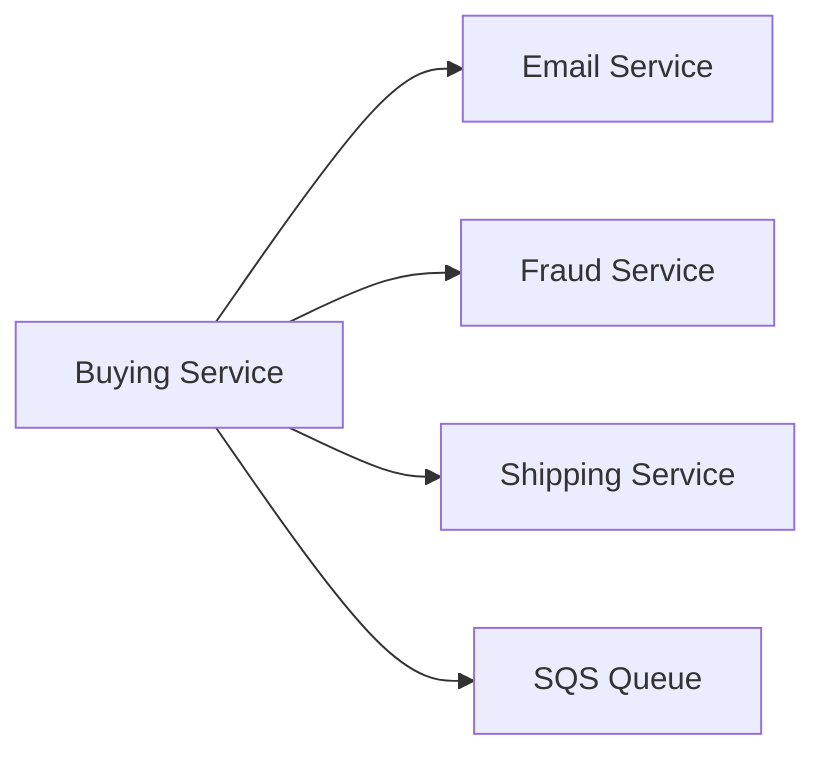
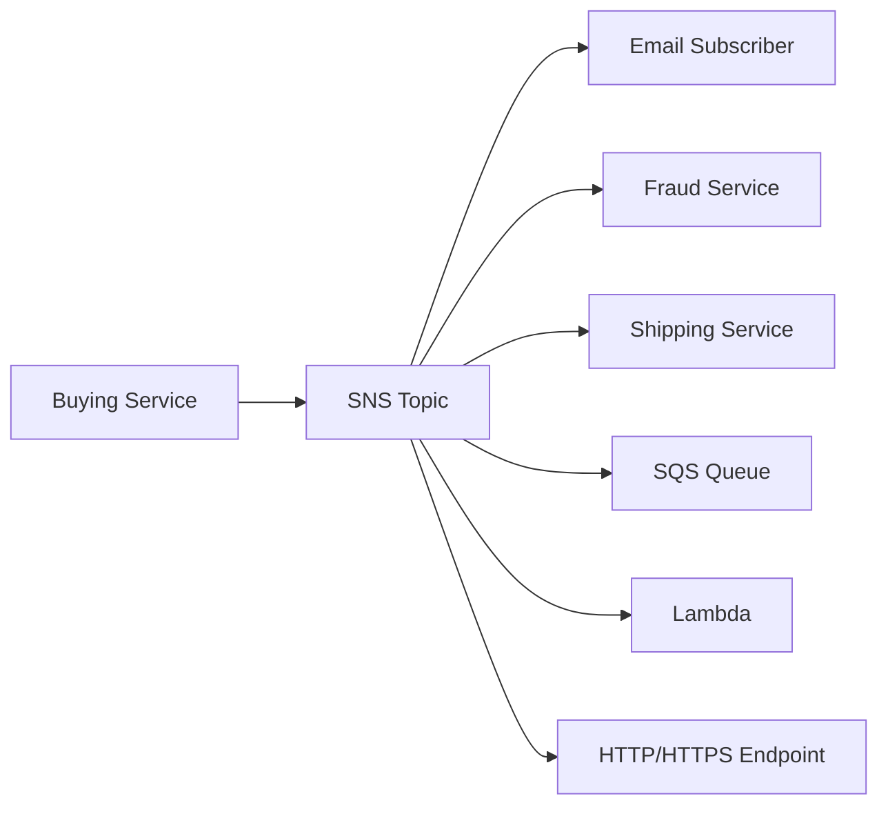
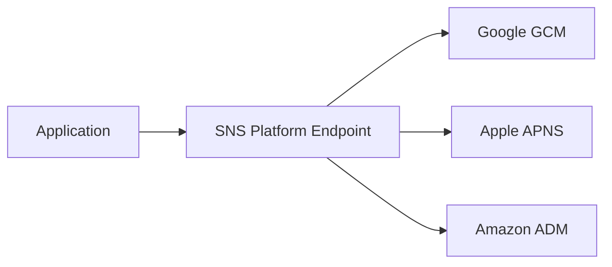
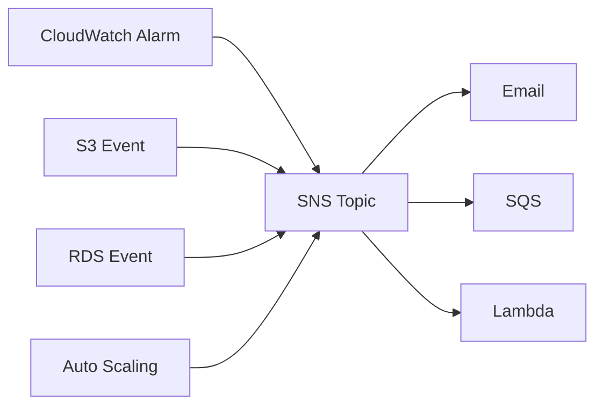

# Amazon SNS (Simple Notification Service)

## 📢 Amazon SNS – Dịch vụ Publish/Subscribe (Pub/Sub)

### 1. **Amazon SNS là gì?**

* **Amazon SNS (Simple Notification Service)** là dịch vụ nhắn tin theo mô hình **Pub/Sub (Publish-Subscribe)**.
* Thay vì gửi một message đến từng service riêng lẻ, producer chỉ cần **publish** một lần vào **SNS Topic**, sau đó SNS sẽ tự động phân phối message đến tất cả **subscribers**.

---

## 2. ❌ Cách tích hợp trực tiếp (Direct Integration)

Nếu không dùng SNS, một ứng dụng phải tự gửi message đến từng service.

### Luồng hoạt động

### Nhược điểm

* Mỗi khi thêm một service mới, phải sửa code của producer.
* Tăng độ phụ thuộc (**tight coupling**).
* Khó mở rộng và bảo trì.

---

## 3. ✅ Mô hình Pub/Sub với Amazon SNS

Thay vì gửi trực tiếp, producer chỉ cần gửi message đến **SNS Topic**.

### Luồng hoạt động

### Ưu điểm

* Producer chỉ cần biết **SNS Topic**.
* Có thể thêm hoặc xóa subscriber mà không cần sửa code producer.
* Hỗ trợ mô hình **One-to-Many Messaging**.
* Dễ mở rộng hệ thống.

---

## 4. 📨 Publish và Subscribe

### Publish

* Producer gửi message đến một **SNS Topic**.
* Thực hiện thông qua **Topic Publish SDK**.

### Subscribe

* Các **Subscribers** đăng ký lắng nghe (**subscribe**) SNS Topic.
* Mặc định, **mọi subscriber đều nhận được tất cả message** được publish vào Topic.

> ⚠️ Có thể sử dụng **Message Filtering** để chỉ nhận các message thỏa điều kiện nhất định.

---

## 5. 👥 Subscribers có thể là gì?

Amazon SNS hỗ trợ nhiều loại subscriber khác nhau:

| Subscriber               | Mô tả                            |
| ------------------------ | -------------------------------- |
| 📧 Email                 | Gửi Email Notification           |
| 📱 SMS                   | Gửi tin nhắn SMS                 |
| 📲 Mobile Notification   | Push Notification đến Mobile App |
| 🌐 HTTP / HTTPS Endpoint | Gửi HTTP Request đến Web Service |
| 📬 Amazon SQS            | Đưa message vào Queue            |
| ⚡ AWS Lambda             | Trigger Lambda Function          |
| 🚒 Kinesis Data Firehose | Đưa dữ liệu vào S3, Redshift,... |

---

## 6. 📱 SNS cho Mobile Application

SNS hỗ trợ gửi Push Notification trực tiếp đến Mobile App.

### Luồng hoạt động

* Cần tạo:

  * **Platform Application**
  * **Platform Endpoint**
* Sau đó publish message đến Platform Endpoint.

---

## 7. 🔔 AWS Services có thể Publish vào SNS

Rất nhiều dịch vụ AWS có thể gửi notification trực tiếp đến SNS Topic, ví dụ:

* CloudWatch Alarms
* Auto Scaling Group Notifications
* CloudFormation Events
* AWS Budgets
* Amazon S3 Events
* AWS DMS
* AWS Lambda
* Amazon DynamoDB
* Amazon RDS
* ...

### Luồng hoạt động

---

## 8. 🔐 Bảo mật của Amazon SNS

Amazon SNS cung cấp các cơ chế bảo mật tương tự Amazon SQS:

### In-flight Encryption

* ✅ Dữ liệu được mã hóa khi truyền (**Encryption in Transit**) mặc định.

### At-rest Encryption

* ✅ Hỗ trợ mã hóa dữ liệu lưu trữ bằng **AWS KMS Keys**.

### Client-side Encryption

* Client có thể tự mã hóa message trước khi gửi lên SNS.
* Client cũng chịu trách nhiệm giải mã khi nhận.

---

## 9. 🛡️ Access Control

### IAM Policies

* Toàn bộ SNS APIs được kiểm soát thông qua **IAM Policies**.
* IAM quyết định ai được phép:

  * Publish.
  * Subscribe.
  * Tạo hoặc xóa Topic.

### SNS Access Policies

* Hoạt động tương tự **S3 Bucket Policy**.
* Thường dùng để:

  * Hỗ trợ **Cross-Account Access**.
  * Cho phép các dịch vụ AWS (ví dụ **Amazon S3 Events**) publish vào SNS Topic.

---

## 10. 📊 Direct Integration vs Amazon SNS

| Tiêu chí              | Direct Integration         | Amazon SNS                      |
| --------------------- | -------------------------- | ------------------------------- |
| 📨 Gửi message        | Gửi riêng cho từng service | Publish một lần vào SNS Topic   |
| 🔗 Coupling           | Cao                        | Thấp                            |
| ➕ Thêm subscriber mới | Phải sửa code producer     | Chỉ cần subscribe vào Topic     |
| 📡 Mô hình            | Point-to-Point             | **Publish/Subscribe (Pub/Sub)** |
| 🚀 Khả năng mở rộng   | Kém                        | Rất tốt                         |

---

## 11. 📌 Mẹo ghi nhớ cho kỳ thi

* 📢 **Amazon SNS = Pub/Sub Service**.
* 📨 **Producer chỉ publish vào một SNS Topic**.
* 👥 **Nhiều subscribers có thể cùng nhận một message**.
* ⚙️ Hỗ trợ subscriber như:

  * Email
  * SMS
  * HTTP/HTTPS
  * Amazon SQS
  * AWS Lambda
  * Kinesis Data Firehose
* 🔔 Nhiều dịch vụ AWS (CloudWatch, S3, RDS, Budgets, Auto Scaling...) có thể gửi event vào SNS.
* 🔐 Hỗ trợ:

  * **In-flight Encryption**
  * **At-rest Encryption (KMS)**
  * **IAM Policies**
  * **SNS Access Policies**

---

## ✅ Kết luận

* **Amazon SNS** là dịch vụ **Publish/Subscribe (Pub/Sub)** dùng để phân phối một message đến nhiều nơi nhận.
* Thay vì tích hợp trực tiếp với từng service, producer chỉ cần **publish** vào **SNS Topic**, còn SNS sẽ tự động gửi đến các **subscribers**.
* Đây là giải pháp giúp hệ thống **loosely coupled**, dễ mở rộng và tích hợp với nhiều dịch vụ AWS cũng như ứng dụng bên ngoài.
