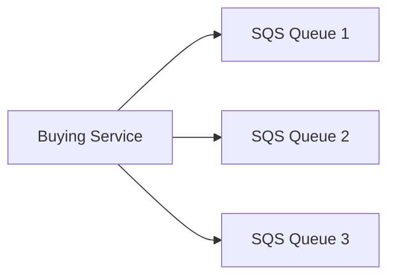
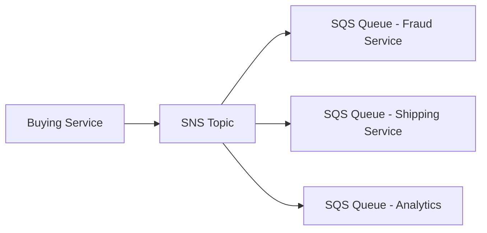
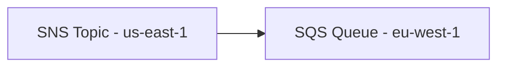
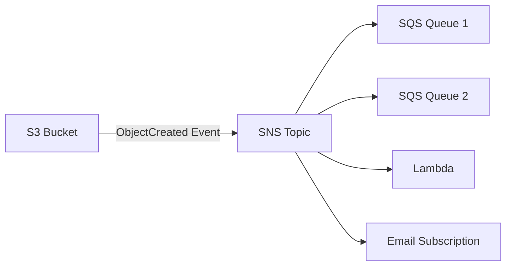
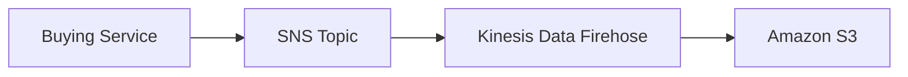
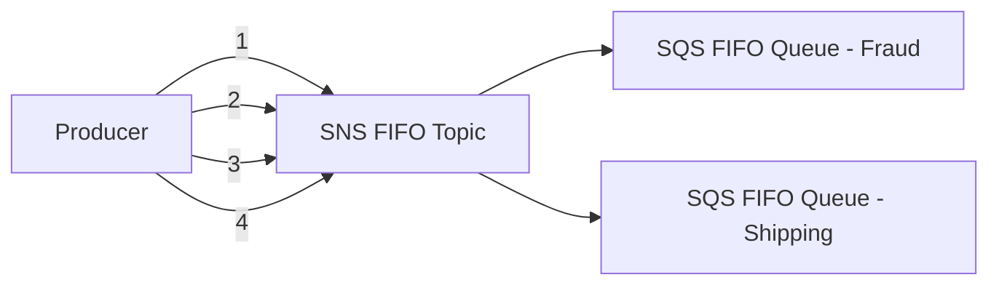
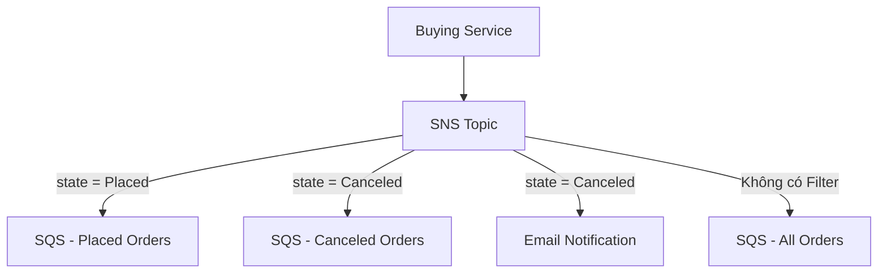

# SNS + SQS Fan-Out Pattern

## 📢 SNS + SQS Fan-Out Pattern là gì?

**Fan-Out Pattern** là kiến trúc trong đó một message chỉ cần được gửi **một lần** vào **SNS Topic**, sau đó **SNS** sẽ tự động phân phối (**fan-out**) message đó đến **nhiều Subscriber**, điển hình là các **SQS Queue**.

Mục tiêu:

* ✅ Giảm sự phụ thuộc giữa Producer và Consumer (**Decoupled Architecture**).
* ✅ Tránh phải gửi cùng một message đến nhiều Queue riêng lẻ.
* ✅ Dễ dàng mở rộng khi cần thêm Consumer mới.

---

# 1. ❌ Gửi trực tiếp đến nhiều SQS Queue

Nếu Producer gửi trực tiếp đến từng Queue:



### Nhược điểm

* ⚠️ Nếu ứng dụng bị crash giữa chừng, một số Queue có thể không nhận được message.
* ⚠️ Có thể xảy ra lỗi khi gửi đến từng Queue riêng biệt (**delivery failures**).
* ⚠️ Khi thêm Queue mới, phải sửa logic của Producer.

---

# 2. ✅ Fan-Out Pattern với SNS

Thay vì gửi nhiều lần, Producer chỉ gửi **một lần** vào **SNS Topic**.



### Ưu điểm

* ✅ Producer chỉ gửi **1 lần**.
* ✅ Mỗi Subscriber nhận một bản sao của message.
* ✅ Kiến trúc **Fully Decoupled**.
* ✅ Có thể thêm Subscriber mới mà không cần sửa Producer.
* ✅ **SQS** cung cấp:

  * Data Persistence.
  * Delayed Processing.
  * Retry khi xử lý thất bại.

---

# 3. 🔐 Queue Access Policy

Để **SNS** có thể ghi message vào **SQS Queue**, cần cấu hình:

* **SQS Queue Access Policy** cho phép **SNS Topic** thực hiện `SendMessage`.

Nếu không có policy phù hợp, SNS sẽ không thể gửi message vào Queue.

---

# 4. 🌍 Cross-Region Delivery

**SNS Topic** và **SQS Queue** **không bắt buộc** phải ở cùng Region.



* Chỉ cần cấu hình **Security/Policy** phù hợp là có thể gửi message giữa các Region.

---

# 5. 🪣 S3 Event → SNS → Multiple SQS Queues

## Hạn chế của S3 Event Notification

Đối với cùng một tổ hợp:

* **Event Type** (ví dụ: `ObjectCreated`)
* **Prefix** (ví dụ: `images/`)

S3 chỉ cho phép **một Event Rule**.

Nếu muốn gửi cùng một sự kiện đến nhiều Queue, nên dùng **Fan-Out Pattern**.

### Kiến trúc



### Lợi ích

* Một sự kiện từ S3 có thể được phân phối đến:

  * ✅ Nhiều SQS Queue.
  * ✅ Lambda.
  * ✅ Email.
  * ✅ Các Subscriber khác.

---

# 6. 📦 SNS → Kinesis Data Firehose → Amazon S3

SNS có thể tích hợp trực tiếp với **Kinesis Data Firehose (KDF)** để lưu message xuống S3.



Ngoài **Amazon S3**, **Kinesis Data Firehose** còn hỗ trợ nhiều đích lưu trữ khác.

---

# 7. 📑 SNS FIFO + SQS FIFO

SNS cũng hỗ trợ **FIFO Topic**, giúp duy trì thứ tự message.

## Luồng hoạt động



Các Queue sẽ nhận message theo đúng thứ tự:

```
1 → 2 → 3 → 4
```

### Tính năng

* ✅ **Ordering** theo **Message Group ID**.
* ✅ **Deduplication** bằng:

  * `Deduplication ID`, hoặc
  * `Content-Based Deduplication`.
* ✅ Hỗ trợ **Fan-Out** nhưng vẫn giữ đúng thứ tự message.
* ⚠️ Throughput bị giới hạn tương tự **SQS FIFO**.

---

# 8. 🔍 Message Filtering trong SNS

## Mặc định

Nếu Subscription **không có Filter Policy**:

➡️ Nhận **tất cả message** từ SNS Topic.

---

## Sử dụng Filter Policy

Ví dụ Producer gửi message:

```json
{
  "orderId": 1001,
  "product": "pencil",
  "quantity": 4,
  "state": "Placed"
}
```

Có thể cấu hình các Subscriber khác nhau.



### Ví dụ Filter Policy

* `state = Placed`

  * ➜ Chỉ nhận đơn hàng đã đặt.

* `state = Canceled`

  * ➜ Chỉ nhận đơn hàng bị hủy.

* `state = Declined`

  * ➜ Chỉ nhận đơn hàng bị từ chối.

* Không có Filter

  * ➜ Nhận toàn bộ message.

---

# 9. 📊 So sánh Fan-Out thông thường và Message Filtering

| Tiêu chí                   | Fan-Out thông thường | Fan-Out + Message Filtering   |
| -------------------------- | -------------------- | ----------------------------- |
| Message gửi đến Subscriber | Tất cả Subscriber    | Chỉ Subscriber thỏa điều kiện |
| Filter                     | ❌ Không              | ✅ JSON Filter Policy          |
| Dễ mở rộng                 | ✅ Có                 | ✅ Có                          |
| Giảm xử lý dư thừa         | ❌ Không              | ✅ Có                          |
| Use Case                   | Broadcast            | Routing theo nội dung message |

---

# 10. 📌 Mẹo ghi nhớ cho kỳ thi

* 📢 **SNS** = Publish/Subscribe.
* 📬 **SQS** = Queue dùng để lưu trữ và xử lý bất đồng bộ.
* 🌟 **SNS + SQS Fan-Out** = Gửi **1 lần**, nhiều Queue cùng nhận.
* 🔐 Muốn SNS ghi vào SQS → phải cấu hình **SQS Queue Access Policy**.
* 🪣 Muốn một **S3 Event** gửi đến nhiều Queue → dùng **S3 → SNS → nhiều Subscriber**.
* 📦 Muốn lưu message SNS xuống S3 → dùng **Kinesis Data Firehose**.
* 📑 Muốn **Ordering + Deduplication** → dùng **SNS FIFO + SQS FIFO**.
* 🔍 Muốn mỗi Subscriber chỉ nhận một số message nhất định → dùng **Message Filtering (JSON Filter Policy)**.

---

# ✅ Kết luận

* **SNS + SQS Fan-Out Pattern** là kiến trúc phổ biến để phân phối một message đến nhiều Consumer một cách **decoupled**, dễ mở rộng và an toàn.
* Khi cần:

  * Phát tán đến nhiều Queue → **SNS Fan-Out**.
  * Giữ thứ tự → **SNS FIFO + SQS FIFO**.
  * Chỉ nhận một phần message → **Message Filtering**.
  * Phân phối sự kiện từ S3 đến nhiều đích → **S3 → SNS → Fan-Out**.
  * Lưu trữ message lâu dài → **SNS → Kinesis Data Firehose → Amazon S3**.
