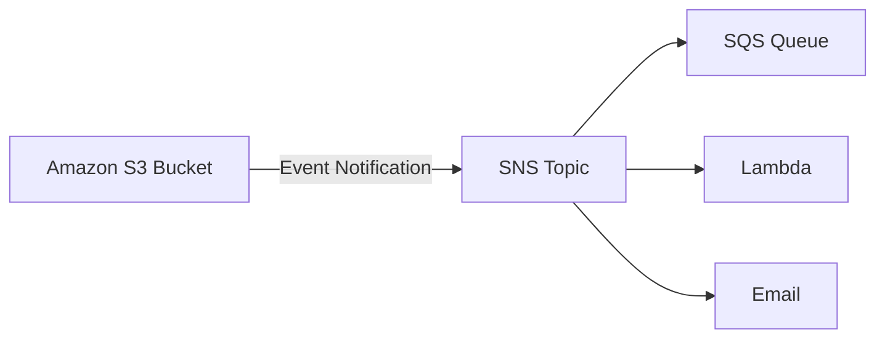
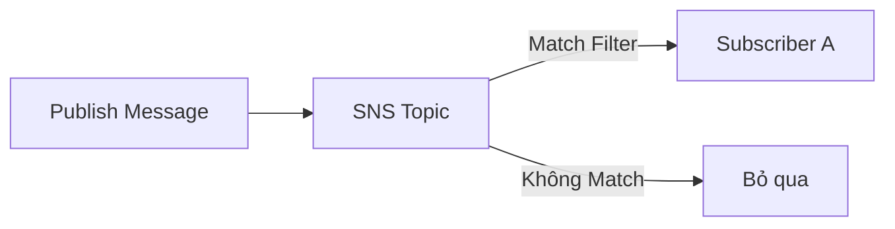
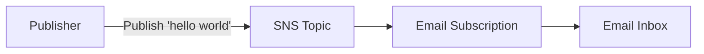
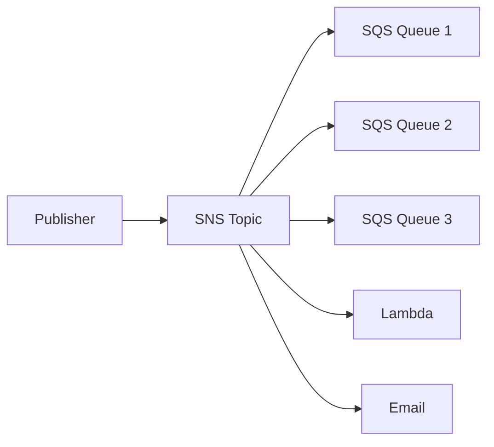

# AWS SNS Hands-on

## 📢 Thực hành với Amazon SNS (Simple Notification Service)

### 1. 📝 Tạo SNS Topic

Khi tạo một **SNS Topic**, có hai lựa chọn:

#### ✅ Standard Topic

* **Best-effort message ordering** (không đảm bảo thứ tự tuyệt đối).
* **At least once message delivery** (có thể nhận trùng nhưng đảm bảo ít nhất một lần).
* **Highest throughput** (hỗ trợ số lượng publish rất lớn).
* Có thể được subscribe bởi:

  * **SQS**
  * **Lambda**
  * **HTTPS**
  * **SMS**
  * **Email**
  * **Mobile Application**

#### ✅ FIFO Topic

* **Strictly preserved message ordering** (đảm bảo đúng thứ tự).
* **Exactly once message delivery** (không bị trùng lặp).
* Hỗ trợ khoảng **300 publishes/second**.
* Chỉ **SQS FIFO Queue** mới có thể subscribe.
* Tên Topic phải kết thúc bằng **`.fifo`**.

| Đặc điểm         | Standard Topic                     | FIFO Topic                 |
| ---------------- | ---------------------------------- | -------------------------- |
| Message Ordering | Best-effort                        | Strict                     |
| Delivery         | At least once                      | Exactly once               |
| Throughput       | Rất cao                            | ~300 publishes/s           |
| Subscriber       | SQS, Lambda, Email, SMS, HTTPS,... | Chỉ SQS FIFO               |
| Tên Topic        | Bất kỳ                             | Phải kết thúc bằng `.fifo` |

---

## 2. 🔐 Access Policy

SNS Topic có thể cấu hình **Access Policy** để xác định:

* Ai (**Who**) được phép ghi dữ liệu vào Topic.
* Dịch vụ nào (**What**) được phép publish message.

Cơ chế này tương tự:

* **S3 Bucket Policy**
* **SQS Queue Policy**

### Ví dụ

Có thể cho phép **Amazon S3** gửi Event Notification vào SNS Topic.



Muốn làm được điều này, **Access Policy** của SNS phải cho phép S3 thực hiện `Publish`.

---

## 3. 📬 Tạo Subscription

Sau khi tạo Topic, cần tạo **Subscription** để nhận message.

SNS hỗ trợ nhiều protocol:

* Email
* Email-JSON
* HTTP
* HTTPS
* SMS
* Lambda
* SQS
* Kinesis Data Firehose

Ví dụ trong bài thực hành sử dụng **Email**.

---

## 4. ✅ Xác nhận Subscription (Confirmation)

Khi tạo Subscription bằng Email:

1. SNS gửi một email xác nhận.
2. Người nhận phải bấm **Confirm Subscription**.
3. Sau khi xác nhận, trạng thái chuyển từ:

```
Pending Confirmation
        │
        ▼
Confirmed
```

Chỉ khi ở trạng thái **Confirmed**, Subscription mới nhận được message.

---

## 5. 🎯 Subscription Filter Policy

Có thể cấu hình **Subscription Filter Policy** để chỉ nhận một phần message phù hợp điều kiện.

Nếu **không cấu hình Filter Policy**:

* Mọi message publish vào SNS Topic sẽ được gửi đến Subscription.

Nếu **có Filter Policy**:

* Chỉ những message thỏa điều kiện mới được chuyển tiếp.



Điều này hữu ích khi có nhiều Subscriber nhưng mỗi Subscriber chỉ quan tâm đến một nhóm message nhất định.

---

## 6. 📨 Publish Message

Ví dụ publish nội dung:

```
hello world
```

Luồng xử lý:



Kết quả:

* SNS nhận message.
* SNS gửi email tới endpoint đã subscribe.
* Người dùng nhận được email chứa nội dung `"hello world"`.

---

## 7. 🔀 SNS Fanout Pattern với SQS

Một trong những kiến trúc phổ biến của SNS là **Fanout Pattern**.

Một message được gửi tới nhiều **SQS Queue** cùng lúc.



Ưu điểm:

* Một lần **Publish**, nhiều hệ thống cùng nhận dữ liệu.
* Giảm coupling giữa Publisher và Consumer.
* Dễ mở rộng thêm Subscriber mà không cần sửa Publisher.

---

## 8. 🗑️ Xóa tài nguyên sau khi thực hành

Sau khi hoàn thành:

1. Xóa **Subscription**.
2. Xóa **SNS Topic**.
3. AWS yêu cầu nhập:

```
delete me
```

để xác nhận việc xóa Topic.

---

# 📌 Mẹo ghi nhớ cho kỳ thi

* **Standard Topic**

  * ✅ Best-effort ordering.
  * ✅ At least once delivery.
  * ✅ Throughput cao.
  * ✅ Hỗ trợ nhiều loại Subscriber.

* **FIFO Topic**

  * ✅ Strict ordering.
  * ✅ Exactly once delivery.
  * ✅ Chỉ hỗ trợ **SQS FIFO**.
  * ✅ Tên phải kết thúc bằng **`.fifo`**.

* **Access Policy**

  * Dùng để kiểm soát dịch vụ hoặc tài khoản nào được phép **Publish** vào SNS Topic.

* **Subscription Filter Policy**

  * Cho phép Subscriber chỉ nhận các message phù hợp điều kiện.

* **SNS Fanout Pattern**

  * Một Publisher → Một SNS Topic → Nhiều Subscriber (SQS, Lambda, Email, ...).

---

# ✅ Kết luận

* **Amazon SNS** là dịch vụ **Pub/Sub** giúp phân phối message đến nhiều Subscriber.
* Hai loại Topic:

  * **Standard** → Throughput cao, hỗ trợ nhiều endpoint.
  * **FIFO** → Đảm bảo thứ tự và không trùng lặp, chỉ dùng với **SQS FIFO**.
* Các khái niệm quan trọng cần nhớ:

  * **Access Policy**
  * **Subscription**
  * **Subscription Filter Policy**
  * **Fanout Pattern**
  * **Pending Confirmation → Confirmed**
