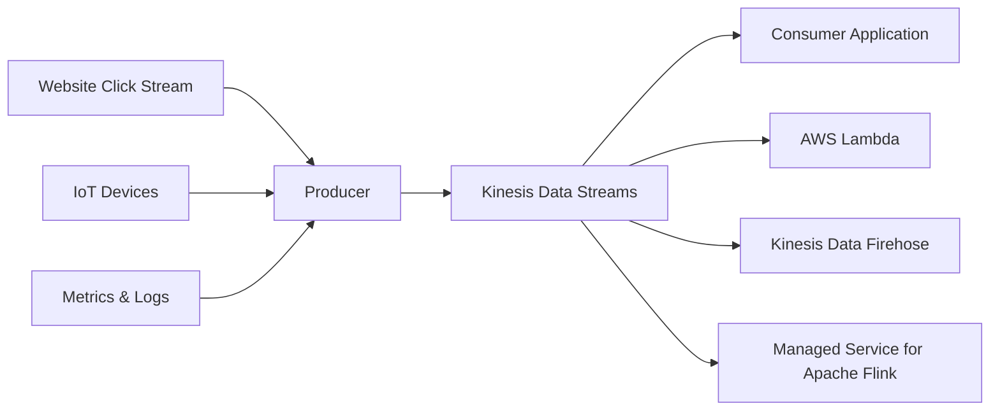
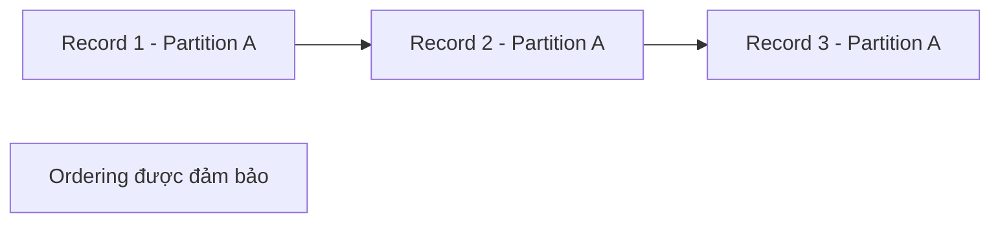

# Kinesis Data Streams

## 🌊 Kinesis Data Streams – Thu thập và xử lý Streaming Data theo thời gian thực

### 1. **Kinesis Data Streams là gì?**

* **Amazon Kinesis Data Streams (KDS)** là dịch vụ dùng để **collect** và **store streaming data in real-time**.
* 🔑 **Keyword quan trọng cho kỳ thi:** **Real-Time**.
* Phù hợp cho các hệ thống cần xử lý dữ liệu ngay khi dữ liệu được tạo ra.

---

## 2. 📊 Streaming Data là gì?

**Streaming Data** là dữ liệu được sinh ra và sử dụng ngay lập tức, ví dụ:

* 🖱️ **Click Stream** từ website.
* 🚲 Dữ liệu từ các thiết bị **IoT** (Internet of Things).
* 📈 **Metrics** và 📜 **Logs** từ server.
* 📡 Các sự kiện phát sinh liên tục theo thời gian thực.

---

## 3. 🚀 Kiến trúc tổng quan

### Luồng dữ liệu

### Producers

Dữ liệu được gửi vào Kinesis thông qua **Producer**:

* Ứng dụng tự viết code.
* **Kinesis Agent** cài trên server để gửi **Metrics** và **Logs**.
* Các hệ thống khác tích hợp với Kinesis.

### Consumers

Dữ liệu trong Kinesis có thể được đọc bởi:

* Ứng dụng tự viết (**Consumer Application**).
* **AWS Lambda**.
* **Amazon Data Firehose**.
* **Managed Service for Apache Flink** để phân tích dữ liệu theo thời gian thực.

---

# 4. 📦 Data Retention

* Dữ liệu trong **Kinesis Data Streams** có thể được lưu giữ (**Retention**) tối đa **365 ngày**.
* Do dữ liệu được lưu trữ (persisted), các **Consumer** có thể:

  * 🔄 **Replay Data**
  * 🔄 **Reprocess Data**
* ❌ Sau khi ghi vào Kinesis, **không thể xóa thủ công**.
* Dữ liệu chỉ bị xóa khi hết thời gian **Retention**.

---

# 5. 📏 Giới hạn dữ liệu

* Mỗi record có kích thước tối đa **10 MB**.
* Tuy nhiên, use case phổ biến nhất là:

  * 📌 Rất nhiều **small real-time records**.
  * Ví dụ: click event, log event, sensor data,...

---

# 6. 🔢 Partition ID và Data Ordering

* Nếu nhiều record sử dụng cùng một **Partition ID**:

  * ✅ Kinesis đảm bảo **thứ tự (ordering)** của các record đó.
* Điều này hữu ích khi các sự kiện có liên quan theo thời gian hoặc cùng một thực thể.

---

# 7. 🔐 Security

Kinesis Data Streams hỗ trợ:

* 🔒 **KMS Encryption at Rest**.
* 🔒 **HTTPS Encryption in Flight**.

Giúp bảo vệ dữ liệu cả khi lưu trữ và khi truyền qua mạng.

---

# 8. 📚 Thư viện hỗ trợ

## Kinesis Producer Library (KPL)

* Dùng để xây dựng **Producer** hiệu năng cao (**High Throughput**).
* Tối ưu việc gửi dữ liệu vào Kinesis.

## Kinesis Client Library (KCL)

* Dùng để xây dựng **Consumer** hiệu năng cao.
* Hỗ trợ đọc dữ liệu và quản lý việc xử lý giữa nhiều Consumer.

> 📌 Mẹo nhớ:
>
> * **KPL = Producer Library**
> * **KCL = Consumer Library**

---

# 9. ⚙️ Capacity Modes

## 9.1 Provisioned Mode

Trong **Provisioned Mode**, người dùng phải tự cấu hình số lượng **Shards**.

### Shard là gì?

* **Shard** là đơn vị mở rộng (**scaling unit**) của Kinesis Data Streams.
* Càng nhiều **Shards** thì throughput càng cao.

### Throughput của mỗi Shard

| Loại     | Giới hạn                            |
| -------- | ----------------------------------- |
| 📥 Write | **1 MB/s** hoặc **1,000 records/s** |
| 📤 Read  | **2 MB/s**                          |

Ví dụ:

* Muốn ghi **10 MB/s** hoặc **10,000 records/s**.
* ➜ Cần khoảng **10 Shards**.

### Scale

* Có thể **Scale Up** hoặc **Scale Down** bằng cách tăng/giảm số lượng **Shards**.
* Việc scale được thực hiện **thủ công**.
* Cần theo dõi throughput để quyết định số lượng Shards phù hợp.

### Chi phí

* Trả phí theo:

  * **Shard Provisioned**
  * **Số giờ sử dụng**

---

## 9.2 On-Demand Mode

Trong **On-Demand Mode**:

* Không cần quản lý số lượng **Shards**.
* AWS tự động scale dựa trên lưu lượng thực tế.

### Đặc điểm

* Mặc định hỗ trợ khoảng:

  * **4,000 records/s**
  * hoặc **4 MB/s** ghi dữ liệu.
* Tự động mở rộng dựa trên throughput quan sát được trong khoảng thời gian gần đây.

### Chi phí

* Trả phí theo:

  * **Stream mỗi giờ**
  * **Lượng dữ liệu đọc/ghi (Data In/Out)**

---

# 10. 📊 So sánh Provisioned vs On-Demand

| Tiêu chí            | Provisioned                  | On-Demand                       |
| ------------------- | ---------------------------- | ------------------------------- |
| ⚙️ Quản lý Capacity | Tự quản lý Shards            | AWS tự động quản lý             |
| 📈 Scaling          | Thủ công                     | Tự động                         |
| 💰 Chi phí          | Theo số lượng Shards         | Theo Stream + Data In/Out       |
| 🎯 Phù hợp          | Workload ổn định, dễ dự đoán | Workload biến động, khó dự đoán |

---

# 11. 📌 Mẹo ghi nhớ cho kỳ thi

* 🌊 **Kinesis Data Streams = Real-Time Streaming Data**.
* 📥 **Producer** gửi dữ liệu vào Stream.
* 📤 **Consumer**, **Lambda**, **Firehose**, **Apache Flink** đọc dữ liệu từ Stream.
* 🕒 Dữ liệu có thể được **Retention tối đa 365 ngày**.
* 🔄 Có thể **Replay/Reprocess** dữ liệu.
* ❌ Không thể xóa record thủ công sau khi ghi.
* 🔢 Cùng **Partition ID** ⇒ đảm bảo **Ordering**.
* 📚 **KPL** dành cho **Producer**, **KCL** dành cho **Consumer**.
* ⚙️ **Provisioned Mode** sử dụng **Shards** và cần tự scale.
* 🚀 **On-Demand Mode** tự động scale và không cần quản lý Shards.

---

# ✅ Kết luận

* **Amazon Kinesis Data Streams** là dịch vụ thu thập và lưu trữ **Streaming Data theo thời gian thực (Real-Time)**.
* Hỗ trợ nhiều nguồn dữ liệu và nhiều loại Consumer để xử lý ngay khi dữ liệu phát sinh.
* Hai chế độ mở rộng:

  * **Provisioned Mode** → tự quản lý **Shards**.
  * **On-Demand Mode** → AWS tự động scale.
* Đây là lựa chọn phù hợp cho các hệ thống cần xử lý **Real-Time Analytics**, **Click Stream**, **IoT**, **Metrics** và **Logs**.
