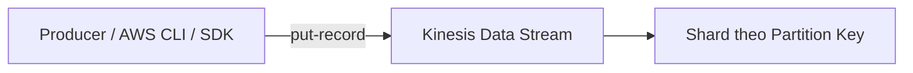
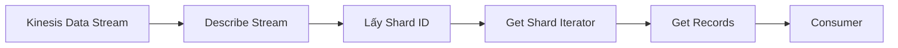
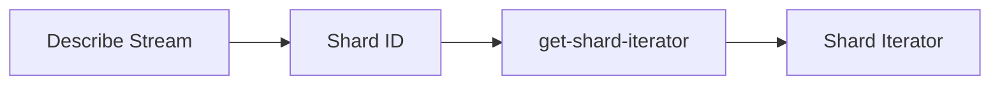
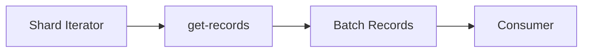
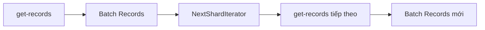
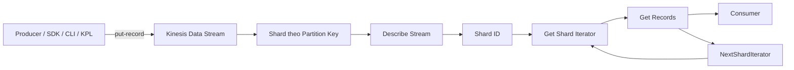

# Kinesis Data Streams Hands-on

## 🚀 Thực hành với Kinesis Data Streams

Bài thực hành này hướng dẫn cách tạo **Kinesis Data Stream**, gửi dữ liệu (**Producer**) và đọc dữ liệu (**Consumer**) bằng **AWS CLI**.

---

# 1. 🏗️ Tạo Kinesis Data Stream

Trong dịch vụ **Amazon Kinesis**, có 3 lựa chọn chính:

* **Kinesis Data Streams**
* **Kinesis Data Firehose**
* **Kinesis Data Analytics**

Ở bài này chỉ sử dụng **Kinesis Data Streams**.

---

## Chế độ Capacity

### ✅ On-demand Mode

* AWS tự động **Auto Scaling** capacity.
* Không cần cấu hình số lượng **Shard**.
* Giới hạn:

  * **Write:** 200 MB/s hoặc 200,000 records/s.
  * **Read:** 400 MB/s mỗi consumer (khi dùng **Enhanced Fan-Out**).
* Mô hình tính phí theo **Pay-per-throughput**.

### ✅ Provisioned Mode

* Người dùng phải tự cấu hình số lượng **Shard**.
* Có thể dùng **Shard Estimator Tool** để ước lượng số Shard cần thiết.

---

## Capacity của 1 Shard

| Thuộc tính          | Giá trị    |
| ------------------- | ---------- |
| ✍️ Write Throughput | **1 MB/s** |
| 📖 Read Throughput  | **2 MB/s** |

Nếu tạo **10 Shards** thì throughput sẽ tăng gấp 10 lần.

---

# 2. 📤 Producer gửi dữ liệu vào Stream

Có nhiều cách để ghi dữ liệu vào **Kinesis Data Streams**:

* **Kinesis Agent**
* **AWS SDK**
* **Kinesis Producer Library (KPL)**

Trong bài demo sử dụng **AWS CLI / SDK**.

## Luồng Producer



---

## API sử dụng

```bash
put-record
```

Ví dụ cần cung cấp:

* **Stream Name** (`DemoStream`)
* **PartitionKey**
* **Data**

Ví dụ:

```text
PartitionKey = user1
Data = user signup
```

---

## Partition Key

* Các record có cùng **Partition Key** sẽ được ghi vào cùng một **Shard**.
* Trong demo chỉ có **1 Shard**, nên mọi record đều nằm trên Shard này.

---

# 3. 📈 Theo dõi Monitoring

Sau khi gửi dữ liệu:

* Có thể xem metric trong **CloudWatch**.
* Ví dụ:

  * **PutRecords**
  * Throughput
  * Số lượng record

Metric có thể mất một khoảng thời gian mới hiển thị.

---

# 4. 📖 Consumer đọc dữ liệu từ Stream

Có nhiều lựa chọn Consumer:

* **Kinesis Data Analytics**
* **Kinesis Data Firehose**
* **Lambda**
* **Kinesis Client Library (KCL)**
* **AWS SDK / CLI**

Trong demo sử dụng **AWS CLI** ở mức **low-level API**.

---

## Luồng Consumer



---

# 5. 🔍 Bước 1: Describe Stream

Trước khi đọc dữ liệu cần biết:

* Stream có bao nhiêu **Shard**
* **Shard ID** là gì

Sử dụng:

```bash
describe-stream
```

Ví dụ:

```text
shardId-000000000000
```

---

# 6. 🎯 Bước 2: Lấy Shard Iterator

Sử dụng API:

```bash
get-shard-iterator
```

Trong demo:

```text
ShardIteratorType = TRIM_HORIZON
```

Ý nghĩa:

* **TRIM_HORIZON** → đọc từ **đầu Stream** (toàn bộ record cũ).
* Các chế độ khác có thể chỉ đọc record mới được ghi từ thời điểm Consumer bắt đầu.

---

## Luồng lấy Shard Iterator



---

# 7. 📥 Bước 3: Đọc Record

Sử dụng:

```bash
get-records
```

Cần truyền vào:

```text
Shard Iterator
```

Luồng hoạt động:



---

## Dữ liệu trả về

Mỗi record bao gồm:

* PartitionKey
* Sequence Number
* Timestamp
* Data (được mã hóa **Base64**)

Ví dụ:

```text
user signup
user login
user logout
```

Sau khi decode Base64 sẽ thu được dữ liệu gốc.

---

# 8. 🔄 NextShardIterator

Sau mỗi lần gọi:

```bash
get-records
```

Kết quả sẽ trả về:

```text
NextShardIterator
```

Lần đọc tiếp theo cần sử dụng chính **NextShardIterator** này để tiếp tục đọc từ vị trí trước đó.

## Luồng đọc liên tục



---

# 9. ⚡ Shared Consumption

Demo sử dụng:

* **Describe Stream**
* **Get Shard Iterator**
* **Get Records**

=> Đây là cơ chế **Shared Consumption**.

Không sử dụng:

* **Enhanced Fan-Out**

Nếu muốn tận dụng **Enhanced Fan-Out**, nên dùng **Kinesis Client Library (KCL)** thay vì thao tác ở mức low-level.

---

# 10. ☁️ CloudShell

Bài demo sử dụng **AWS CloudShell**:

* Không cần cài đặt AWS CLI trên máy cá nhân.
* Tự động sử dụng **IAM Credentials** của tài khoản hiện tại.
* Tự động cấu hình Region tương ứng.
* CloudShell được AWS cung cấp miễn phí.

---

# 📊 Tóm tắt Producer và Consumer



---

# 📌 Mẹo ghi nhớ

| Keyword                | Ý nghĩa                                       |
| ---------------------- | --------------------------------------------- |
| **On-demand Mode**     | AWS tự động scale số Shard                    |
| **Provisioned Mode**   | Người dùng tự cấu hình Shard                  |
| **1 Shard**            | 1 MB/s Write, 2 MB/s Read                     |
| **Partition Key**      | Quyết định record vào Shard nào               |
| **put-record**         | Gửi dữ liệu vào Stream                        |
| **describe-stream**    | Xem thông tin và Shard ID                     |
| **get-shard-iterator** | Lấy con trỏ để đọc dữ liệu                    |
| **TRIM_HORIZON**       | Đọc từ đầu Stream                             |
| **get-records**        | Đọc dữ liệu từ Stream                         |
| **NextShardIterator**  | Tiếp tục đọc từ vị trí hiện tại               |
| **Shared Consumption** | Cơ chế đọc dùng trong demo                    |
| **Enhanced Fan-Out**   | Cơ chế đọc hiệu năng cao, thường dùng với KCL |

---

# ✅ Kết luận

* **Producer** ghi dữ liệu vào **Kinesis Data Stream** bằng `put-record`.
* Record được phân phối vào **Shard** dựa trên **Partition Key**.
* **Consumer** cần:

  1. `describe-stream`
  2. `get-shard-iterator`
  3. `get-records`
* Dữ liệu trả về được mã hóa **Base64** và cần dùng **NextShardIterator** để tiếp tục đọc các record mới.
* Trong thực tế, nên sử dụng **Kinesis Client Library (KCL)** khi xây dựng Consumer để đơn giản hóa việc quản lý Shard và hỗ trợ **Enhanced Fan-Out**.
