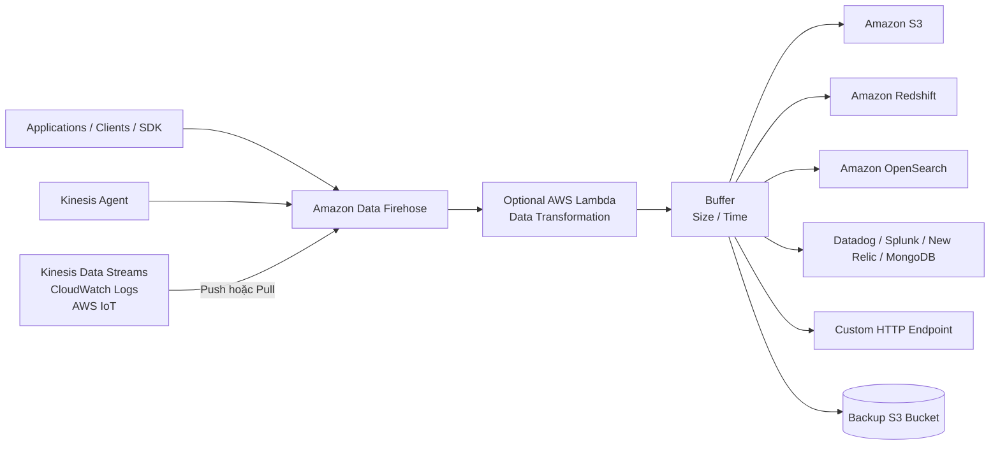
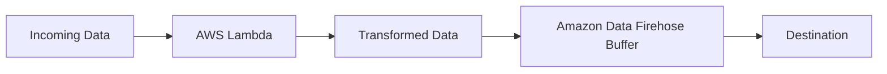
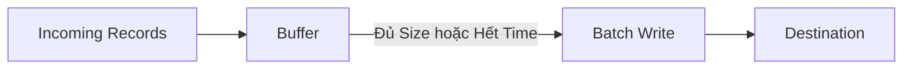
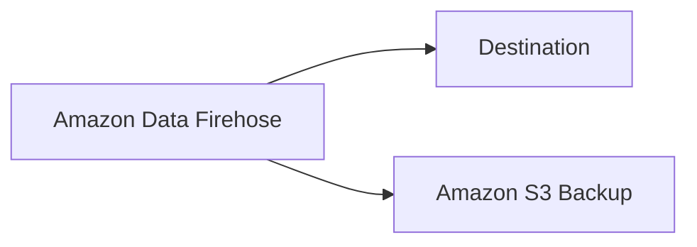

# Amazon Data Firehose

## 🚀 Amazon Data Firehose – Dịch vụ đưa Streaming Data đến các đích lưu trữ và phân tích

## 1. Amazon Data Firehose là gì?

* **Amazon Data Firehose** là dịch vụ **fully managed** và **serverless** dùng để **thu thập, chuyển đổi (transform) và chuyển dữ liệu streaming** đến nhiều **target destinations**.
* Trước đây dịch vụ có tên là **Kinesis Data Firehose**, nhưng hiện được đổi thành **Amazon Data Firehose** vì không chỉ làm việc với Kinesis.

---

## 2. 🔄 Luồng hoạt động của Amazon Data Firehose

### Quy trình

1. **Producers** (Applications, Clients, SDK, Kinesis Agent...) gửi dữ liệu vào **Amazon Data Firehose**.
2. Firehose cũng có thể **pull dữ liệu** từ:

   * **Kinesis Data Streams**
   * **Amazon CloudWatch Logs / Events**
   * **AWS IoT**
3. Dữ liệu có thể được **transform** thông qua **AWS Lambda** (tùy chọn).
4. Firehose lưu dữ liệu vào **Buffer**.
5. Khi đạt ngưỡng về **Size** hoặc **Time**, Buffer sẽ được **flush** để ghi dữ liệu theo batch đến các đích.

---

## 3. 🎯 Các Target Destinations được hỗ trợ

### AWS Destinations

* **Amazon S3**
* **Amazon Redshift**
* **Amazon OpenSearch Service**

### Third-party Destinations

* **Datadog**
* **Splunk**
* **New Relic**
* **MongoDB**

### Custom Destination

* **HTTP Endpoint** để tích hợp với hệ thống riêng nếu destination chưa được hỗ trợ.

---

## 4. 🔧 Data Transformation

Firehose có thể sử dụng **AWS Lambda** để xử lý dữ liệu trước khi ghi xuống đích.

Ví dụ:

* Chuyển đổi **CSV → JSON**.
* Thay đổi cấu trúc dữ liệu.
* Thêm hoặc loại bỏ field.
* Chuẩn hóa dữ liệu trước khi lưu vào **Amazon S3** hoặc **Amazon Redshift**.

### Luồng xử lý

---

## 5. 📦 Buffer và Near Real-Time

Một đặc điểm quan trọng của Firehose là sử dụng **Buffer**.

* Firehose sẽ gom dữ liệu vào Buffer.
* Buffer được flush khi:

  * Đủ **Size**.
  * Hoặc đủ **Time**.
* Sau đó dữ liệu được ghi xuống đích theo **batch**.

> 💡 Chính vì có cơ chế Buffer nên **Amazon Data Firehose là dịch vụ "Near Real-Time"**, không phải Real-Time tuyệt đối.

---

## 6. 💾 Backup dữ liệu

Firehose hỗ trợ ghi dữ liệu vào **Amazon S3** để backup.

Có thể cấu hình:

* ✅ Backup **toàn bộ dữ liệu**.
* ✅ Chỉ backup **các record bị lỗi (failed data)**.

---

## 7. 📄 Định dạng dữ liệu hỗ trợ

### Input Formats

* CSV
* JSON
* Parquet
* Avro
* Text
* Binary

### Data Conversion

Firehose có thể chuyển đổi dữ liệu sang:

* **Parquet**
* **ORC**

### Compression

Hỗ trợ nén bằng:

* **gzip**
* **snappy**

Nếu cần xử lý đặc biệt hoặc chuyển đổi tùy chỉnh (ví dụ **CSV → JSON**) thì nên sử dụng **AWS Lambda**.

---

## 8. ⚙️ Đặc điểm nổi bật

* ✅ **Fully Managed**
* ✅ **Serverless**
* ✅ **Automatic Scaling**
* ✅ Chỉ trả phí theo mức sử dụng (**Pay as you use**)
* ✅ Hỗ trợ nhiều destination khác nhau
* ✅ Hỗ trợ Data Transformation bằng **AWS Lambda**
* ⚠️ Là dịch vụ **Near Real-Time**

---

# 9. 📊 So sánh Kinesis Data Streams và Amazon Data Firehose

| Tiêu chí                  | **Kinesis Data Streams**   | **Amazon Data Firehose**                              |
| ------------------------- | -------------------------- | ----------------------------------------------------- |
| 🎯 Mục đích               | Thu thập Streaming Data    | Đưa Streaming Data đến Destination                    |
| 👨‍💻 Producer / Consumer | Tự viết code               | AWS quản lý                                           |
| ⏱️ Thời gian xử lý        | **Real-Time**              | **Near Real-Time**                                    |
| 📈 Scaling                | Provisioned hoặc On-Demand | Automatic Scaling                                     |
| 💾 Lưu trữ dữ liệu        | Có (tối đa 1 năm)          | Không lưu trữ lâu dài                                 |
| 🔄 Replay                 | ✅ Có                       | ❌ Không                                               |
| 🎛️ Quản lý hạ tầng       | Cần quản lý Stream         | Fully Managed                                         |
| 🎯 Destination            | Consumer tự xử lý          | Gửi trực tiếp đến S3, Redshift, OpenSearch, Splunk... |

---

## 10. 📌 Mẹo ghi nhớ cho kỳ thi

* 🚀 **Amazon Data Firehose = Load Streaming Data vào Destination**.
* ⚡ **Near Real-Time** vì có **Buffer** trước khi ghi dữ liệu.
* ☁️ **Fully Managed + Serverless + Automatic Scaling**.
* 🔄 Có thể **Transform Data bằng AWS Lambda**.
* 📦 Hỗ trợ ghi trực tiếp đến:

  * Amazon S3
  * Amazon Redshift
  * Amazon OpenSearch
  * Datadog
  * Splunk
  * New Relic
  * MongoDB
  * Custom HTTP Endpoint
* ❌ **Không có Data Storage và Replay Capability** như **Kinesis Data Streams**.

---

# ✅ Kết luận

* **Amazon Data Firehose** là dịch vụ dùng để **ingest và deliver streaming data** đến nhiều hệ thống đích mà không cần tự quản lý hạ tầng.
* Dữ liệu có thể được **transform bằng AWS Lambda**, lưu tạm trong **Buffer**, sau đó ghi theo **batch** đến destination.
* Điểm cần nhớ trong bài thi:

  * **Near Real-Time** → Nghĩ ngay đến **Amazon Data Firehose**.
  * **Real-Time + Replay + Data Retention** → Nghĩ đến **Kinesis Data Streams**.
