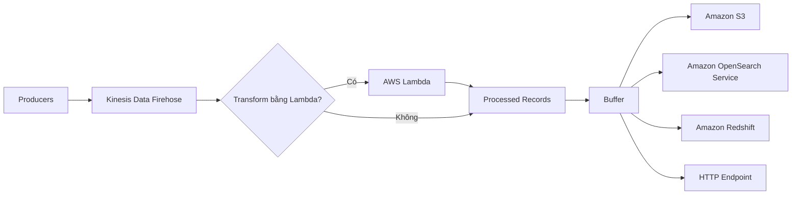
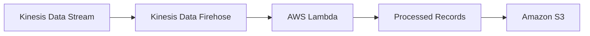
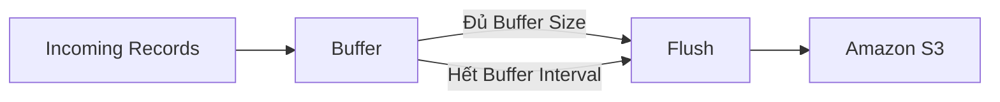
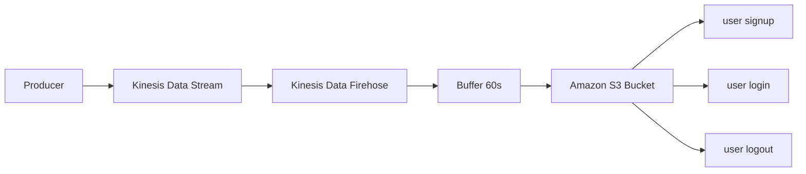

# Kinesis Data Firehose – Delivery Stream Demo

## 🚀 1. Kinesis Data Firehose là gì?

**Kinesis Data Firehose** là dịch vụ dùng để **ingest**, **transform** và **deliver** dữ liệu streaming đến các dịch vụ lưu trữ hoặc phân tích mà không cần quản lý hạ tầng.

Một **Delivery Stream** sẽ nhận dữ liệu từ nhiều nguồn và tự động chuyển đến đích mong muốn.

---

# 2. 📥 Nguồn dữ liệu (Source)

Kinesis Data Firehose có thể nhận dữ liệu từ nhiều nguồn khác nhau:

* ✅ **Kinesis Data Streams**
* ✅ **Direct PUT** từ ứng dụng
* ✅ **Kinesis Agent**
* ✅ Các dịch vụ AWS như:

  * CloudWatch
  * IoT Core
  * EventBridge
* ✅ Ứng dụng tự xây dựng thông qua **AWS SDK**

Trong bài demo:

* **Source:** `Kinesis Data Stream`
* **Destination:** `Amazon S3`

---

# 3. 🔄 Luồng xử lý của Kinesis Data Firehose

---

# 4. 🎯 Các Destination quan trọng cần nhớ

Kinesis Data Firehose hỗ trợ nhiều đích lưu trữ, nhưng trong kỳ thi nên ghi nhớ đặc biệt:

| Destination                     | Ghi chú                    |
| ------------------------------- | -------------------------- |
| ✅ **Amazon S3**                 | Lưu trữ object             |
| ✅ **Amazon OpenSearch Service** | Trước đây là Elasticsearch |
| ✅ **Amazon Redshift**           | Data Warehouse             |
| HTTP Endpoint                   | Endpoint tùy chỉnh         |
| Third-party Services            | Splunk và các dịch vụ khác |

> 📌 **Mẹo ghi nhớ:** Nếu đề hỏi Firehose có thể đẩy dữ liệu đến đâu, hãy nhớ **S3 + OpenSearch + Redshift**.

---

# 5. ⚙️ Transform Records bằng Lambda

Firehose có thể gọi **AWS Lambda** trước khi ghi dữ liệu xuống Destination.

Các tác vụ thường dùng:

* Chuyển đổi dữ liệu.
* Filter record.
* Uncompress dữ liệu.
* Xử lý hoặc enrich dữ liệu.
* Thay đổi cấu trúc record.

## Luồng xử lý

---

# 6. 🔄 Convert Record Format

Ngoài Lambda, Firehose còn có khả năng **Convert Record Format**.

Ví dụ:

* JSON → **Parquet**
* JSON → **ORC**

Tính năng này hữu ích khi lưu dữ liệu phục vụ **Analytics** hoặc **Data Lake**.

> 📌 Chỉ cần nhớ ở mức độ cao: **Kinesis Data Firehose có thể chuyển đổi định dạng dữ liệu trước khi lưu.**

---

# 7. 📦 Buffer Hints

Firehose **không ghi từng record ngay lập tức** mà sẽ gom dữ liệu vào **Buffer** trước khi ghi xuống Destination.

Có hai tham số quan trọng:

## Buffer Size

* Mặc định khoảng **5 MB**.
* Buffer lớn hơn → hiệu quả hơn.
* Buffer nhỏ hơn → dữ liệu được ghi nhanh hơn.

## Buffer Interval

* Quy định thời gian tối đa trước khi flush dữ liệu.
* Ví dụ:

  * **60 giây** → tối đa 60 giây sẽ ghi xuống S3.
  * **300 giây** → tối đa 5 phút.
  * **900 giây** → tối đa 15 phút.

### Cách hoạt động

> 📌 Firehose sẽ ghi dữ liệu khi **đủ kích thước Buffer** **hoặc** khi **hết thời gian Buffer Interval**, tùy điều kiện nào đến trước.

---

# 8. 🗜️ Compression và Encryption

Trước khi ghi xuống Destination, Firehose có thể:

## Compression

Hỗ trợ:

* GZIP
* Snappy
* Zip
* Hadoop-Compatible Snappy

Lợi ích:

* Giảm dung lượng lưu trữ.
* Tiết kiệm chi phí trên Amazon S3.

## Encryption

Có thể mã hóa dữ liệu trước khi lưu nhằm tăng cường bảo mật.

---

# 9. 🔐 IAM Role

Khi tạo Delivery Stream, AWS sẽ tự tạo hoặc sử dụng một **IAM Role**.

IAM Role này cấp quyền cho Firehose:

* Đọc dữ liệu từ **Kinesis Data Stream**.
* Ghi dữ liệu vào **Amazon S3**.
* Truy cập các tài nguyên liên quan.

---

# 10. 🧪 Demo thực tế

Sau khi tạo **Delivery Stream**:

1. Gửi dữ liệu mới vào **Kinesis Data Stream**.
2. Firehose nhận dữ liệu.
3. Dữ liệu được lưu trong **Buffer**.
4. Sau **Buffer Interval (ví dụ 60 giây)** hoặc khi đủ kích thước Buffer, dữ liệu sẽ được ghi xuống **Amazon S3**.

## Luồng demo

Trong ví dụ:

* Gửi 3 record:

  * `user signup`
  * `user login`
  * `user logout`
* Sau khoảng **60 giây**, Firehose ghi cả 3 record vào **một object** trong **Amazon S3**.

---

# 11. 📊 Monitoring

Sau khi Delivery Stream hoạt động:

* Có thể xem **Metrics** để theo dõi lưu lượng dữ liệu.
* **Error Logs** được ghi vào **CloudWatch Logs** để hỗ trợ debug và giám sát.

---

# 12. ⚠️ Lưu ý khi sử dụng

* Firehose **không xử lý dữ liệu đã có trước khi tạo Delivery Stream**.
* Chỉ những dữ liệu **được gửi sau khi Delivery Stream được cấu hình** mới được xử lý.
* Sau khi thực hành, nên xóa:

  * **Delivery Stream**
  * **Kinesis Data Stream**
* Nếu để các tài nguyên này chạy, AWS sẽ tiếp tục tính phí.

---

# 📌 Tóm tắt nhanh

| Thành phần                 | Chức năng                                                                              |
| -------------------------- | -------------------------------------------------------------------------------------- |
| **Kinesis Data Firehose**  | Ingest, Transform và Deliver dữ liệu streaming                                         |
| **Source**                 | Kinesis Data Stream, Direct PUT, Kinesis Agent, CloudWatch, EventBridge, IoT Core, SDK |
| **Transform**              | AWS Lambda                                                                             |
| **Convert Format**         | Parquet, ORC                                                                           |
| **Buffer**                 | Gom dữ liệu trước khi ghi xuống Destination                                            |
| **Destination quan trọng** | Amazon S3, Amazon OpenSearch Service, Amazon Redshift                                  |
| **Compression**            | GZIP, Snappy, Zip...                                                                   |
| **Encryption**             | Mã hóa dữ liệu trước khi lưu                                                           |
| **IAM Role**               | Cho phép Firehose đọc Source và ghi Destination                                        |
| **Monitoring**             | Metrics và CloudWatch Logs                                                             |

## ✅ Kết luận

* **Kinesis Data Firehose** là dịch vụ giúp đưa dữ liệu streaming đến các hệ thống lưu trữ và phân tích một cách tự động.
* Có thể **Transform bằng Lambda**, **Convert Record Format**, **Buffer**, **Compress** và **Encrypt** dữ liệu trước khi ghi.
* Đối với kỳ thi AWS, hãy ghi nhớ ba Destination quan trọng nhất:

  * 🪣 **Amazon S3**
  * 🔍 **Amazon OpenSearch Service**
  * 📊 **Amazon Redshift**
