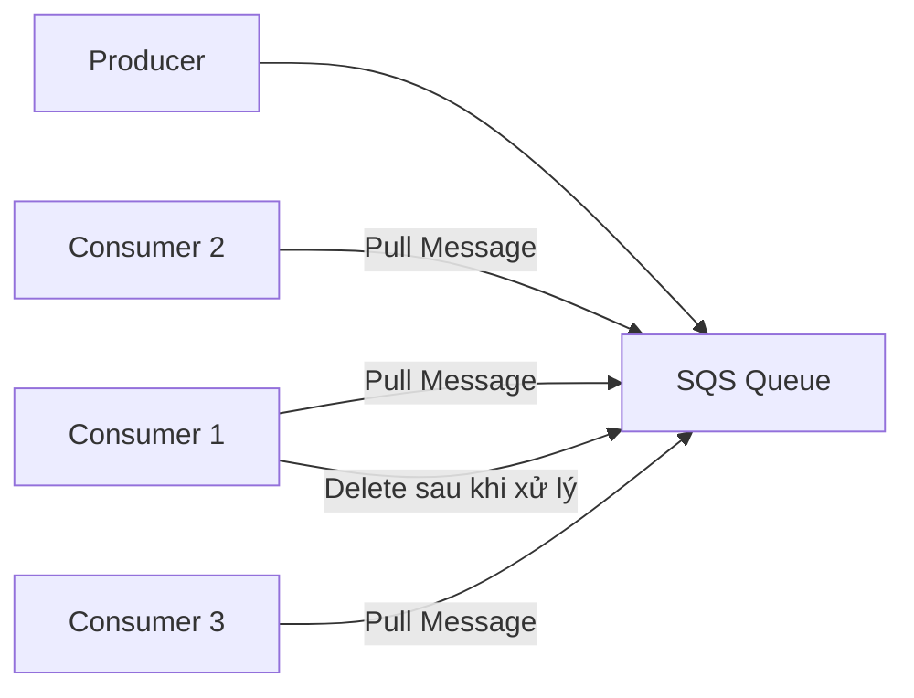
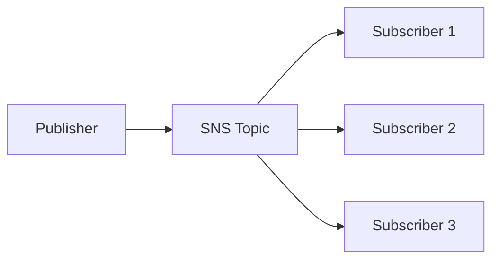
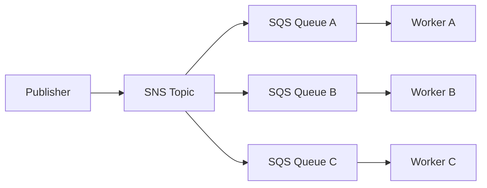
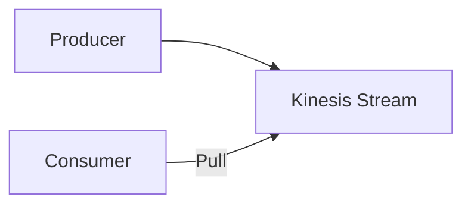
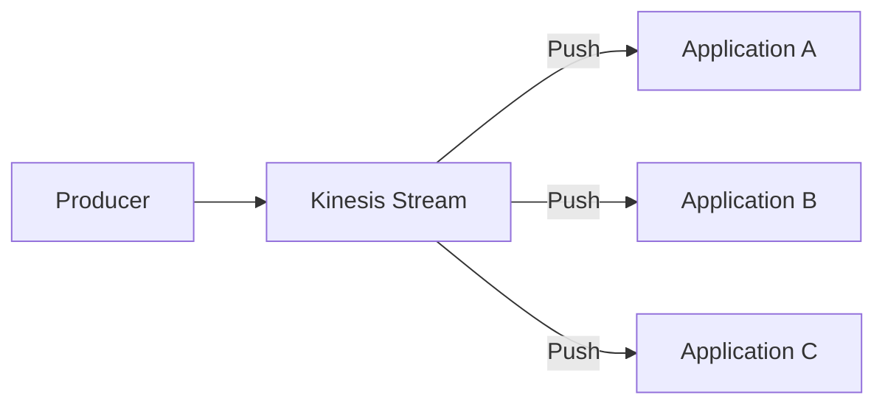

# SQS vs SNS vs Kinesis – So sánh tổng quan

## 🎯 Mục tiêu

Ba dịch vụ **Amazon SQS**, **Amazon SNS** và **Amazon Kinesis** đều được dùng để truyền dữ liệu giữa các hệ thống, nhưng có mô hình hoạt động và use case rất khác nhau.

---

# 1. 📬 Amazon SQS (Simple Queue Service)

## Cách hoạt động

* **SQS** sử dụng mô hình **Pull**.
* **Consumer** phải chủ động gửi request để lấy (**pull**) message từ Queue.
* Sau khi xử lý xong, **Consumer phải Delete message** để các Consumer khác không đọc lại.

### Luồng hoạt động

---

## Đặc điểm

* ✅ Có thể có nhiều **Consumer/Worker** cùng xử lý Queue.
* ✅ AWS tự động scale, không cần cấu hình throughput trước.
* ✅ Có thể xử lý hàng trăm nghìn message với tốc độ cao.
* ✅ Chỉ hỗ trợ **Ordering Guarantee** khi dùng **FIFO Queue**.
* ✅ Hỗ trợ **Message Delay** (ví dụ: message chỉ xuất hiện sau 30 giây).

---

# 2. 📢 Amazon SNS (Simple Notification Service)

## Cách hoạt động

* **SNS** sử dụng mô hình **Publish/Subscribe (Pub/Sub)**.
* **Publisher** gửi (**push**) message đến **SNS Topic**.
* SNS sẽ **push bản sao của message** đến **tất cả Subscriber**.

### Luồng hoạt động

---

## Đặc điểm

* ✅ Mỗi Subscriber nhận **một bản sao** của message.
* ✅ Hỗ trợ tối đa khoảng **12,500,000 subscribers/topic**.
* ✅ Không cần provision throughput.
* ⚠️ Message trên SNS **không persistent** lâu dài; nếu không được deliver thành công thì có nguy cơ mất dữ liệu.

---

## Kết hợp SNS với SQS (Fan-Out Pattern)

SNS thường được kết hợp với SQS để phân phối message đến nhiều Queue.

* Có thể kết hợp:

  * **SNS + SQS**
  * **SNS FIFO Topic + SQS FIFO Queue**

---

# 3. 🌊 Amazon Kinesis Data Streams

## Cách hoạt động

**Kinesis** hỗ trợ **hai cơ chế đọc dữ liệu**.

### Standard Consumers (Pull)

* Consumer chủ động **pull** dữ liệu từ Kinesis.
* Throughput:

  * **2 MB/s per shard**.

---

### Enhanced Fan-Out (Push)

* Kinesis chủ động **push** dữ liệu đến Consumer.
* Throughput:

  * **2 MB/s per shard per consumer**.
* Cho phép nhiều ứng dụng đọc dữ liệu song song với hiệu năng cao hơn.

---

## Đặc điểm

* ✅ Dữ liệu được **persisted** trong Kinesis Data Streams.
* ✅ Có thể **Replay Data** trong thời gian lưu trữ.
* ✅ Thường dùng cho:

  * **Real-Time Big Data**
  * **Analytics**
  * **ETL**
* ✅ Đảm bảo **Ordering** trong phạm vi từng **Shard**.
* ⚠️ Cần quản lý số lượng **Shard** (trừ khi dùng On-Demand Mode).
* ⚠️ Dữ liệu chỉ được giữ trong một khoảng thời gian (**Data Retention**), ví dụ từ **1 đến 365 ngày**.

---

# 4. Capacity Mode của Kinesis

## ✅ Provisioned Mode

* Người dùng phải chỉ định trước số lượng **Shard** cần sử dụng.
* Chủ động scale khi lưu lượng thay đổi.

## ✅ On-Demand Mode

* AWS tự động điều chỉnh số lượng **Shard** theo lưu lượng thực tế.
* Không cần quản lý capacity thủ công.

---

# 5. 📊 So sánh SQS, SNS và Kinesis

| Tiêu chí           | **SQS**                           | **SNS**                            | **Kinesis Data Streams**               |
| ------------------ | --------------------------------- | ---------------------------------- | -------------------------------------- |
| 📨 Mô hình         | Queue                             | Publish/Subscribe                  | Streaming                              |
| 🔄 Cơ chế          | **Pull**                          | **Push**                           | Pull hoặc Push (Enhanced Fan-Out)      |
| 👥 Consumer        | Nhiều Worker cùng chia nhau xử lý | Tất cả Subscriber đều nhận bản sao | Nhiều Consumer đọc cùng Stream         |
| 💾 Lưu trữ dữ liệu | Có (đến khi Delete)               | Không persistent lâu dài           | Có (Data Retention 1–365 ngày)         |
| 🔁 Replay Data     | ❌ Không                           | ❌ Không                            | ✅ Có                                   |
| 📏 Ordering        | Chỉ với **FIFO Queue**            | Chỉ với **FIFO Topic**             | Theo từng **Shard**                    |
| ⚡ Throughput       | Auto Scale                        | Auto Scale                         | Phụ thuộc **Shard** hoặc **On-Demand** |
| ⏱ Delay Message    | ✅ Có                              | ❌                                  | ❌                                      |
| 🎯 Use Case        | Task Queue, Job Processing        | Notification, Fan-Out              | Real-Time Streaming, Analytics, ETL    |

---

# 6. 📝 Mẹo ghi nhớ

## 📬 SQS

> **Pull + Queue + Delete sau khi xử lý**

* Consumer tự lấy message.
* Mỗi message thường chỉ được xử lý một lần.
* Phù hợp cho **Job Queue** và **Background Processing**.

---

## 📢 SNS

> **Push + Publish/Subscribe + Fan-Out**

* Một Publisher gửi.
* Nhiều Subscriber nhận cùng lúc.
* Phù hợp cho **Notification** và **Broadcast Event**.

---

## 🌊 Kinesis

> **Streaming + Replay + Shard**

* Dữ liệu được lưu tạm để có thể đọc lại.
* Hỗ trợ xử lý **Real-Time Big Data**, **Analytics** và **ETL**.
* Có thể dùng **Pull (Standard Consumer)** hoặc **Push (Enhanced Fan-Out)**.

---

# ✅ Kết luận

* **Amazon SQS** → Dịch vụ **Message Queue**, Consumer **Pull** message và **Delete** sau khi xử lý.
* **Amazon SNS** → Dịch vụ **Publish/Subscribe**, Publisher **Push** message đến nhiều Subscriber theo mô hình **Fan-Out**.
* **Amazon Kinesis Data Streams** → Dịch vụ **Streaming** cho dữ liệu thời gian thực, hỗ trợ **Replay**, **Ordering theo Shard**, và thích hợp cho **Analytics** hoặc **ETL** quy mô lớn.
