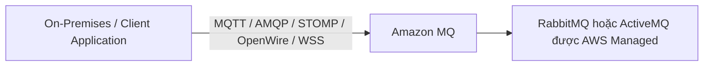
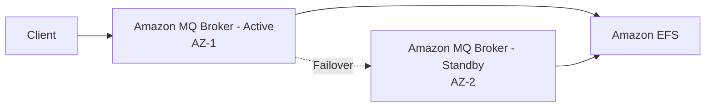

# Amazon MQ

## 📨 Amazon MQ – Managed Message Broker cho RabbitMQ và ActiveMQ

### 1. **Amazon MQ là gì?**

* **Amazon MQ** là dịch vụ **Managed Message Broker** của AWS dành cho:

  * **RabbitMQ**
  * **ActiveMQ**
* Mục đích là giúp các ứng dụng đang sử dụng các **message broker truyền thống** dễ dàng chạy trên AWS mà **không cần re-engineer** để dùng **SQS** hoặc **SNS**.

---

## 2. 🤔 Tại sao cần Amazon MQ?

### Vấn đề

* **Amazon SQS** và **Amazon SNS** là các dịch vụ **cloud-native** của AWS.
* Chúng sử dụng **proprietary protocols** và **AWS APIs** riêng.
* Trong khi đó, nhiều ứng dụng **On-Premises** đang sử dụng các **open protocols** như:

  * **MQTT**
  * **AMQP**
  * **STOMP**
  * **OpenWire**
  * **WSS**

Khi **migrate** ứng dụng lên AWS, việc sửa toàn bộ ứng dụng để chuyển sang SQS/SNS có thể rất tốn kém.

### Giải pháp

👉 Sử dụng **Amazon MQ** để tiếp tục dùng các **open protocols** quen thuộc mà không cần thay đổi nhiều mã nguồn.

---

## 3. 🔄 Luồng hoạt động của Amazon MQ

* Ứng dụng giao tiếp với **Amazon MQ** bằng các **open protocols**.
* AWS quản lý hạ tầng của **RabbitMQ** hoặc **ActiveMQ** phía sau.

---

## 4. ⚖️ So sánh Amazon MQ với SQS và SNS

| Tiêu chí                   | **Amazon MQ**                    | **Amazon SQS / SNS**         |
| -------------------------- | -------------------------------- | ---------------------------- |
| 🎯 Công nghệ               | RabbitMQ / ActiveMQ              | Dịch vụ native của AWS       |
| 📡 Protocol                | MQTT, AMQP, STOMP, OpenWire, WSS | AWS proprietary APIs         |
| 🔧 Tương thích ứng dụng cũ | ✅ Rất tốt                        | ❌ Thường phải sửa ứng dụng   |
| 📈 Khả năng mở rộng        | Hạn chế hơn                      | Gần như **infinite scaling** |
| 🖥️ Vận hành               | Chạy trên broker/server          | Managed hoàn toàn bởi AWS    |
| 📨 Queue                   | ✅ Có                             | ✅ SQS                        |
| 📢 Topic / Pub-Sub         | ✅ Có                             | ✅ SNS                        |

---

## 5. 🚀 Đặc điểm nổi bật của Amazon MQ

### ✅ Hỗ trợ Queue và Topic

Một **Amazon MQ Broker** có thể cung cấp:

* 📨 **Queue** (tương tự **Amazon SQS**).
* 📢 **Topic / Publish-Subscribe** (tương tự **Amazon SNS**).

Điều này cho phép một broker đáp ứng nhiều mô hình messaging khác nhau.

---

### ⚠️ Khả năng Scale

* **Amazon MQ không scale mạnh bằng SQS hoặc SNS**.
* Do chạy trên các **broker/server**, nên vẫn có thể gặp các vấn đề liên quan đến hạ tầng máy chủ.

Trong khi đó:

* **SQS** và **SNS** được thiết kế với khả năng **gần như mở rộng vô hạn (infinite scaling)**.

---

## 6. 🏢 High Availability với Multi-AZ

Amazon MQ có thể được triển khai theo mô hình **Multi-AZ** để tăng tính sẵn sàng.

### Kiến trúc

* Một **Broker Active**.
* Một **Broker Standby** ở **Availability Zone** khác.
* Cả hai cùng sử dụng **Amazon EFS** làm backend storage.

### Luồng hoạt động

---

## 7. 💾 Vai trò của Amazon EFS trong Failover

* **Amazon EFS** là **Network File System** có thể được mount từ nhiều **Availability Zones**.
* Cả **Broker Active** và **Broker Standby** đều truy cập cùng một dữ liệu trên **Amazon EFS**.
* Khi xảy ra **Failover**:

  * Broker Standby trở thành Broker Active.
  * Dữ liệu vẫn được giữ nguyên vì nằm trên **Amazon EFS**.
  * Client có thể tiếp tục hoạt động mà không mất message.

---

## 8. 📌 Mẹo ghi nhớ cho kỳ thi

* 🌐 **Amazon MQ** = **Managed RabbitMQ + Managed ActiveMQ**.
* 🔓 Hỗ trợ các **open protocols**:

  * MQTT
  * AMQP
  * STOMP
  * OpenWire
  * WSS
* 🚚 Thích hợp khi **migrate** ứng dụng On-Premises lên AWS mà không muốn chuyển sang **SQS/SNS APIs**.
* 📈 **Scale kém hơn SQS/SNS** vì chạy trên broker.
* 🏢 Muốn **High Availability** → triển khai **Multi-AZ** với **Amazon EFS** để hỗ trợ **Failover**.
* 📨 Một broker có thể hỗ trợ cả **Queue** và **Topic**.

---

## ✅ Kết luận

* **Amazon MQ** là lựa chọn phù hợp khi cần giữ nguyên các **open protocols** và tận dụng các hệ thống **RabbitMQ** hoặc **ActiveMQ** hiện có.
* Nếu xây dựng ứng dụng mới trên AWS và không bị ràng buộc về tương thích, **Amazon SQS** và **Amazon SNS** thường là lựa chọn ưu tiên nhờ khả năng **managed hoàn toàn** và **infinite scaling**.
* Trong môi trường yêu cầu tính sẵn sàng cao, có thể triển khai **Amazon MQ Multi-AZ** với **Amazon EFS** để đảm bảo **Failover** an toàn và không mất dữ liệu.
