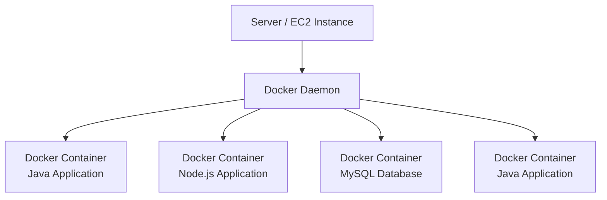
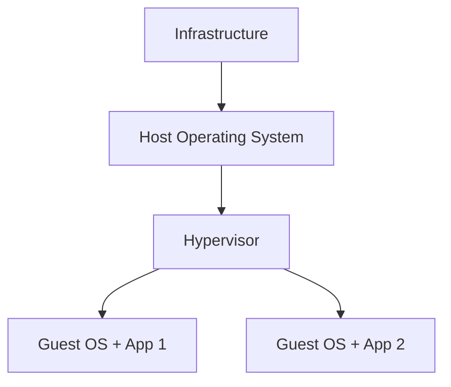
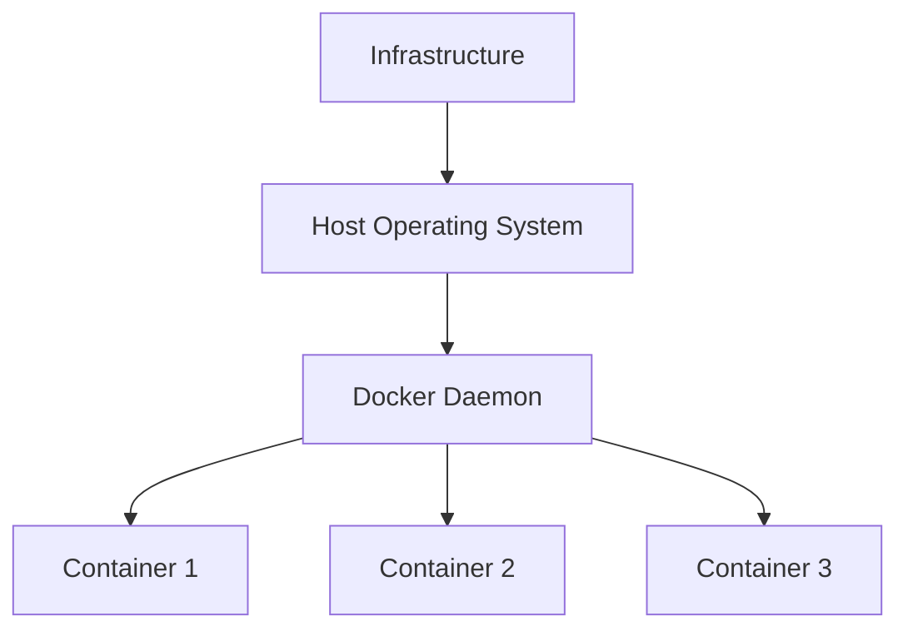
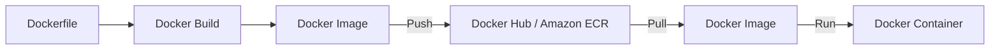
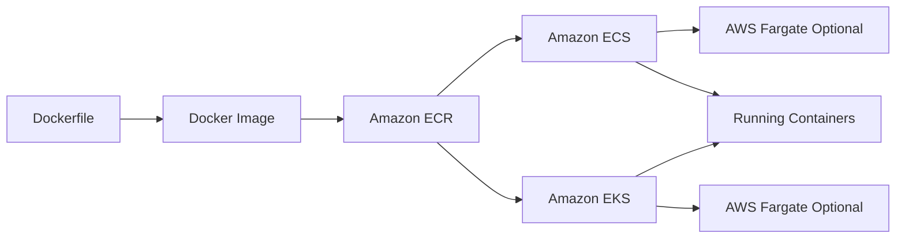

# Docker, ECS, EKS và Fargate Overview

## 🐳 1. Docker là gì?

**Docker** là một nền tảng (**software development platform**) dùng để **đóng gói (package)** và **triển khai (deploy)** ứng dụng dưới dạng **Container**.

* Ứng dụng được đóng gói thành **Docker Container**.
* Container có tính chuẩn hóa (**standardized**), có thể chạy trên nhiều môi trường khác nhau.
* Sau khi được **containerized**, ứng dụng sẽ hoạt động giống nhau trên mọi hệ điều hành hoặc máy chủ.

### ✅ Lợi ích

* Không gặp vấn đề về **compatibility**.
* Hành vi của ứng dụng có tính **predictable**.
* Dễ **deploy**, **maintain** và mở rộng.
* Hỗ trợ hầu hết mọi ngôn ngữ lập trình, hệ điều hành và công nghệ.

---

## 🚀 2. Use Case của Docker

Docker đặc biệt phù hợp với các trường hợp:

* 🧩 **Microservice Architecture** (từ khóa quan trọng cần nhớ).
* ☁️ **Lift and Shift** ứng dụng từ **On-Premises** lên Cloud.
* 📦 Bất kỳ hệ thống nào cần chạy ứng dụng dưới dạng **Container**.

---

## 🏗️ 3. Docker hoạt động như thế nào?

Một máy chủ (ví dụ **EC2 Instance**) cài đặt **Docker Daemon (Docker Agent)** và chạy nhiều **Docker Container**.

Ví dụ:

### Đặc điểm

* Một server có thể chạy nhiều container.
* Có thể chạy nhiều bản sao của cùng một ứng dụng.
* Container có thể chứa:

  * Java Application
  * Node.js Application
  * MySQL Database
  * hoặc bất kỳ ứng dụng nào khác.

---

# 📦 4. Docker Image và Docker Container

## Docker Image

Là mẫu (template) được build từ **Dockerfile**, chứa toàn bộ mã nguồn và cấu hình cần thiết.

## Docker Container

Là phiên bản đang chạy (**running instance**) của một **Docker Image**.

> 💡 **Docker Image → Run → Docker Container**

---

# 🗂️ 5. Docker Repository

Docker Image thường được lưu trữ trong **Docker Repository**.

Có hai lựa chọn phổ biến:

| Repository                                  | Mô tả                                                                        |
| ------------------------------------------- | ---------------------------------------------------------------------------- |
| **Docker Hub**                              | Public repository phổ biến, chứa nhiều base image như Ubuntu, MySQL...       |
| **Amazon ECR (Elastic Container Registry)** | Dịch vụ lưu trữ Docker Image của AWS, hỗ trợ cả Private và Public Repository |
| **Amazon ECR Public Gallery**               | Public repository do AWS cung cấp                                            |

---

# ⚖️ 6. So sánh Docker và Virtual Machine

## Virtual Machine (VM)

### Đặc điểm

* Mỗi VM có **Guest Operating System** riêng.
* Các VM được **cách ly (isolated)** với nhau.
* Ít chia sẻ tài nguyên.
* Ví dụ: **Amazon EC2** là một **Virtual Machine** chạy trên **Hypervisor**.

---

## Docker Container

### Đặc điểm

* Các Container dùng chung **Host OS**.
* Chia sẻ tài nguyên của máy chủ.
* Có thể chia sẻ networking và một số dữ liệu.
* Nhẹ (**lightweight**) hơn VM.
* Chạy được nhiều Container hơn trên cùng một Server.

---

## 📊 So sánh nhanh

| Tiêu chí                       | Virtual Machine          | Docker Container   |
| ------------------------------ | ------------------------ | ------------------ |
| OS                             | Mỗi VM có Guest OS riêng | Dùng chung Host OS |
| Kích thước                     | Lớn                      | Nhỏ, nhẹ           |
| Khởi động                      | Chậm hơn                 | Nhanh              |
| Mức độ cô lập                  | Cao                      | Thấp hơn VM        |
| Chia sẻ tài nguyên             | Ít                       | Có                 |
| Số lượng chạy trên cùng server | Ít hơn                   | Nhiều hơn          |

---

# 🔄 7. Quy trình làm việc với Docker

### Các bước

1. Viết **Dockerfile**.
2. Thực hiện **Build** để tạo **Docker Image**.
3. **Push** Image lên **Docker Repository** (Docker Hub hoặc Amazon ECR).
4. **Pull** Image về máy cần sử dụng.
5. **Run** Image để tạo **Docker Container** chạy ứng dụng.

---

# ☁️ 8. Quản lý Docker trên AWS

AWS cung cấp nhiều dịch vụ để làm việc với Container:

| Dịch vụ                                     | Mô tả                                                       |
| ------------------------------------------- | ----------------------------------------------------------- |
| **Amazon ECS (Elastic Container Service)**  | Dịch vụ quản lý Docker Container do AWS phát triển          |
| **Amazon EKS (Elastic Kubernetes Service)** | Dịch vụ Kubernetes được AWS quản lý                         |
| **AWS Fargate**                             | Nền tảng **Serverless Container**, chạy được với ECS và EKS |
| **Amazon ECR (Elastic Container Registry)** | Lưu trữ Docker Image                                        |

---

# 🔄 9. Mối quan hệ giữa Docker và các dịch vụ AWS

---

# 📌 10. Mẹo ghi nhớ cho kỳ thi

* 🐳 **Docker** → Công nghệ đóng gói ứng dụng thành **Container**.
* 📦 **Docker Image** → File đã build, chưa chạy.
* ▶️ **Docker Container** → Phiên bản đang chạy của Docker Image.
* 🗂️ **Docker Hub** → Public Docker Repository.
* 📦 **Amazon ECR** → Docker Repository của AWS.
* 🚢 **Amazon ECS** → Dịch vụ quản lý Docker Container của AWS.
* ☸️ **Amazon EKS** → Kubernetes được AWS quản lý.
* ⚡ **AWS Fargate** → Chạy Container theo mô hình **Serverless**, không cần quản lý Server.

---

# ✅ Kết luận

* **Docker** giúp đóng gói ứng dụng thành **Container**, đảm bảo chạy nhất quán trên nhiều môi trường.
* **Docker Image** được lưu trên **Docker Repository** như **Docker Hub** hoặc **Amazon ECR**, sau đó được **Run** để tạo **Docker Container**.
* Trên AWS:

  * **Amazon ECS** dùng để quản lý Docker Container.
  * **Amazon EKS** cung cấp Kubernetes được quản lý.
  * **AWS Fargate** cho phép chạy Container theo mô hình Serverless.
* Từ khóa quan trọng cần nhớ: **Container**, **Docker Image**, **Docker Container**, **Docker Hub**, **Amazon ECR**, **Amazon ECS**, **Amazon EKS**, **AWS Fargate**, **Microservice Architecture**, **Lift and Shift**.
