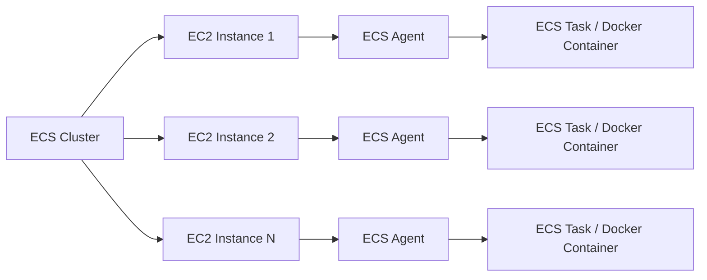
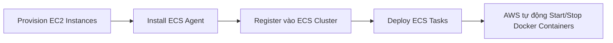
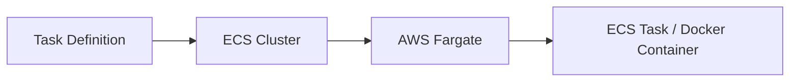
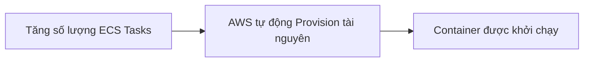
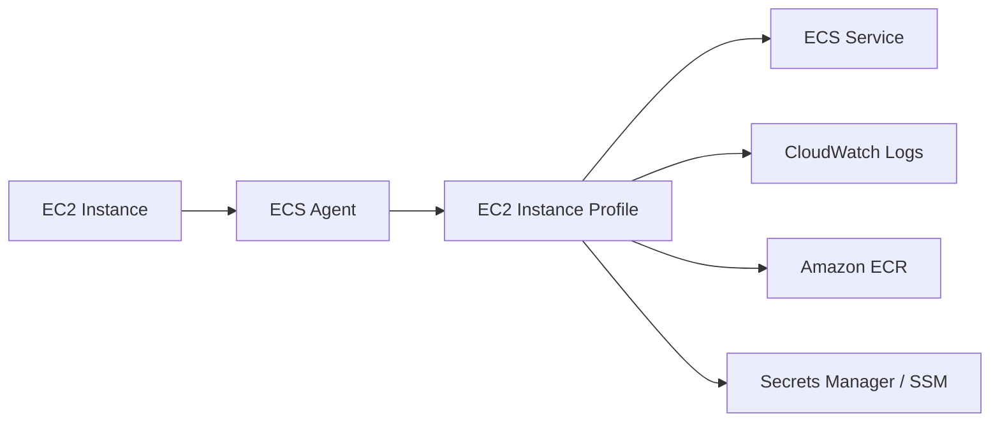
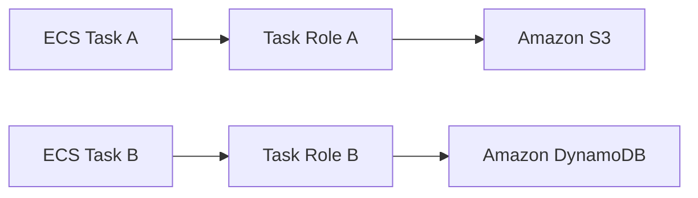
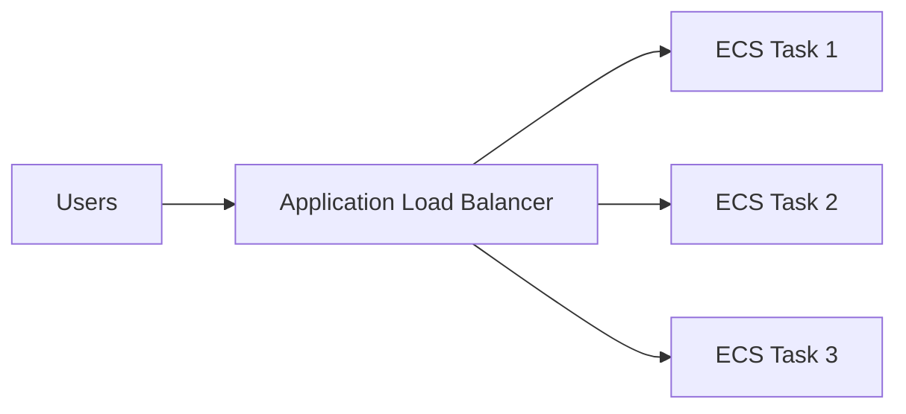
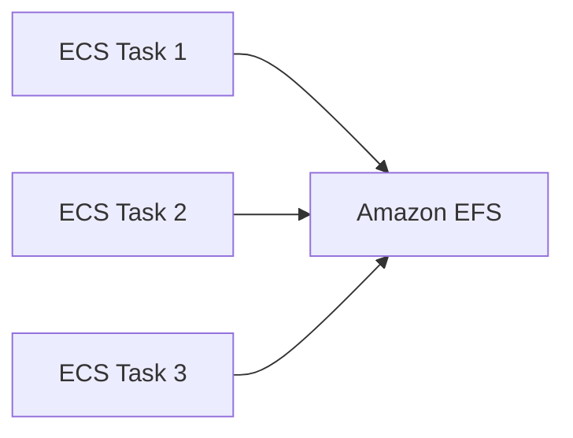
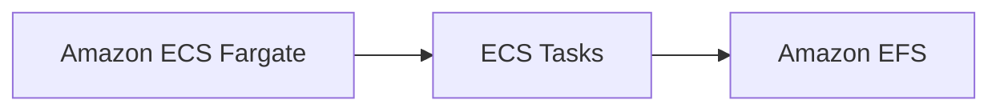

# Amazon ECS Overview

## 🚢 Amazon ECS (Elastic Container Service)

### 1. **Amazon ECS là gì?**

* **Amazon ECS (Elastic Container Service)** là dịch vụ quản lý và chạy **Docker Containers** trên AWS.
* Khi chạy container trên ECS:

  * Container được triển khai dưới dạng **ECS Task**.
  * Các **ECS Task** được quản lý trong một **ECS Cluster**.

---

# 2. 🚀 Hai loại Launch Type của ECS

## 🖥️ EC2 Launch Type

### Đặc điểm

* ECS Cluster được tạo từ các **EC2 Instances**.
* Người dùng phải **tự provision và quản lý infrastructure**.
* Mỗi EC2 Instance phải chạy **ECS Agent** để đăng ký với dịch vụ ECS.

### Luồng hoạt động

### Quy trình triển khai

### Ưu điểm

* Toàn quyền quản lý EC2.
* Phù hợp khi cần cấu hình hệ điều hành hoặc môi trường đặc biệt.

### Nhược điểm

* Phải tự quản lý:

  * EC2 Instances
  * Scaling
  * Capacity
  * Patch và bảo trì máy chủ

---

## ⚡ Fargate Launch Type

### Đặc điểm

* **Serverless** – không cần quản lý EC2 Instances.
* Chỉ cần định nghĩa **Task Definition** (CPU, RAM...).
* AWS tự động chạy container phía sau.

### Luồng hoạt động

### Scale

### Ưu điểm

* ✅ Không cần quản lý server.
* ✅ Dễ mở rộng.
* ✅ Chỉ cần tăng số lượng **Tasks**.
* ✅ Là lựa chọn được AWS khuyến nghị trong nhiều trường hợp.

> 📌 **Mẹo thi:** Nếu đề bài yêu cầu **serverless containers**, **không muốn quản lý EC2**, hãy chọn **Fargate**.

---

# 3. 🔐 IAM Roles trong ECS

## EC2 Instance Profile

Chỉ áp dụng cho **EC2 Launch Type**.

Được **ECS Agent** sử dụng để:

* Gọi API đến **Amazon ECS**.
* Gửi log lên **CloudWatch Logs**.
* Pull Docker Images từ **Amazon ECR**.
* Truy cập **Secrets Manager** hoặc **SSM Parameter Store**.

---

## ECS Task Role

Áp dụng cho cả:

* ✅ EC2 Launch Type
* ✅ Fargate Launch Type

Mỗi **ECS Task** có thể sử dụng một IAM Role riêng.

### Lợi ích

* Phân quyền theo từng ứng dụng.
* Mỗi container chỉ có quyền truy cập tài nguyên cần thiết.

> 📌 **Task Role** được khai báo trong **Task Definition**.

---

# 4. 🌐 Load Balancer Integration

ECS có thể tích hợp với nhiều loại Load Balancer.

## Luồng hoạt động

## Các lựa chọn

### ✅ Application Load Balancer (ALB)

* Phù hợp với hầu hết ứng dụng HTTP/HTTPS.
* Hoạt động tốt với cả:

  * EC2 Launch Type
  * Fargate

### ✅ Network Load Balancer (NLB)

Nên dùng khi:

* Cần **High Throughput**.
* Cần **High Performance**.
* Hoặc sử dụng cùng **AWS PrivateLink**.

### ⚠️ Classic Load Balancer (CLB)

* Không được khuyến nghị.
* Thiếu nhiều tính năng hiện đại.
* Không hỗ trợ tốt cho **Fargate**.

---

# 5. 💾 Persistent Storage với Amazon EFS

Container thường mang tính tạm thời, vì vậy nếu cần lưu trữ dữ liệu lâu dài và chia sẻ giữa nhiều Task thì nên dùng **Amazon EFS**.

## Luồng hoạt động

## Đặc điểm

* **Amazon EFS** là **Network File System**.
* Tương thích với:

  * EC2 Launch Type
  * Fargate Launch Type
* Nhiều ECS Tasks ở nhiều **Availability Zones (AZ)** có thể cùng mount một EFS và chia sẻ dữ liệu.

---

## Combo được khuyến nghị

* **Fargate** → Chạy container theo mô hình **Serverless**.
* **Amazon EFS** → Cung cấp **Persistent Shared Storage** theo mô hình **Serverless**.

Đây là sự kết hợp rất phổ biến khi cần:

* Không quản lý server.
* Lưu trữ dữ liệu lâu dài.
* Chia sẻ dữ liệu giữa nhiều container.

---

# 6. 📊 So sánh EC2 Launch Type và Fargate

| Tiêu chí                  | **EC2 Launch Type**   | **Fargate Launch Type**            |
| ------------------------- | --------------------- | ---------------------------------- |
| 🖥️ Quản lý EC2           | Có                    | ❌ Không                            |
| ⚙️ Quản lý Infrastructure | Người dùng tự quản lý | AWS quản lý                        |
| 🚀 Serverless             | ❌                     | ✅                                  |
| 📈 Scale                  | Scale EC2 + Tasks     | Chỉ cần scale Tasks                |
| 🔧 ECS Agent              | Phải cài trên EC2     | AWS quản lý                        |
| 🎯 Phù hợp                | Cần kiểm soát máy chủ | Muốn triển khai nhanh, ít vận hành |

---

# 7. 📌 Mẹo ghi nhớ cho kỳ thi

* 🚢 **Amazon ECS** = Dịch vụ chạy và quản lý **Docker Containers**.
* 🖥️ **EC2 Launch Type** = Tự quản lý **EC2 Instances** + cài **ECS Agent**.
* ⚡ **Fargate Launch Type** = **Serverless**, không cần quản lý EC2.
* 🔐 **EC2 Instance Profile** = Quyền của **ECS Agent** trên EC2.
* 🔐 **ECS Task Role** = Quyền của từng **ECS Task/Container** khi truy cập AWS Services.
* 🌐 **ALB** = Lựa chọn mặc định cho HTTP/HTTPS.
* 🚀 **NLB** = Dùng khi cần hiệu năng hoặc throughput rất cao.
* 💾 **Amazon EFS** = **Persistent Multi-AZ Shared Storage** cho ECS Tasks.

---

# ✅ Kết luận

* **Amazon ECS** giúp triển khai và quản lý **Docker Containers** trên AWS.
* Có hai **Launch Type**:

  * **EC2 Launch Type** → Tự quản lý hạ tầng.
  * **Fargate Launch Type** → **Serverless**, AWS quản lý toàn bộ infrastructure.
* Nên sử dụng:

  * **Application Load Balancer (ALB)** để phân phối lưu lượng HTTP/HTTPS.
  * **Amazon EFS** khi cần **persistent multi-AZ shared storage**.
* **Fargate + Amazon EFS** là sự kết hợp phổ biến để xây dựng hệ thống container hiện đại, dễ mở rộng và ít phải quản lý vận hành.
