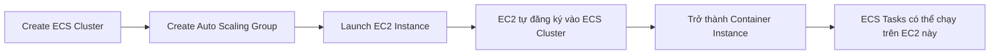
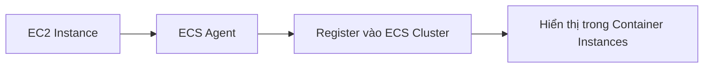
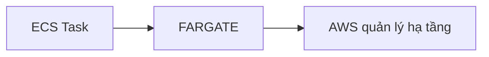
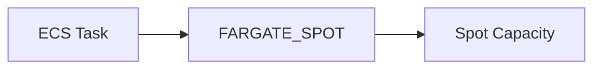
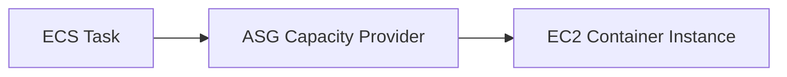
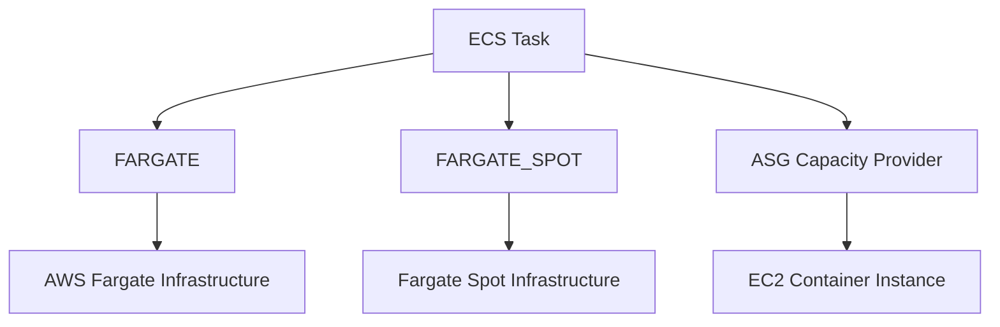

# Creating ECS Cluster - Hands On

## 🚀 Tạo Amazon ECS Cluster và tìm hiểu Capacity Providers

### 1. **Tạo ECS Cluster**

* Trong **Amazon ECS Console**, chọn **Clusters → Create Cluster**.
* Đặt tên Cluster, ví dụ: `DemoCluster`.
* Khi tạo Cluster, cần chọn cách cung cấp **Infrastructure (Capacity)** để chạy Container.

---

## 2. ⚙️ Các lựa chọn Infrastructure (Capacity Providers)

AWS hiện cung cấp nhiều cách để chạy **ECS Tasks**:

| Capacity Provider                    | Mô tả                                                                         |
| ------------------------------------ | ----------------------------------------------------------------------------- |
| **Fargate**                          | Chạy Serverless, không cần quản lý EC2 Instance.                              |
| **Fargate + Managed Instances**      | Kết hợp Fargate và EC2 do AWS quản lý.                                        |
| **Fargate + Self-managed Instances** | Kết hợp Fargate và EC2 do người dùng tự quản lý thông qua Auto Scaling Group. |

> 📌 Xu hướng hiện tại của AWS là khuyến khích sử dụng **Fargate** hoặc **Managed Instances**, thay vì **Self-managed Instances**.

---

## 3. 🏗️ Managed Instances

Khi sử dụng **Managed Instances**:

* Cần tạo:

  * **EC2 Instance Profile**
  * **Infrastructure Role**
* AWS sẽ tự quản lý:

  * EC2 Instances
  * Scaling
  * Capacity phù hợp với yêu cầu của **Task Definition** và **Service**.

Có thể cấu hình:

* Min / Max vCPU
* Min / Max Memory
* Chỉ cho phép một số **Instance Type** nhất định (ví dụ: `t3.micro`).

---

## 4. 🖥️ Self-managed Instances

Nếu chọn **Self-managed Instances**:

* ECS sẽ tạo hoặc sử dụng một **Auto Scaling Group (ASG)**.
* Người dùng tự quyết định:

  * EC2 Instance Type (ví dụ: `t3.micro`)
  * Min / Max Capacity
  * Root EBS Volume Size
  * SSH hay không
  * Networking

---

## 5. 🔄 Luồng tạo ECS Cluster với Self-managed Instances

---

## 6. 📈 Auto Scaling Group được tạo tự động

Khi tạo Cluster với **Self-managed Instances**:

* AWS tạo một **Auto Scaling Group**.
* Ví dụ:

  * Min Capacity = 0
  * Max Capacity = 5
* ASG có thể trải rộng trên nhiều **Availability Zones (AZs)**.

Điều này giúp ECS có thể phân phối **Tasks** trên nhiều AZ để tăng tính sẵn sàng.

---

## 7. 📦 Container Instance là gì?

Khi EC2 được khởi tạo thành công:

* EC2 sẽ **register** vào ECS Cluster.
* EC2 này trở thành một **Container Instance**.
* Các ECS Tasks có thể được schedule lên Container Instance này nếu còn đủ tài nguyên.

### Luồng đăng ký

---

## 8. 🎯 Ba Capacity Providers trong ECS Cluster

Sau khi tạo Cluster, có thể thấy các **Capacity Providers** sau:

### ✅ FARGATE

* Cho phép chạy **ECS Tasks** trên **AWS Fargate**.
* Không cần quản lý EC2.

---

### ✅ FARGATE_SPOT

* Chạy ECS Tasks trên **Fargate Spot**.
* Chi phí thấp hơn nhưng có thể bị AWS thu hồi tài nguyên bất cứ lúc nào.

---

### ✅ ASG Provider

* ECS Tasks chạy trên các **EC2 Instances** thuộc **Auto Scaling Group**.

---

## 9. 🚀 Luồng chạy ECS Task

Một ECS Task có thể được triển khai theo nhiều cách tùy **Capacity Provider**.

---

## 10. 📊 Container Instance cung cấp Capacity

Khi một **Container Instance** được đăng ký thành công:

* ECS biết được lượng tài nguyên còn khả dụng:

  * CPU
  * Memory
* Các ECS Tasks sẽ được đặt lên EC2 cho đến khi hết Capacity.

Ví dụ:

| Thuộc tính       | Giá trị |
| ---------------- | ------- |
| CPU Available    | 1024    |
| Memory Available | 982 MB  |
| Running Tasks    | 0       |

---

## 📌 Mẹo ghi nhớ

* 🚀 **Fargate** → Serverless, không quản lý EC2.
* 💰 **Fargate Spot** → Rẻ hơn nhưng có thể bị thu hồi.
* 🖥️ **ASG Provider** → ECS Tasks chạy trên EC2 trong **Auto Scaling Group**.
* 📦 **Container Instance** = EC2 đã đăng ký vào ECS Cluster.
* 📈 **Auto Scaling Group** chịu trách nhiệm tạo và quản lý số lượng EC2 Instances.

---

## ✅ Kết luận

* Một **Amazon ECS Cluster** có thể hỗ trợ nhiều **Capacity Providers** cùng lúc:

  * **FARGATE**
  * **FARGATE_SPOT**
  * **ASG Provider (EC2)**
* Nếu dùng **Fargate**, AWS quản lý hoàn toàn hạ tầng.
* Nếu dùng **ASG Provider**, ECS Tasks sẽ chạy trên các **Container Instances (EC2)** do Auto Scaling Group cung cấp.
* Đây là nền tảng để triển khai **ECS Services** và **ECS Tasks** trong các bài thực hành tiếp theo.
