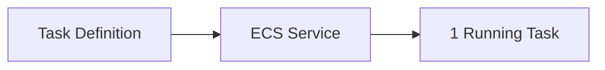
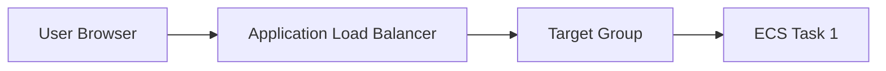
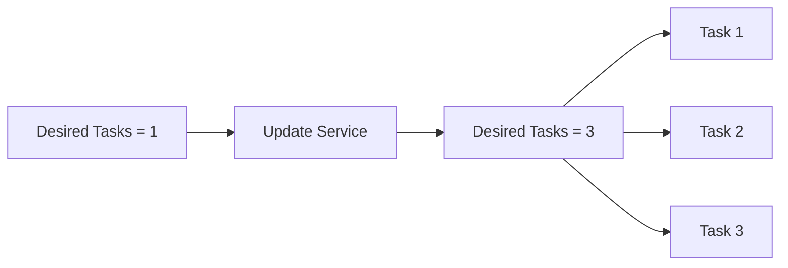
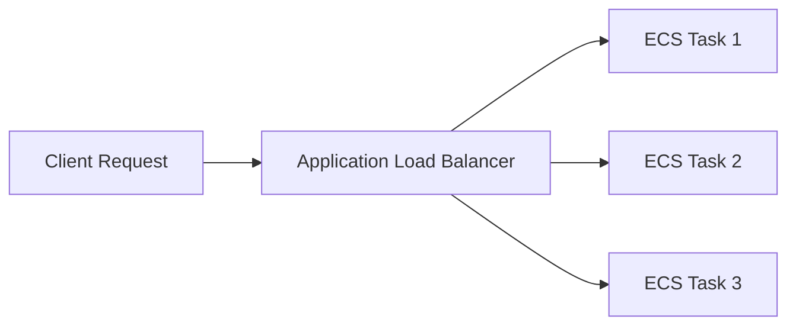
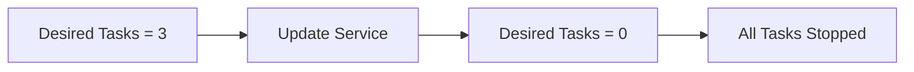
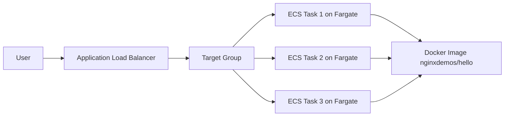

# Creating ECS Service - Hands On

## 🚀 Tạo ECS Service với AWS Fargate

### 1. **Tạo Task Definition**

Trước khi tạo **ECS Service**, cần tạo **Task Definition**.

Task Definition định nghĩa:

* Tên của task (ví dụ: `nginxdemos-hello`).
* Docker Image (ví dụ: `nginxdemos/hello` trên Docker Hub).
* Loại hạ tầng chạy (**AWS Fargate** hoặc **Amazon EC2**).
* CPU và Memory.
* Network, Port Mapping, IAM Role,...

---

### 2. ⚙️ Chọn Compute Infrastructure

Trong ví dụ này sử dụng **AWS Fargate**.

Ưu điểm:

* ✅ **Serverless Compute**.
* ✅ Không cần quản lý EC2 Instance.
* ✅ AWS tự động provision tài nguyên để chạy container.

Ví dụ cấu hình:

* **0.5 vCPU**
* **1 GB Memory**

Có thể mở rộng lên nhiều vCPU và hàng trăm GB RAM nếu cần.

---

### 3. 🔐 Task Role và Task Execution Role

#### **Task Role**

* Là **IAM Role** gán cho container.
* Cho phép container gọi AWS API (S3, DynamoDB, SQS,...).

Ví dụ:

```
Container
    │
    ▼
Task Role (IAM Role)
    │
    ▼
Amazon S3 / DynamoDB / SQS
```

Nếu ứng dụng không truy cập AWS Service thì có thể không cần cấu hình.

---

#### **Task Execution Role**

* Được ECS Agent sử dụng để:

  * Pull Docker Image.
  * Gửi logs.
  * Thực hiện các thao tác quản lý cần thiết.
* Thường sử dụng role mặc định `ecsTaskExecutionRole`.

---

### 4. 🐳 Cấu hình Container

Container sử dụng image:

```
nginxdemos/hello
```

Port Mapping:

```
Host Port 80
        │
        ▼
Container Port 80
```

Ngoài ra có thể cấu hình thêm:

* Environment Variables.
* Resource Limits.
* Logging.
* Storage.

Trong demo sử dụng cấu hình mặc định.

---

### 5. 💾 Storage

AWS Fargate cung cấp **Ephemeral Storage** mặc định (khoảng **21 GB**).

Đây là vùng lưu trữ tạm thời của container và sẽ mất khi Task bị xóa.

---

## 6. 🌐 Tạo ECS Service

Sau khi có **Task Definition**, tiến hành tạo **ECS Service**.

Cấu hình chính:

* Compute: **AWS Fargate**
* Platform Version: Latest
* Deployment Type: Replica
* Desired Tasks: `1`

Ví dụ:



---

## 7. 🔒 Networking

Cấu hình:

* Chọn Subnet.
* Tạo **Security Group** mới.
* Cho phép **HTTP (Port 80)** từ Internet.
* Bật **Public IP = Enabled**.

Nhờ đó người dùng có thể truy cập container từ bên ngoài.

---

## 8. ⚖️ Tích hợp Application Load Balancer (ALB)

Khi tạo Service có thể tạo luôn:

* **Application Load Balancer (ALB)**
* **Listener Port 80**
* **Target Group**
* Mapping đến container Port 80.

### Luồng request



Sau khi truy cập DNS của ALB sẽ hiển thị trang `nginx welcome page`.

---

## 9. 📊 ECS Service theo dõi Task

Sau khi deploy:

* **Desired Tasks = 1**
* **Running Tasks = 1**
* **Status = ACTIVE**

Có thể xem:

* Running Task.
* Private IP.
* Container.
* Logs.
* Events.

---

## 10. 📈 Scale Up Service

Có thể cập nhật:

```
Desired Tasks = 3
```

ECS sẽ tự động tạo thêm Task trên **AWS Fargate**.



AWS sẽ tự động provision tài nguyên cần thiết mà không cần tạo EC2 thủ công.

---

## 11. ⚖️ Load Balancing sau khi Scale

Khi có nhiều Task, **Application Load Balancer** sẽ phân phối request đến từng Task.



Khi refresh trình duyệt nhiều lần, request có thể được chuyển đến các container khác nhau.

---

## 12. 📉 Scale Down để tiết kiệm chi phí

Để giảm chi phí có thể cập nhật:

```
Desired Tasks = 0
```

Khi đó:

* ECS Service vẫn tồn tại.
* Không còn container nào chạy.



Nếu sử dụng EC2 Capacity thì cũng nên giảm **Auto Scaling Group Desired Capacity = 0** để tránh phát sinh chi phí EC2.

---

## 📊 Kiến trúc tổng thể



---

## 📌 Mẹo ghi nhớ

* 📝 **Task Definition** → Blueprint mô tả cách chạy container.
* 🚀 **ECS Service** → Quản lý số lượng **Task** và duy trì trạng thái mong muốn.
* ☁️ **AWS Fargate** → Chạy container theo mô hình **Serverless**, không cần quản lý EC2.
* ⚖️ **Application Load Balancer (ALB)** → Phân phối traffic đến nhiều ECS Task.
* 🎯 **Target Group** → Danh sách các ECS Task nhận request từ ALB.
* 🔐 **Task Role** → IAM Role để container gọi AWS Service.
* 🔧 **Task Execution Role** → IAM Role để ECS thực hiện pull image, logging và các tác vụ hệ thống.

---

## ✅ Kết luận

* Quy trình triển khai:

  1. Tạo **Task Definition**.
  2. Tạo **ECS Service** sử dụng **AWS Fargate**.
  3. Cấu hình **Networking**, **Security Group**, **Public IP**.
  4. Gắn **Application Load Balancer** và **Target Group**.
  5. Scale số lượng **Task** bằng cách thay đổi **Desired Tasks**.
* ECS kết hợp với **AWS Fargate** giúp triển khai và mở rộng container nhanh chóng mà không cần quản lý hạ tầng EC2.
