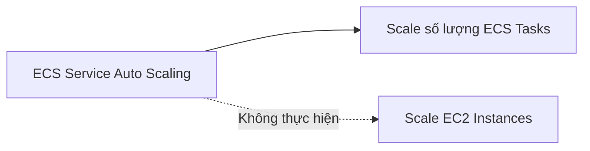
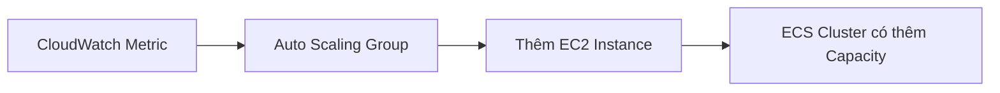
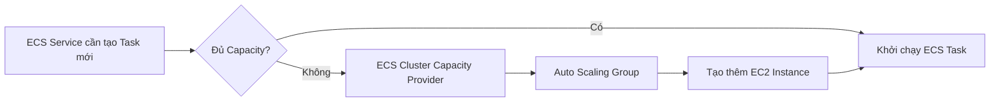
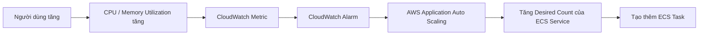
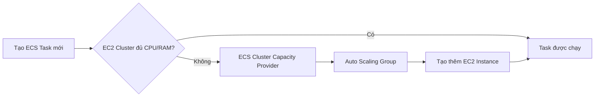

# ECS Service Auto Scaling

## 🚀 ECS Service Auto Scaling – Tự động mở rộng và thu hẹp số lượng ECS Tasks

### 1. **ECS Service Auto Scaling là gì?**

* Mặc định, bạn có thể **tăng/giảm thủ công** số lượng **ECS Tasks** trong một **ECS Service**.
* Ngoài ra, AWS hỗ trợ **tự động scale** số lượng Tasks thông qua **AWS Application Auto Scaling**.
* Mục tiêu là tự động đáp ứng khi tải hệ thống tăng hoặc giảm.

---

## 2. 📊 Các Metric hỗ trợ Auto Scaling

**AWS Application Auto Scaling** có thể scale **ECS Service** dựa trên 3 metric quan trọng:

| Metric                              | Ý nghĩa                                                                          |
| ----------------------------------- | -------------------------------------------------------------------------------- |
| 🖥️ **CPU Utilization**             | Mức sử dụng CPU của ECS Service                                                  |
| 🧠 **Memory Utilization**           | Mức sử dụng RAM của ECS Service                                                  |
| 🌐 **ALB Request Count Per Target** | Số lượng request trên mỗi target do **Application Load Balancer (ALB)** cung cấp |

> 📌 Đây là **3 metric quan trọng cần nhớ** khi làm bài thi AWS.

---

## 3. ⚙️ Các chính sách Auto Scaling

### ✅ Target Tracking Scaling

* Tự động duy trì một giá trị mục tiêu cho metric (ví dụ: CPU 50%).
* AWS sẽ tăng hoặc giảm số lượng Tasks để giữ metric gần mức mong muốn.

### ✅ Step Scaling

* Scale theo từng bước dựa trên mức độ thay đổi của metric.
* Ví dụ:

  * CPU > 70% → thêm 1 Task.
  * CPU > 90% → thêm 3 Tasks.

### ✅ Scheduled Scaling

* Scale theo lịch định sẵn.
* Phù hợp khi biết trước lưu lượng truy cập sẽ tăng hoặc giảm theo thời gian.

Ví dụ:

* Tăng số lượng Tasks vào 8:00 sáng mỗi ngày.
* Giảm số lượng Tasks sau giờ làm việc.

---

## 4. ⚠️ Scale ECS Service ≠ Scale EC2 Cluster

Một điểm rất dễ nhầm lẫn:

* **ECS Service Auto Scaling** chỉ tăng hoặc giảm **số lượng ECS Tasks**.
* **Không tự động tăng hoặc giảm số lượng EC2 Instances** nếu đang sử dụng **EC2 Launch Type**.

---

## 5. ☁️ Trường hợp sử dụng Fargate

Nếu sử dụng **AWS Fargate**:

* Không cần quản lý EC2 Instances.
* Chỉ cần cấu hình **ECS Service Auto Scaling**.
* AWS tự động cung cấp hạ tầng phía sau.

### Ưu điểm

* ✅ Serverless.
* ✅ Cấu hình đơn giản.
* ✅ Không cần EC2 Auto Scaling.
* ✅ Được khuyến nghị sử dụng trong nhiều tình huống và thường xuất hiện trong bài thi AWS.

---

## 6. 🖥️ Scale EC2 Cluster khi dùng EC2 Launch Type

Nếu sử dụng **EC2 Launch Type**, ngoài việc scale Tasks còn cần đảm bảo có đủ EC2 Instances để chạy các Tasks đó.

Có hai cách:

### Cách 1: Auto Scaling Group (ASG)

* Sử dụng **Auto Scaling Group** để scale EC2 Instances.
* Ví dụ:

  * CPU của EC2 tăng cao → ASG tự động tạo thêm EC2 Instance.

---

### Cách 2: ECS Cluster Capacity Provider ⭐ (Khuyến nghị)

* **ECS Cluster Capacity Provider** được liên kết với **Auto Scaling Group**.
* Khi ECS cần chạy thêm Task nhưng không đủ CPU hoặc RAM:

  * Capacity Provider sẽ tự động scale ASG để tạo thêm EC2 Instances.

### 📌 Lưu ý

* Nếu phải lựa chọn giữa:

  * **Auto Scaling Group Scaling**
  * **ECS Cluster Capacity Provider**

➡️ **Ưu tiên sử dụng ECS Cluster Capacity Provider** vì thông minh hơn và tự động xử lý thiếu tài nguyên.

---

## 7. 🔄 Luồng hoạt động của ECS Service Auto Scaling

Khi lượng người dùng tăng:

Nếu sử dụng **EC2 Launch Type** và không đủ tài nguyên:

---

## 8. 📊 So sánh Fargate và EC2 Launch Type

| Tiêu chí                    | **AWS Fargate**            | **EC2 Launch Type**            |
| --------------------------- | -------------------------- | ------------------------------ |
| 🖥️ Quản lý EC2             | ❌ Không cần                | ✅ Người dùng quản lý           |
| 📈 ECS Service Auto Scaling | Có                         | Có                             |
| 🚀 Scale EC2 Instances      | AWS tự xử lý               | Cần ASG hoặc Capacity Provider |
| ⚙️ Cấu hình                 | Đơn giản                   | Phức tạp hơn                   |
| ⭐ Khuyến nghị               | Rất phù hợp cho Serverless | Phù hợp khi cần kiểm soát EC2  |

---

## 9. 📌 Mẹo ghi nhớ cho kỳ thi

* ✅ **AWS Application Auto Scaling** dùng để scale **ECS Service (Tasks)**.
* 📊 Chỉ cần nhớ **3 metric chính**:

  * **CPU Utilization**
  * **Memory Utilization**
  * **ALB Request Count Per Target**
* ⚠️ **Scale ECS Tasks không đồng nghĩa với scale EC2 Instances**.
* ☁️ **AWS Fargate** giúp việc Auto Scaling đơn giản hơn vì không cần quản lý EC2.
* 🖥️ Với **EC2 Launch Type**, nên ưu tiên **ECS Cluster Capacity Provider** thay vì chỉ dùng **Auto Scaling Group**.

---

## ✅ Kết luận

* **ECS Service Auto Scaling** cho phép tự động tăng hoặc giảm số lượng **ECS Tasks** dựa trên các metric như **CPU Utilization**, **Memory Utilization** và **ALB Request Count Per Target**.
* Nếu dùng **AWS Fargate**, việc scale trở nên đơn giản vì AWS quản lý toàn bộ hạ tầng.
* Nếu dùng **EC2 Launch Type**, cần kết hợp thêm **ECS Cluster Capacity Provider** (khuyến nghị) hoặc **Auto Scaling Group** để đảm bảo có đủ EC2 Instances chạy các Tasks mới.
