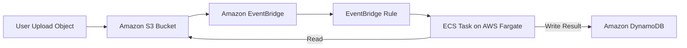
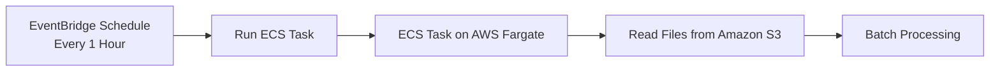
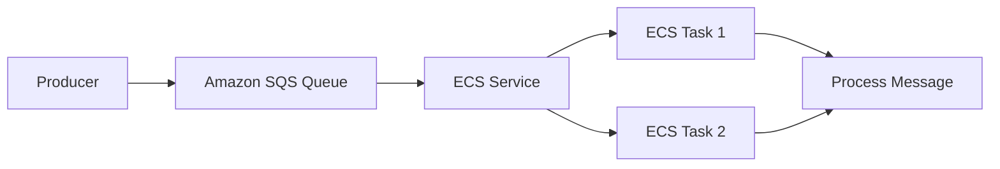
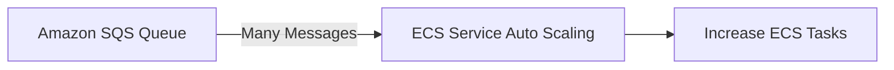
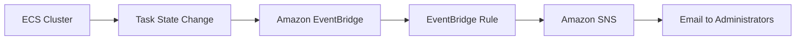

# Amazon ECS – Solution Architectures

## 🏗️ Các kiến trúc phổ biến với Amazon ECS

Bài học giới thiệu một số **Solution Architecture** thường gặp khi sử dụng **Amazon ECS**, đặc biệt là kết hợp với **AWS Fargate**, **Amazon EventBridge**, **Amazon S3**, **Amazon DynamoDB**, **Amazon SQS** và **Amazon SNS** để xây dựng các hệ thống **serverless** và có khả năng mở rộng tự động.

---

# 1. 📂 EventBridge kích hoạt ECS Task khi có sự kiện từ S3

## Mô tả

* Người dùng upload object lên **Amazon S3 Bucket**.
* **Amazon EventBridge** nhận sự kiện từ S3.
* Một **EventBridge Rule** sẽ tự động khởi chạy (**Run ECS Task**) trên **Amazon ECS (Fargate)**.
* ECS Task sử dụng **ECS Task Role** để:

  * Đọc object từ **Amazon S3**.
  * Xử lý dữ liệu (ví dụ: xử lý ảnh hoặc file).
  * Ghi kết quả vào **Amazon DynamoDB**.

## Luồng hoạt động

## Đặc điểm

* ✅ Kiến trúc **serverless**, không cần quản lý EC2.
* ✅ ECS Task chỉ được tạo khi có sự kiện.
* ✅ **ECS Task Role** cấp quyền truy cập đến S3 và DynamoDB.

---

# 2. ⏰ EventBridge Schedule chạy ECS Task theo lịch

## Mô tả

* **Amazon EventBridge** tạo một **Schedule Rule** (ví dụ: chạy mỗi 1 giờ).
* Đến thời điểm định sẵn, EventBridge tự động tạo một **ECS Task** trên **AWS Fargate**.
* Task có thể thực hiện các công việc định kỳ như:

  * Batch Processing.
  * Đọc dữ liệu từ **Amazon S3**.
  * Xử lý file hoặc sinh báo cáo.

## Luồng hoạt động

## Đặc điểm

* ✅ Hoàn toàn **serverless**.
* ✅ Thay thế cho các Cron Job truyền thống.
* ✅ Có thể sử dụng **ECS Task Role** để truy cập các dịch vụ AWS.

---

# 3. 📨 ECS Service xử lý message từ Amazon SQS

## Mô tả

* Các ứng dụng gửi message vào **Amazon SQS Queue**.
* **Amazon ECS Service** gồm nhiều **ECS Tasks** liên tục polling queue để lấy message.
* Sau khi nhận message, các task sẽ xử lý tương ứng.

## Luồng hoạt động

---

## ECS Service Auto Scaling

Có thể bật **ECS Service Auto Scaling** để tự động thay đổi số lượng task dựa trên tải của hệ thống.

Ví dụ:

* Queue có ít message → chạy ít ECS Task.
* Queue có nhiều message → tự động tăng số lượng ECS Task.

## Đặc điểm

* ✅ Tự động scale theo lượng công việc.
* ✅ Phù hợp với hệ thống xử lý bất đồng bộ (**Asynchronous Processing**).
* ✅ Tận dụng khả năng mở rộng của **AWS Fargate**.

---

# 4. 🔍 EventBridge theo dõi vòng đời (Lifecycle) của ECS Task

## Mô tả

**Amazon EventBridge** có thể nhận các sự kiện phát sinh từ **Amazon ECS Cluster**, ví dụ:

* ECS Task **started**.
* ECS Task **stopped**.
* Thông tin về **task state change**.
* **Stopped Reason** khi task kết thúc.

Điều này giúp theo dõi và phản ứng với trạng thái của container.

## Luồng hoạt động

## Use Case

* 📧 Gửi email cảnh báo khi ECS Task bị dừng bất thường.
* 📊 Theo dõi **lifecycle** của container.
* 🚨 Tích hợp với hệ thống monitoring hoặc alert.

---

# 5. 📊 Tóm tắt các kiến trúc

| Kiến trúc                           | Trigger               | Thành phần chính                              | Use Case                           |
| ----------------------------------- | --------------------- | --------------------------------------------- | ---------------------------------- |
| **S3 → EventBridge → ECS Task**     | Upload Object         | Amazon S3, EventBridge, ECS Fargate, DynamoDB | Xử lý ảnh, xử lý file theo sự kiện |
| **EventBridge Schedule → ECS Task** | Theo lịch             | EventBridge Schedule, ECS Fargate             | Batch Job, Cron Job                |
| **Amazon SQS → ECS Service**        | Message Queue         | Amazon SQS, ECS Service, Auto Scaling         | Xử lý hàng đợi, worker service     |
| **ECS → EventBridge → SNS**         | ECS Task State Change | ECS, EventBridge, Amazon SNS                  | Monitoring, Alert, Notification    |

---

# 📌 Mẹo ghi nhớ

* 📂 **S3 + EventBridge + ECS Task** → Xử lý file theo **event-driven architecture**.
* ⏰ **EventBridge Schedule + ECS Task** → Chạy tác vụ định kỳ (**Cron Job serverless**).
* 📨 **Amazon SQS + ECS Service** → Worker xử lý queue và hỗ trợ **ECS Service Auto Scaling**.
* 🔍 **ECS + EventBridge + SNS** → Theo dõi **lifecycle** của ECS Task và gửi cảnh báo.

---

# ✅ Kết luận

* **Amazon EventBridge** có thể:

  * Kích hoạt **ECS Task** khi có sự kiện.
  * Chạy **ECS Task** theo lịch (**Schedule**).
  * Nhận **Task State Change** từ ECS để phục vụ monitoring.
* **Amazon SQS** thường được kết hợp với **ECS Service** để xây dựng hệ thống xử lý bất đồng bộ có khả năng **Auto Scaling**.
* Việc kết hợp **AWS Fargate**, **EventBridge**, **Amazon S3**, **Amazon DynamoDB**, **Amazon SQS** và **Amazon SNS** giúp xây dựng các kiến trúc **serverless**, dễ mở rộng và giảm chi phí vận hành.
