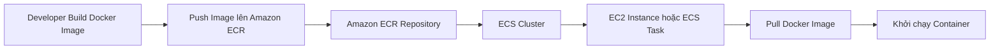
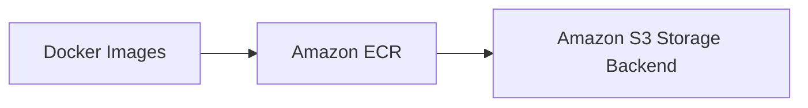
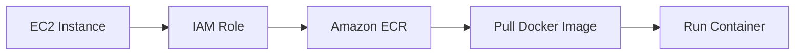

# Amazon ECR (Elastic Container Registry)

## 📦 Amazon ECR là gì?

* **Amazon ECR (Elastic Container Registry)** là dịch vụ dùng để **lưu trữ (store)** và **quản lý (manage)** các **Docker images** trên AWS.
* Thay vì sử dụng các registry công cộng như **Docker Hub**, bạn có thể lưu trữ Docker images trực tiếp trên **Amazon ECR**.

> 📌 Ghi nhớ cho kỳ thi: **Docker images → Amazon ECR**.

---

## 1. 🔒 Các loại Repository trong Amazon ECR

Amazon ECR hỗ trợ 2 loại repository:

### ✅ Private Repository

* Chỉ cho phép truy cập trong **AWS Account** của bạn hoặc các account được cấp quyền.
* Thích hợp để lưu trữ Docker images nội bộ.

### 🌍 Public Repository

* Cho phép publish Docker images lên **Amazon ECR Public Gallery**.
* Bất kỳ ai cũng có thể pull image nếu được public.

---

## 2. 🤝 Tích hợp với Amazon ECS

Amazon ECR được tích hợp chặt chẽ với **Amazon ECS (Elastic Container Service)**.

Luồng hoạt động:

* Docker image được **push** lên **Amazon ECR**.
* **Amazon ECS** hoặc EC2 trong ECS Cluster sẽ **pull** image từ ECR để khởi chạy container.

---

## 3. 💾 Dữ liệu được lưu ở đâu?

* Về mặt người dùng, Docker images được lưu trong **Amazon ECR Repository**.
* **Phía sau (behind the scenes)**, dữ liệu của ECR được lưu trữ trên **Amazon S3**.

---

## 4. 🔐 Bảo mật và IAM

Tất cả quyền truy cập vào **Amazon ECR** đều được quản lý thông qua **IAM**.

Ví dụ khi ECS chạy trên EC2:

* EC2 Instance được gán **IAM Role**.
* IAM Role cấp quyền để **pull Docker images** từ ECR.
* Nếu gặp lỗi **Permission Denied** khi truy cập ECR, cần kiểm tra:

  * ✅ IAM Policy
  * ✅ IAM Role được gán cho EC2 hoặc ECS Task

---

## 5. 🚀 Các tính năng nổi bật của Amazon ECR

Ngoài việc lưu trữ Docker images, Amazon ECR còn hỗ trợ:

* 🔍 **Image Vulnerability Scanning**

  * Quét lỗ hổng bảo mật của Docker image.

* 🏷️ **Image Tags**

  * Quản lý nhiều phiên bản image thông qua tag (`latest`, `v1.0`, `prod`,...).

* 📚 **Versioning**

  * Lưu trữ nhiều phiên bản của cùng một Docker image.

* ♻️ **Image Lifecycle**

  * Tự động xóa hoặc quản lý image cũ theo **Lifecycle Policy** để tiết kiệm dung lượng.

---

## 6. 📊 Docker Hub vs Amazon ECR

| Tiêu chí                  | Docker Hub                           | Amazon ECR                          |
| ------------------------- | ------------------------------------ | ----------------------------------- |
| 🎯 Mục đích               | Registry công cộng cho Docker images | Registry trên AWS cho Docker images |
| 🔒 Private Repository     | Có                                   | Có                                  |
| 🌍 Public Repository      | Có                                   | Có (ECR Public Gallery)             |
| 🤝 Tích hợp AWS           | Hạn chế                              | Tích hợp chặt chẽ với Amazon ECS    |
| 🔐 Quản lý quyền          | Docker Hub Account                   | IAM                                 |
| 🔍 Vulnerability Scanning | Có (tùy gói)                         | Hỗ trợ sẵn                          |
| ♻️ Lifecycle Management   | Có giới hạn                          | Hỗ trợ Image Lifecycle Policy       |

---

## 📌 Mẹo ghi nhớ cho kỳ thi

| Nếu đề bài nhắc đến...             | Nghĩ ngay đến...                   |
| ---------------------------------- | ---------------------------------- |
| Lưu trữ **Docker images** trên AWS | ✅ **Amazon ECR**                   |
| ECS cần pull Docker image          | ✅ **Amazon ECR + IAM Role**        |
| Registry tích hợp với ECS          | ✅ **Amazon ECR**                   |
| Quét lỗ hổng Docker image          | ✅ **Image Vulnerability Scanning** |
| Quản lý version và tag của image   | ✅ **Image Tags & Versioning**      |
| Tự động xóa image cũ               | ✅ **Image Lifecycle Policy**       |

---

## ✅ Kết luận

* **Amazon ECR (Elastic Container Registry)** là dịch vụ dùng để **lưu trữ và quản lý Docker images** trên AWS.
* Hỗ trợ cả **Private Repository** và **Public Repository**.
* Tích hợp chặt chẽ với **Amazon ECS**, cho phép ECS hoặc EC2 **pull** image để chạy container.
* Quyền truy cập được kiểm soát bằng **IAM**.
* Ngoài lưu trữ image, ECR còn cung cấp các tính năng như **Image Vulnerability Scanning**, **Versioning**, **Image Tags** và **Image Lifecycle**.

> 🎯 **Ghi nhớ:** Khi gặp yêu cầu **lưu trữ Docker images trên AWS**, đáp án gần như luôn là **Amazon ECR**.
