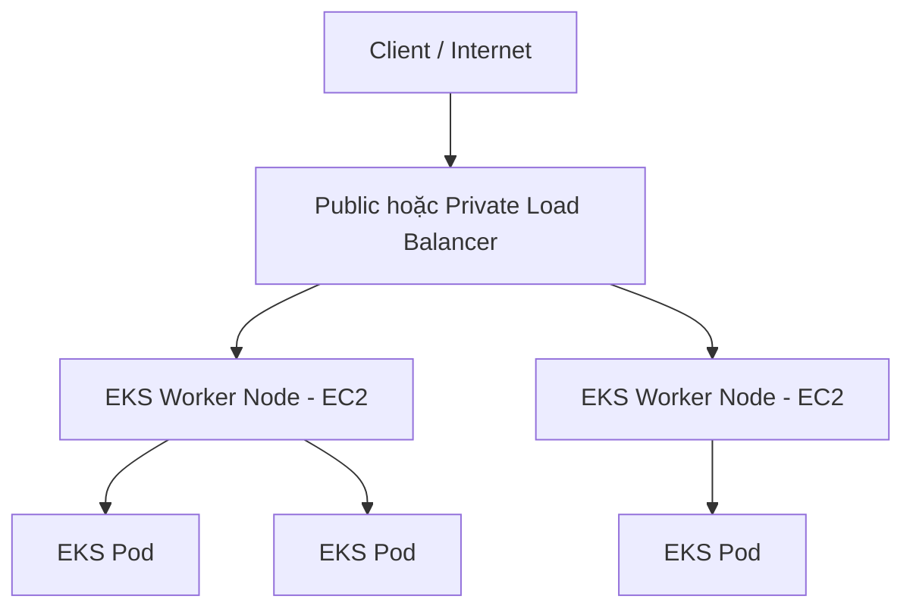
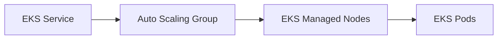
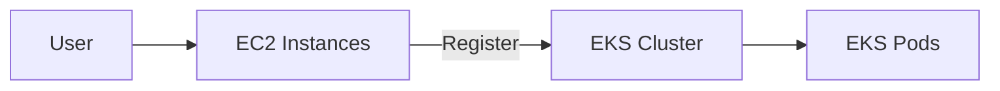
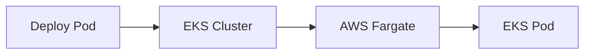
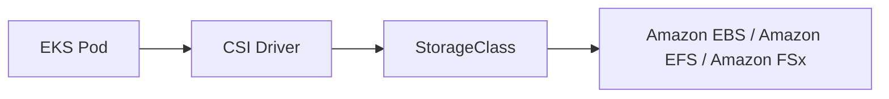

# Amazon EKS - Overview

## ☸️ Amazon EKS (Elastic Kubernetes Service)

### 1. **Amazon EKS là gì?**

* **Amazon EKS (Elastic Kubernetes Service)** là dịch vụ giúp triển khai và quản lý **Kubernetes Cluster** trên AWS.
* Đây là một giải pháp để chạy các **containerized applications** (thường là **Docker**) tương tự như **Amazon ECS**, nhưng sử dụng **Kubernetes** thay vì API riêng của AWS.

---

## 2. 🚀 Kubernetes là gì?

* **Kubernetes** là một nền tảng **open-source** dùng để:

  * Tự động **deployment** container.
  * **Scaling** ứng dụng.
  * **Management** các container.

### So sánh với Amazon ECS

| Tiêu chí       | **Amazon ECS**    | **Amazon EKS (Kubernetes)**                    |
| -------------- | ----------------- | ---------------------------------------------- |
| Nền tảng       | AWS proprietary   | **Open-source Kubernetes**                     |
| API            | API riêng của AWS | **Kubernetes API** chuẩn                       |
| Cloud Agnostic | ❌ Chủ yếu AWS     | ✅ Có thể chạy trên AWS, Azure, Google Cloud... |
| Mục tiêu       | Chạy container    | Chạy container                                 |

> 📌 **Kubernetes** mang tính **Cloud Agnostic**, giúp việc di chuyển workload giữa các Cloud Provider trở nên dễ dàng hơn.

---

## 3. 🎯 Khi nào nên sử dụng Amazon EKS?

Amazon EKS phù hợp khi:

* Công ty đã sử dụng **Kubernetes On-Premises**.
* Đang chạy Kubernetes trên Cloud khác và muốn chuyển sang AWS.
* Muốn sử dụng **Kubernetes API** thay vì API của ECS.
* Cần khả năng **multi-cloud** hoặc dễ dàng **cloud migration**.

---

## 4. 🚀 Các Launch Mode của Amazon EKS

Amazon EKS hỗ trợ 2 chế độ triển khai:

### ✅ EC2 Launch Mode

* Worker Nodes được triển khai trên **EC2 Instances**.
* Người dùng có thể quản lý hoặc để AWS quản lý các Node.

### ✅ Fargate Launch Mode

* Chạy container theo mô hình **Serverless**.
* Không cần quản lý EC2 Instances.
* AWS tự động quản lý hạ tầng bên dưới.

---

## 5. 📊 Kiến trúc Amazon EKS

### Luồng hoạt động

### Thành phần

* **EKS Worker Node** thường là các **EC2 Instance**.
* Trên mỗi Node sẽ chạy nhiều **EKS Pod**.
* **Pod** trong Kubernetes tương đương với **Task** trong ECS.
* Các Node có thể được quản lý bởi **Auto Scaling Group (ASG)**.
* Có thể sử dụng:

  * **Public Load Balancer**
  * **Private Load Balancer**

để expose các **Kubernetes Service** ra bên ngoài hoặc nội bộ.

---

# 6. ⚙️ Các loại Node trong Amazon EKS

## ✅ Managed Node Groups

AWS sẽ tạo và quản lý các **Worker Node (EC2 Instances)**.

Đặc điểm:

* Thuộc **Auto Scaling Group** do EKS quản lý.
* Hỗ trợ:

  * **On-Demand Instances**
  * **Spot Instances**
* Giảm công sức vận hành.

### Luồng

---

## ✅ Self-managed Nodes

Người dùng tự tạo và quản lý các EC2 Instances.

Đặc điểm:

* Tự tạo Node.
* Tự đăng ký Node vào **EKS Cluster**.
* Tự quản lý **Auto Scaling Group**.
* Có thể dùng:

  * **Amazon EKS Optimized AMI**
  * Hoặc tự build **Custom AMI**.
* Hỗ trợ:

  * **On-Demand Instances**
  * **Spot Instances**

### Luồng

---

## ✅ AWS Fargate

Không cần quản lý Node.

Đặc điểm:

* Không có EC2 Instance.
* Không cần bảo trì hạ tầng.
* Chỉ cần deploy container.

### Luồng

---

# 7. 💾 Storage cho Amazon EKS

Amazon EKS hỗ trợ gắn **Data Volume** thông qua:

* **StorageClass Manifest**
* **Container Storage Interface (CSI) Driver**

> 📌 **CSI (Container Storage Interface)** là keyword quan trọng trong kỳ thi.

---

## Các Storage được hỗ trợ

| Storage                       | Hỗ trợ |
| ----------------------------- | ------ |
| ✅ Amazon EBS                  | Có     |
| ✅ Amazon EFS                  | Có     |
| ✅ Amazon FSx for Lustre       | Có     |
| ✅ Amazon FSx for NetApp ONTAP | Có     |

### Lưu ý quan trọng

* **Amazon EFS** là **Storage Class duy nhất hỗ trợ AWS Fargate**.
* **Amazon EBS** chỉ phù hợp khi sử dụng Worker Nodes (EC2).

---

## Luồng gắn Storage

---

# 8. 📊 So sánh các loại Node

| Tiêu chí         | Managed Node Group | Self-managed Node  | AWS Fargate        |
| ---------------- | ------------------ | ------------------ | ------------------ |
| Quản lý EC2      | AWS                | Người dùng         | Không có EC2       |
| Tự tạo Node      | ❌                  | ✅                  | ❌                  |
| Auto Scaling     | AWS quản lý        | Người dùng quản lý | AWS tự động        |
| Quản lý hạ tầng  | Thấp               | Cao                | Gần như không cần  |
| Hỗ trợ On-Demand | ✅                  | ✅                  | ✅                  |
| Hỗ trợ Spot      | ✅                  | ✅                  | Phụ thuộc cấu hình |

---

# 9. 📌 Mẹo ghi nhớ cho kỳ thi

* ☸️ **Amazon EKS = Managed Kubernetes Service trên AWS**.
* 🌍 **Kubernetes là Open-source và Cloud Agnostic**, có thể chạy trên nhiều Cloud Provider.
* 📦 Trong Kubernetes:

  * **Pod** ≈ **Task** của ECS.
* 🚀 EKS hỗ trợ:

  * **EC2 Launch Mode**
  * **AWS Fargate**
* 💾 Storage sử dụng **StorageClass + CSI Driver**.
* 📁 Nếu dùng **AWS Fargate**, **Amazon EFS** là loại Storage được hỗ trợ.

---

# ✅ Kết luận

* **Amazon EKS** là dịch vụ quản lý **Kubernetes Cluster** trên AWS.
* Phù hợp với doanh nghiệp đã sử dụng Kubernetes hoặc cần kiến trúc **multi-cloud**.
* Có 3 cách triển khai Node:

  * **Managed Node Groups**
  * **Self-managed Nodes**
  * **AWS Fargate**
* Các **Pod** chạy trên Worker Node hoặc Fargate và có thể sử dụng **Amazon EBS**, **Amazon EFS**, **Amazon FSx** thông qua **CSI Driver** và **StorageClass**.
