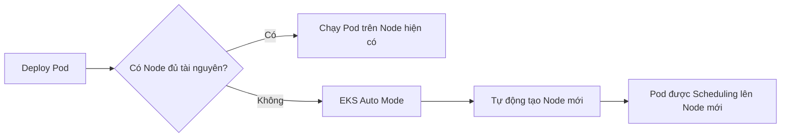
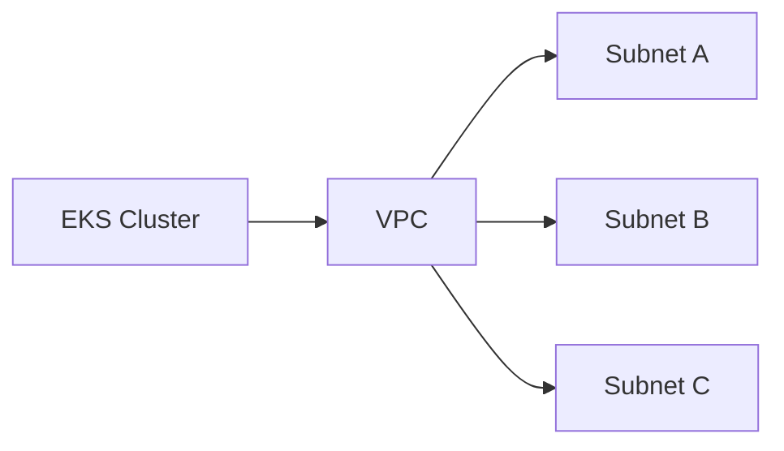
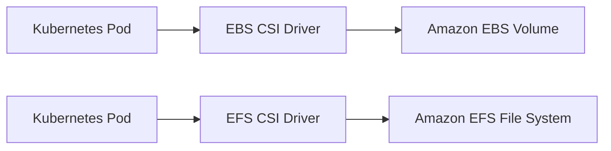
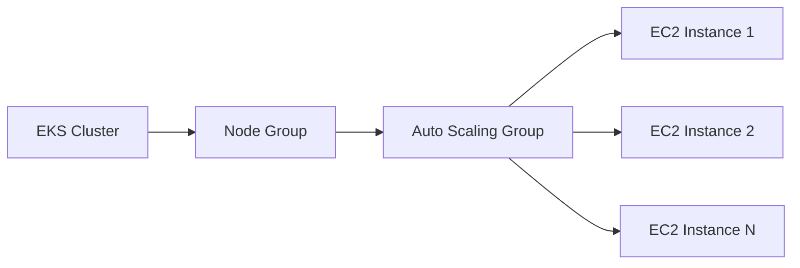
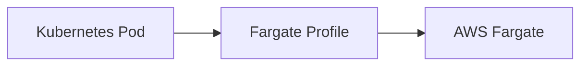
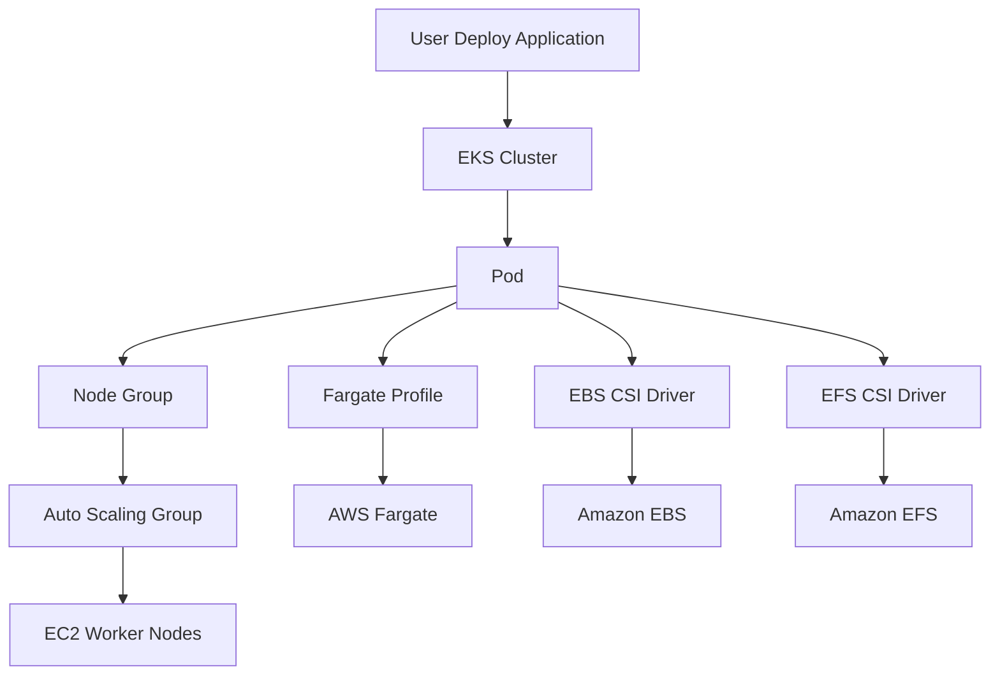

# 179. Amazon EKS – Hands On

## 🚀 Tổng quan

Bài thực hành này giới thiệu cách tạo và cấu hình một **Amazon EKS (Elastic Kubernetes Service) Cluster** trên AWS Console.

> ⚠️ Mục đích chính là giúp hiểu quy trình cấu hình EKS. Việc tự tạo Cluster có thể phát sinh chi phí AWS.

---

# 1. 🏗️ Tạo EKS Cluster

Khi tạo một **EKS Cluster**, AWS cung cấp hai chế độ:

* **Quick Configuration**: Cấu hình nhanh với các thiết lập mặc định.
* **Custom Configuration**: Tùy chỉnh chi tiết các thành phần của Cluster.

Trong bài này sử dụng **Custom Configuration** để xem đầy đủ các tùy chọn.

---

# 2. 🤖 EKS Auto Mode

## EKS Auto Mode là gì?

**EKS Auto Mode** giúp AWS tự động quản lý hạ tầng cho Kubernetes.

Khi một **Pod** mới không thể chạy trên các **Node** hiện có:

* ✅ EKS sẽ tự động tạo thêm **Node** mới.
* ✅ Không cần người dùng tự tạo EC2 Instance.

### Luồng hoạt động

---

# 3. 🔐 IAM Role cho EKS Cluster

Để tạo Cluster thành công cần cấu hình **Cluster IAM Role**.

Role này cần được gắn các **Managed Policies** cần thiết cho EKS Auto Mode, ví dụ:

* EKS Block Storage Policy
* EKS Cluster Policy
* EKS Compute Policy
* EKS Load Balancing Policy
* EKS Networking Policy

AWS có thể tự động tạo **Recommended Role** để đơn giản hóa việc cấu hình.

---

# 4. 🖥️ Node IAM Role

Ngoài Cluster Role còn có **Node IAM Role**.

Mục đích:

* Cho phép các **Worker Node** đăng ký (**register**) vào EKS Cluster.
* AWS có thể tạo **AmazonEKSAutoNodeRole** với các quyền mặc định được đề xuất.

---

# 5. 🌐 Networking Configuration

Khi tạo Cluster cần chỉ định:

* **VPC**
* **Subnets**
* **Security Groups** (nếu cần)
* Loại địa chỉ IP (IPv4 hoặc IPv6)
* Kiểu truy cập Cluster:

  * Public
  * Private
  * Public + Private

### Kiến trúc tổng quát

---

# 6. 📊 Monitoring và Logging

EKS hỗ trợ tích hợp nhiều cơ chế giám sát:

* **CloudWatch Metrics**
* **CloudWatch Logs**
* **Prometheus**
* Network Monitoring
* Control Plane Logs

Nhờ đó có thể theo dõi hoạt động của Kubernetes Cluster dễ dàng.

---

# 7. 🧩 Add-ons

EKS hỗ trợ nhiều **Add-ons**, bao gồm:

* DNS
* SageMaker
* Amazon EFS
* Community Add-ons
* Marketplace Add-ons

Đặc biệt:

* **EBS CSI Driver** → Cho phép Pod sử dụng **Amazon EBS Volume**.
* **EFS CSI Driver** → Cho phép Pod sử dụng **Amazon EFS File System**.

### Luồng sử dụng EBS/EFS

---

# 8. 📦 Tài nguyên bên trong EKS

Sau khi tạo Cluster, Console cho phép xem trực tiếp các tài nguyên Kubernetes như:

* Pods
* ReplicaSets
* Deployments
* StatefulSets

Điều này giúp quản lý Cluster thuận tiện ngay trên AWS Console.

---

# 9. 🖥️ Compute trong EKS

Mục **Compute** hiển thị các **Worker Nodes** đang chạy.

Nếu bật **EKS Auto Mode**, AWS sẽ tự động tạo và quản lý các Node phù hợp.

---

# 10. 📈 Node Group

## Node Group là gì?

**Node Group** là tập hợp các **EC2 Instances** được quản lý bởi một **Auto Scaling Group (ASG)**.

Khi tạo Node Group cần cấu hình:

* IAM Role
* Launch Template (tùy chọn)
* AMI
* Instance Type
* Disk Size
* Min/Max Size
* Warm Pool (tùy chọn)
* Node Repair
* Networking

### Kiến trúc Node Group

---

# 11. 🚀 Fargate Profile

Ngoài Node Group, EKS còn hỗ trợ **Fargate Profile**.

Khi sử dụng:

* Không cần quản lý EC2 Instance.
* Pod sẽ chạy trực tiếp trên **AWS Fargate** do AWS quản lý.

### Luồng hoạt động

---

# 12. 📌 Mối quan hệ giữa các thành phần

---

# 13. 📊 So sánh Node Group và Fargate

| Tiêu chí          | **Node Group**               | **Fargate Profile**        |
| ----------------- | ---------------------------- | -------------------------- |
| 🖥️ Compute       | EC2 Instances                | AWS Fargate                |
| ⚙️ Quản lý Server | Cần quản lý EC2              | AWS quản lý hoàn toàn      |
| 📈 Scaling        | Thông qua Auto Scaling Group | AWS tự động xử lý          |
| 🎯 Phù hợp        | Muốn kiểm soát hạ tầng       | Muốn Serverless Kubernetes |

---

# 14. 📌 Mẹo ghi nhớ cho kỳ thi

* 🤖 **EKS Auto Mode** → Tự động tạo **Node** khi Pod không còn chỗ chạy.
* 🏗️ **Node Group** → Tập hợp EC2 được quản lý bởi **Auto Scaling Group**.
* 🚀 **Fargate Profile** → Chạy Pod trực tiếp trên **AWS Fargate**, không cần EC2.
* 💾 **EBS CSI Driver** → Gắn **Amazon EBS Volume** cho Pod.
* 📂 **EFS CSI Driver** → Gắn **Amazon EFS File System** cho Pod.
* 🔐 Cần cấu hình **IAM Role** cho cả **Cluster** và **Node** để EKS hoạt động đúng.

---

# ✅ Kết luận

* **Amazon EKS** là dịch vụ Kubernetes được AWS quản lý (**Managed Kubernetes Service**).
* AWS hỗ trợ nhiều tính năng giúp giảm công sức vận hành như:

  * **EKS Auto Mode**
  * **Managed Node Groups**
  * **Fargate Profiles**
  * **CloudWatch Monitoring**
  * **CSI Drivers (EBS/EFS)**
* Khi triển khai thực tế, cần chú ý cấu hình **IAM Roles**, **Networking**, **Node Groups/Fargate** và **Add-ons** để Cluster hoạt động ổn định.
