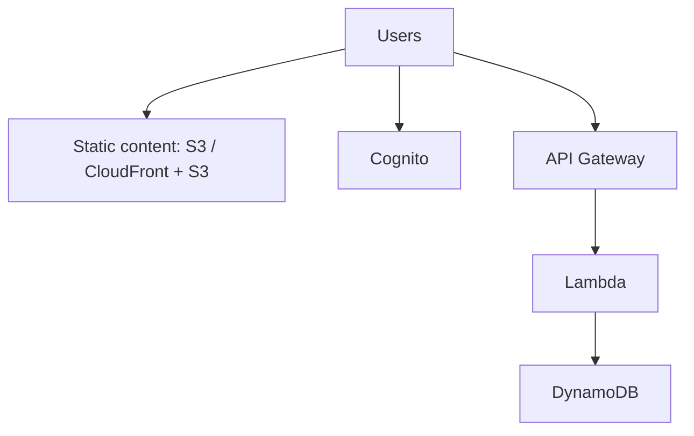

# 213. About the Serverless Section

## 🎯 Giới thiệu
- **Serverless** không có nghĩa là không có server.
- Ý chính là: bạn **không phải quản lý server** và **không phải provision infrastructure**.
- Ban đầu, serverless chủ yếu được hiểu là **Function as a Service (FaaS)**.
- Hiện nay, serverless còn bao gồm nhiều dịch vụ được **managed từ xa**, như:
  - database
  - messaging
  - storage
- Trong AWS, phần này sẽ tập trung nhiều vào **Lambda, DynamoDB, API Gateway, Cognito** và các dịch vụ liên quan.

## 1. Serverless là gì
- Developer chỉ cần **deploy code**, ban đầu là deploy **functions**.
- AWS là nơi đã tiên phong với **AWS Lambda** trong mô hình serverless.
- Serverless nghĩa là:
  - bạn **không thấy server**
  - bạn **không quản lý server**
  - bạn **không provision server**
- Nhưng hệ thống vẫn có server ở phía backend, chỉ là nhà cung cấp dịch vụ lo phần đó.

## 2. Kiến trúc serverless trong AWS
- Ví dụ kiến trúc serverless được nhắc tới trong bài:
  - User lấy **static content** từ **S3** hoặc **CloudFront + S3**
  - User đăng nhập qua **Cognito**
  - User gọi **REST API** qua **API Gateway**
  - **API Gateway** kích hoạt **Lambda**
  - **Lambda** lưu và truy xuất dữ liệu từ **DynamoDB**
- Ngoài ra, các dịch vụ cũng được xem là phù hợp với serverless use case:
  - **SNS**
  - **SQS**
  - **Kinesis Data Firehose**
  - **Aurora Serverless**
  - **Step Functions**
  - **Fargate**

## 3. Các dịch vụ serverless được nhắc đến
- **Lambda**: nền tảng serverless quan trọng nhất trong phần này.
- **DynamoDB**: lưu trữ dữ liệu cho ứng dụng serverless.
- **API Gateway**: nhận REST API request và kích hoạt Lambda.
- **Cognito**: nơi lưu identity của user trong ví dụ.
- **S3**: phục vụ static website/content.
- **CloudFront**: kết hợp với S3 để phân phối nội dung.
- **SNS / SQS**: không cần quản lý server, tự scale.
- **Kinesis Data Firehose**: scale theo throughput, pay for what you use.
- **Aurora Serverless**: database scale on demand.
- **Step Functions** và **Fargate**: cũng được xếp vào nhóm serverless theo cách bài giảng mô tả.

## 📊 Bảng tóm tắt
| Tiêu chí | Mô tả |
|----------|------|
| Khái niệm | Không quản lý server, không provision server |
| Ý nghĩa ban đầu | **FaaS** |
| Mở rộng hiện nay | Bao gồm database, messaging, storage được managed |
| Dịch vụ trọng tâm | **Lambda, DynamoDB, API Gateway, Cognito** |
| Ví dụ kiến trúc | S3/CloudFront -> Cognito -> API Gateway -> Lambda -> DynamoDB |
| Dịch vụ liên quan | **SNS, SQS, Kinesis Data Firehose, Aurora Serverless, Step Functions, Fargate** |
| Trọng tâm ôn thi | AWS exam test khá nhiều về kiến thức serverless |

## 💡 Mẹo ghi nhớ cho kỳ thi AWS
- Nhớ câu: **serverless không phải là không có server, mà là bạn không quản lý server**.
- Gắn serverless với chuỗi kiến trúc:
  - **S3 / CloudFront** cho static content
  - **Cognito** cho identity
  - **API Gateway** cho API entry point
  - **Lambda** cho xử lý logic
  - **DynamoDB** cho data storage
- Khi thấy dịch vụ **tự scale**, **pay for what you use**, và **không cần provision server** thì thường có liên hệ với serverless.
- Các keyword nên thuộc lòng: **Lambda, DynamoDB, API Gateway, Cognito, SNS, SQS, Kinesis Data Firehose, Aurora Serverless, Step Functions, Fargate**.

## ✅ Kết luận
- Serverless là mô hình giúp developer tập trung vào **code**, không phải quản lý server.
- Trong AWS, serverless không chỉ là **Lambda**, mà còn gồm nhiều dịch vụ được managed và scale tự động.
- Phần serverless là nội dung quan trọng trong kỳ thi AWS, đặc biệt các mối liên hệ giữa **Lambda, API Gateway, DynamoDB, Cognito, S3, CloudFront** và các dịch vụ serverless khác.
