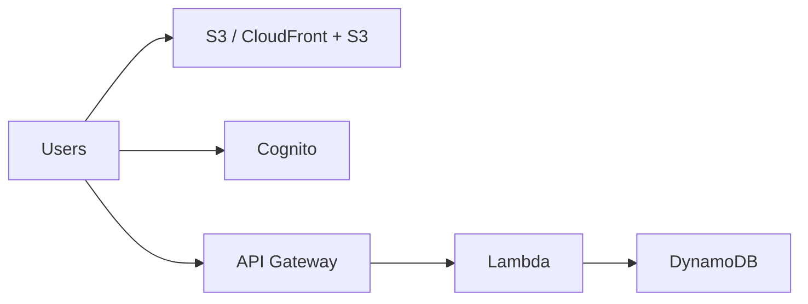

# 214. Serverless Introduction

## 🎯 Giới thiệu
- **Serverless** là mô hình mà developer **không phải quản lý server** nữa.
- Không có nghĩa là **không có server**; đúng hơn là bạn **không nhìn thấy, không provision, không vận hành** chúng.
- Ban đầu, serverless chủ yếu được hiểu là **Function as a Service (FaaS)**.
- Hiện nay, serverless đã mở rộng sang nhiều dịch vụ được **managed remotely**, miễn là bạn không phải tự provision server.
- AWS Lambda là dịch vụ tiên phong cho khái niệm này trong AWS.

## 1. Serverless là gì? 🤖
- Developer chỉ cần **deploy code**, ban đầu là deploy dưới dạng **functions**.
- Trọng tâm của serverless:
  - Không quản lý server
  - Không tự provision infrastructure
  - Trả tiền theo mức sử dụng
- Serverless trong AWS không chỉ là Lambda, mà còn bao gồm nhiều dịch vụ khác khi chúng tự scale và không cần bạn quản lý server.

## 2. Kiến trúc Serverless trên AWS 🧩
- Ví dụ kiến trúc serverless được nêu trong transcript:
  - **S3** hoặc **CloudFront + S3** để phục vụ static content
  - **Cognito** để lưu identity của user
  - **API Gateway** để nhận REST API requests
  - **Lambda** để xử lý logic
  - **DynamoDB** để lưu và truy xuất dữ liệu
- Đây là một reference architecture cho serverless applications trên AWS.

## 3. Các dịch vụ được xem là Serverless trong transcript ⚙️
- Ngoài **Lambda**, transcript còn nhắc tới các dịch vụ serverless khác:
  - **DynamoDB**
  - **API Gateway**
  - **Cognito**
  - **Amazon S3**
  - **SNS**
  - **SQS**
  - **Kinesis Data Firehose**
  - **Aurora Serverless**
  - **Step Functions**
  - **Fargate**
- Điểm chung:
  - Tự scale hoặc managed
  - Không phải provision server
  - Trả phí theo mức sử dụng hoặc theo throughput

## 📊 Bảng tóm tắt
| Tiêu chí | Mô tả |
|----------|------|
| Khái niệm | Serverless là mô hình không cần quản lý server |
| Ý nghĩa chính | Không phải là không có server, mà là không phải vận hành/provision server |
| Khởi đầu | Ban đầu được hiểu là **FaaS** |
| Dịch vụ tiêu biểu | **AWS Lambda** |
| Kiến trúc mẫu | **S3**, **CloudFront**, **Cognito**, **API Gateway**, **Lambda**, **DynamoDB** |
| Dịch vụ serverless khác | **SNS**, **SQS**, **Kinesis Data Firehose**, **Aurora Serverless**, **Step Functions**, **Fargate** |
| Đặc điểm chung | Tự scale, managed remotely, pay for what you use |

## 💡 Mẹo ghi nhớ cho kỳ thi AWS
- Nhớ câu cốt lõi: **serverless không có nghĩa là không có server, mà là bạn không quản lý server**.
- Khi gặp câu hỏi về serverless, nghĩ ngay tới:
  - **Lambda** cho xử lý code
  - **API Gateway** cho REST API
  - **DynamoDB** cho lưu trữ dữ liệu
  - **S3 + CloudFront** cho static website/content
  - **Cognito** cho identity
- Đừng chỉ gắn serverless với Lambda; transcript nhấn mạnh rằng **nhiều dịch vụ AWS khác cũng có thể là serverless** nếu bạn không phải provision server.

## ✅ Kết luận
- Serverless là mô hình giúp developer tập trung vào **code**, không phải quản lý hạ tầng.
- Trong AWS, serverless bao trùm nhiều dịch vụ như **Lambda, DynamoDB, API Gateway, Cognito, S3, SNS, SQS** và các dịch vụ khác được nhắc trong transcript.
- Đây là nền tảng quan trọng vì exam AWS sẽ kiểm tra khá nhiều về **serverless knowledge**.
