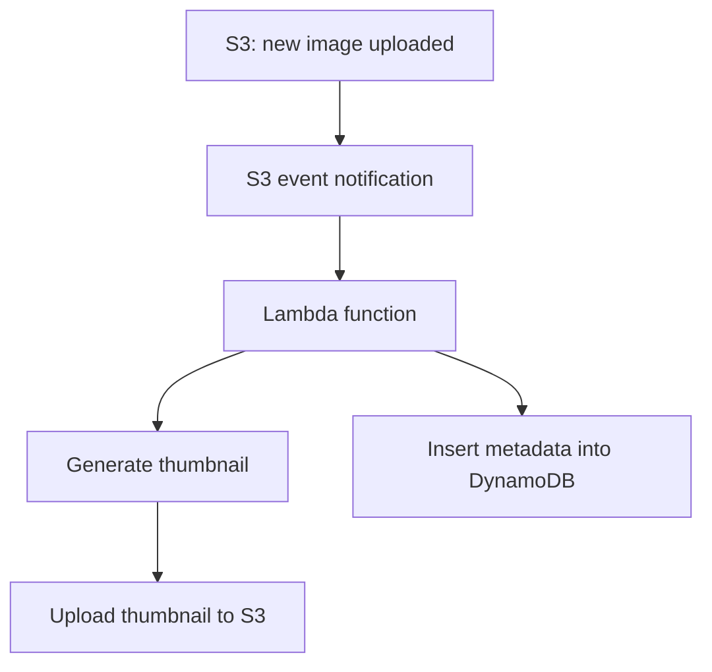
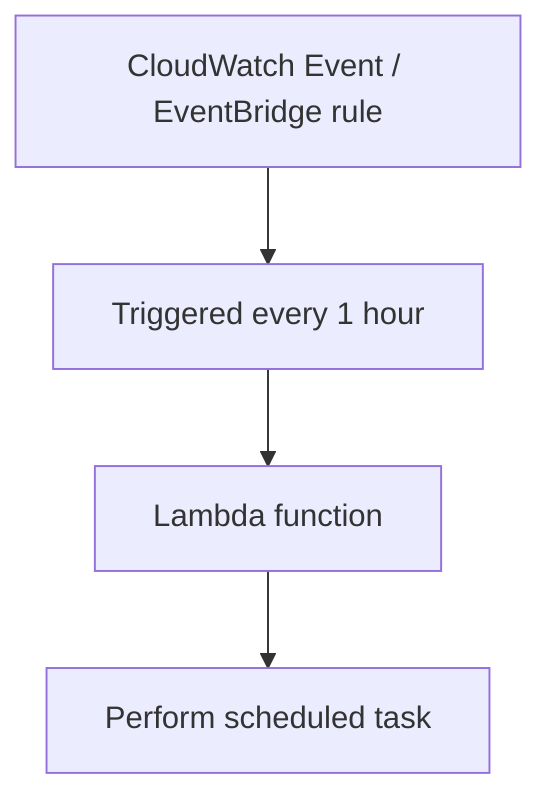

# 215. Lambda Overview

## 🎯 Giới thiệu
AWS Lambda là dịch vụ **serverless** cho phép chạy **functions** mà **không cần quản lý servers**.

- Với **EC2**, bạn phải provision virtual servers, giới hạn bởi memory và CPU đã cấp.
- EC2 thường phải chạy liên tục, dù có hay không có request.
- Muốn scale thì phải dùng **Auto Scaling groups** và tự động thêm/bớt servers.
- Với **Lambda**:
  - Chỉ cần upload code và function.
  - Chạy **on demand** khi được invoke.
  - Không chạy thì **không bị billing**.
  - Scale **tự động** theo số lượng request/concurrency.
- Thời gian chạy tối đa của Lambda là **up to 15 minutes**.

## 1. Đặc điểm chính của Lambda
### ⚙️ Lambda khác gì so với EC2
- **No servers to manage**
- **On demand execution**
- **Automatic scaling**
- **Short execution time**: tối đa 15 phút
- Chỉ trả tiền khi function chạy

### 💰 Pricing
- Tính phí theo:
  - **Number of requests / invocations**
  - **Compute time** của function
- Free tier:
  - **1 million Lambda requests**
  - **400,000 gigabyte seconds** compute time
- Billing theo độ dài thực thi với **1 millisecond increments**
- Ví dụ giá trong transcript:
  - Sau free tier: **20 cents per extra 1 million requests**
  - Và **$1 for 600,000 gigabyte seconds**

### 🧠 Memory và hiệu năng
- Có thể provision tới **10 GB RAM per function**
- Khi tăng RAM, AWS cũng tăng chất lượng **CPU** và **network performance**

## 2. Runtime, ngôn ngữ và container
### 🧩 Ngôn ngữ được hỗ trợ
- Hỗ trợ nhiều ngôn ngữ như:
  - **node.js**
  - **Python**
  - **Java**
  - **C# / .NET Core**
  - **PowerShell**
  - **Ruby**
- Hỗ trợ thêm qua **custom runtime API**
  - Ví dụ: **Rust**, **Golang**

### 📦 Container support
- Lambda cũng có thể chạy **container images**
- Cần implement **Lambda Runtime API**
- Tuy nhiên, theo transcript, nếu chạy **Docker images**, từ góc nhìn exam thì thường **ưu tiên ECS hoặc Fargate** hơn Lambda

## 3. Tích hợp với AWS services
Lambda tích hợp rất mạnh với nhiều dịch vụ AWS:

- **API Gateway**: tạo REST API và invoke Lambda
- **Kinesis**: xử lý, transform data on the fly
- **DynamoDB**: tạo **triggers** khi database có thay đổi
- **S3**: khi có file được tạo/upload thì Lambda có thể được trigger
- **CloudFront**: dùng **Lambda@Edge**
- **CloudWatch Events / EventBridge**: phản ứng với sự kiện trong infrastructure
- **CloudWatch Logs**: stream logs đến nơi khác
- **SNS**: phản ứng với notifications
- **SQS**: xử lý messages trong queue
- **Cognito**: phản ứng với event như user login
- **CodePipeline state changes**: kích hoạt automation khi trạng thái pipeline thay đổi

### 🔁 Mermaid flow

## 📊 Bảng tóm tắt
| Tiêu chí | Mô tả |
|----------|------|
| Mô hình | **Serverless functions**, không quản lý servers |
| Cách chạy | **On demand**, chỉ chạy khi được invoke |
| Scale | **Automatic scaling** theo concurrency |
| Thời lượng | Tối đa **15 minutes** |
| Tính phí | Theo **requests** và **compute time** |
| Free tier | **1 million requests**, **400,000 gigabyte seconds** |
| Hỗ trợ ngôn ngữ | **node.js, Python, Java, C#, PowerShell, Ruby**, custom runtime |
| Container | Hỗ trợ **container images**, nhưng exam thường ưu tiên **ECS/Fargate** cho Docker |
| Tích hợp nổi bật | **API Gateway, S3, DynamoDB, Kinesis, CloudWatch Events/EventBridge, SNS, SQS, Cognito** |

## 💡 Mẹo ghi nhớ cho kỳ thi AWS
- Nhớ 3 ý cốt lõi của Lambda: **no servers**, **on demand**, **auto scaling**.
- Lambda thường xuất hiện trong các bài toán **event-driven**:
  - S3 upload
  - DynamoDB trigger
  - EventBridge schedule
  - SQS processing
- Nếu đề bài nói về **REST API + Lambda**, nghĩ ngay đến **API Gateway**.
- Nếu đề bài nói về **CRON/serverless scheduling**, nghĩ đến **CloudWatch Events / EventBridge + Lambda**.
- Nếu đề bài hỏi về **Docker image**, transcript nhấn mạnh: **ECS hoặc Fargate** thường là lựa chọn ưu tiên hơn Lambda.
- Ghi nhớ free tier:
  - **1 million requests**
  - **400,000 gigabyte seconds**
- Khi tăng **RAM**, Lambda cũng cải thiện **CPU** và **network**.

## ✅ Kết luận
AWS Lambda là lựa chọn **serverless** để chạy code nhanh, theo sự kiện, không cần quản lý máy chủ. Điểm mạnh chính là **tự động scale**, **billing theo usage**, và **tích hợp sâu với AWS services** như **S3, API Gateway, DynamoDB, CloudWatch Events/EventBridge, SNS, SQS**. Đây là dịch vụ rất hay xuất hiện trong câu hỏi về **event-driven architecture** và **serverless design**.
